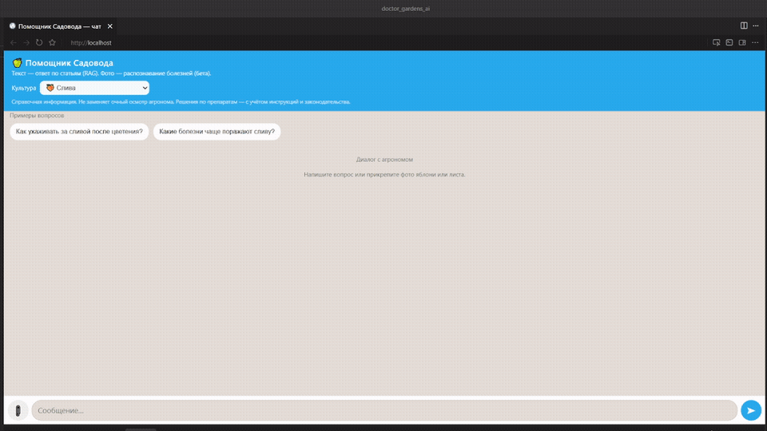
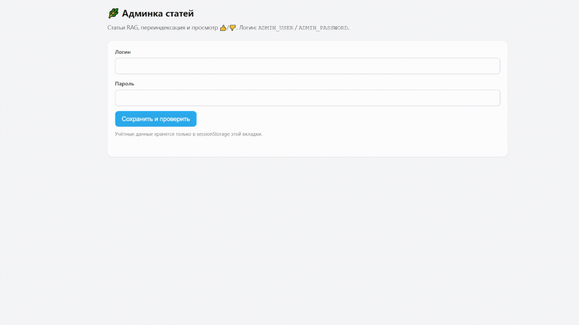

# 🍏 grounded-horticulture — помощник садовода

**Grounded RAG** для садоводства: ответы по научным статьям с проверкой фактов, а не «галлюцинации» LLM. Telegram Mini App и веб-чат с API-ключом.

[](LICENSE)
[](server/)
[](api/)
[](docker-compose.yml)

## Демо

| Чат: вопрос → RAG-ответ | Админка: статьи и 👍/👎 |
|:---:|:---:|
|  |  |

[▶ Полная запись чата (MP4)](docs/assets/demo-chat.mp4) · [▶ Полная запись админки (MP4)](docs/assets/demo-admin.mp4)

---

## Что это

Ассистент для садовода и агронома: **текст** → гибридный поиск по базе статей → ответ LLM с **верификацией** цифр и дозировок; **фото** → CV + рекомендация (бета, без production-весов в репо).

| Компонент | Роль |
|-----------|------|
| **Go** (`server/`) | Auth, сессии Postgres, оркестрация RAG+LLM, verify, rate limit, `/metrics` |
| **Python** (`api/`, `rag/`) | Hybrid retrieval (Chroma + BM25 + reranker), CV `/classify` |
| **Web** (`webapp/`) | Чат, админка загрузки статей, nginx в Docker |

**Доступ:** Telegram `initData` или браузер `X-API-Key` (см. `.env.example`).

> **Публичный репозиторий:** в git только демо-данные (`data/demo_hr/`, `data/apple/sample_*.txt`). Полный корпус статей и веса `.pth` — локально. [DATA_LICENSE.md](DATA_LICENSE.md) · [data/README.md](data/README.md)

## Быстрый старт (Docker)

```bash
cp .env.example .env   # задайте LLM_API_KEY, API_KEYS, ADMIN_PASSWORD
docker compose up -d --build
```

Откройте **http://localhost/** (чат) и **http://localhost/admin.html** (админка).  
Первый запуск classifier: ~30 с прогрев моделей, затем ответы за несколько секунд.

```bash
docker compose ps          # все сервисы healthy
make smoke                 # smoke-тест API (нужен TELEGRAM_AUTH_DISABLED=true в .env)
docker compose down
```

После смены статей в `data/`: `make docker-reindex-apply`.

## Архитектура

```
┌─────────────────┐     ┌──────────────────┐     ┌─────────────────────────────┐
│  Telegram Web   │────▶│   Go Server      │────▶│ Python (Flask / gunicorn)   │
│  или браузер    │◀────│  auth, sessions  │     │  /classify — CV (бета)      │
│  X-API-Key      │     │  /message (чат)  │────▶│  /rag/context — hybrid RAG  │
└─────────────────┘     └────────┬─────────┘     └─────────────────────────────┘
                                 │
                                 ▼  LLM (OpenRouter / OpenAI-compatible)
                          ┌──────────────┐
                          │  LLM API     │
                          └──────────────┘
```

**Текст:** вопрос → Go → Python `/rag/context` → LLM + verify → ответ в чат (стриминг).  
**Фото:** снимок → CV → LLM или шаблон из `photo_templates.json`.

## Стек

- **RAG:** `multilingual-e5-small`, Chroma, BM25 (RRF), `bge-reranker-base`, query expansion (`agro_glossary.json`)
- **CV:** MobileNetV2 + PyTorch (обучение: `cv/train_classifier.py`)
- **Backend:** Gin, PostgreSQL, Prometheus `/metrics`
- **Eval:** 68 вопросов в `eval/rag_*_baseline.jsonl`, `scripts/run_rag_eval.py`

Подробный case study для портфолио: [**docs/AGRO_CASE_STUDY_RU.md**](docs/AGRO_CASE_STUDY_RU.md) · [EN](docs/AGRO_CASE_STUDY_EN.md)

## Структура проекта

```
grounded-horticulture/
├── server/           # Go: /message, /classify, RAG+LLM, сессии, admin API
├── api/ + rag/       # Python: /rag/context, /classify, Chroma, BM25, reranker
├── webapp/           # index.html, admin.html, app.js
├── config/           # crops, prompts, branding, few_shot, question_categories
├── data/             # статьи .txt (в публичном git — demo + sample)
├── eval/             # baseline JSONL для регрессии retrieval
└── docker-compose.yml
```

## Установка без Docker

<details>
<summary>Локальная разработка (раскрыть)</summary>

**Python** (порт 5000):

```bash
pip install -r cv/requirements.txt
cp .env.example .env
python api/app.py
```

**Go** (порт 8080):

```bash
cd server && go mod download && go run .
```

**Web App:** разместите `webapp/` на HTTPS-хостинге; API — на Go-сервере.

Переменные: `TELEGRAM_BOT_TOKEN` или `API_KEYS`, `LLM_API_KEY`, `DATABASE_URL` — см. `.env.example`.  
Dev без Telegram: `TELEGRAM_AUTH_DISABLED=true` (только локально).

</details>

## API (кратко)

| Метод | Путь | Назначение |
|-------|------|------------|
| `POST` | `/api/message` | Чат: текст (RAG) или фото (CV) |
| `POST` | `/api/message/stream` | То же, SSE-стриминг ответа |
| `POST` | `/api/session` | Новая сессия |
| `GET` | `/api/history` | История диалога |
| `POST` | `/api/feedback` | 👍/👎 на ответ |
| `POST` | `/classify` | CV без сессии |
| `POST` | `/rag/context` | Только retrieval (Python) |

Auth: `X-Telegram-Init-Data` или `X-API-Key`. `POST /chat` устарел — используйте `/message`.

<details>
<summary>Примеры запросов (раскрыть)</summary>

**POST /message** (JSON):

```json
{"session_id": "…", "text": "Какие признаки парши на листьях?", "crop_id": "apple"}
```

**POST /rag/context** (Python):

```json
{"question": "подвои для интенсивного сада", "crop_id": "apple"}
```

</details>

## Документация

| Тема | Файл |
|------|------|
| Архитектура платформы | [docs/ARCHITECTURE.md](docs/ARCHITECTURE.md) |
| Деплой и прод | [docs/DEPLOY.md](docs/DEPLOY.md) |
| Roadmap | [docs/ROADMAP.md](docs/ROADMAP.md) |
| База знаний по коду | [docs/knowledge-base/README.md](docs/knowledge-base/README.md) |
| Публикация / демо | [docs/PUBLIC_REPO.md](docs/PUBLIC_REPO.md) |
| Аудит готовности | [docs/PILOT_READINESS_AUDIT.md](docs/PILOT_READINESS_AUDIT.md) |

## Лицензия

Исходный код — [Apache License 2.0](LICENSE).  
Тексты в `data/` — [DATA_LICENSE.md](DATA_LICENSE.md).

## Контакты

Вопросы и предложения — через [Issues](https://github.com/kantik001/grounded-horticulture_ru/issues).
