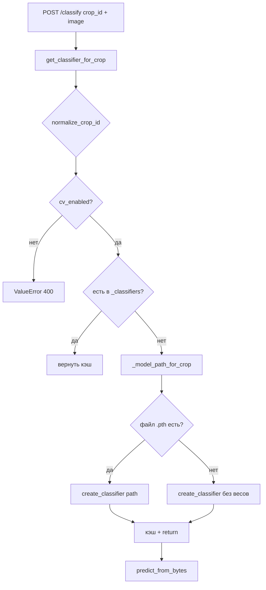

# Разбор: `classifier/registry.py`

**Исходный файл:** `classifier/registry.py`  
**Язык:** Python  
**Связанные модули:** `classifier/apple_classifier.py`, `rag/crops_config.py`, `config/crops.json`, `classifier/api_server.py`  
**Кто вызывает:** `api_server.classify_image()` → `get_classifier_for_crop(crop_id)`

---

## Зачем этот файл

Это **фабрика и кэш CV-моделей по культуре** (`crop_id`).

Один файл решает три задачи:

1. Проверить, разрешено ли распознавание фото для выбранной культуры (`cv_enabled` в `crops.json`).
2. Найти путь к весам `.pth` в переменных окружения.
3. Создать `AppleClassifier` **один раз на культуру** и переиспользовать (не грузить PyTorch при каждом запросе).

Без `registry.py` пришлось бы дублировать эту логику в `api_server.py`.

---

## Глобальный кэш `_classifiers`

```python
_classifiers: Dict[str, object] = {}
```

- Ключ: нормализованный `crop_id` (например `"apple"`).
- Значение: экземпляр `AppleClassifier`.
- Живёт **в памяти процесса** Python-сервиса до перезапуска контейнера.

Плюс: быстрые повторные запросы.  
Минус: сменили `.pth` на диске — нужен **restart** контейнера `classifier`, иначе старая модель в RAM.

---

## Поиск пути к весам: `_model_path_for_crop`

```python
def _model_path_for_crop(crop_id: str) -> Optional[str]:
    env_key = f"MODEL_PATH_{crop_id.upper()}"
    path = os.environ.get(env_key)
    if path:
        return path
    if crop_id == "apple":
        return os.environ.get("MODEL_PATH")
    return None
```

| Культура | Переменная в `.env` (пример) |
|----------|------------------------------|
| apple | `MODEL_PATH` или `MODEL_PATH_APPLE` |
| pear (в будущем) | `MODEL_PATH_PEAR` |
| любая | `MODEL_PATH_{CROP_ID_UPPER}` |

Если переменной нет → `None` → классификатор без ваших весов (только ImageNet backbone).

### Относительные пути

```python
if model_path and not os.path.isabs(model_path):
    model_path = os.path.normpath(os.path.join(os.path.dirname(__file__), model_path))
```

Путь считается **от папки `classifier/`**, не от корня проекта.  
Пример: `MODEL_PATH=../models/apple_classifier.pth`.

---

## Главная функция: `get_classifier_for_crop`

### Шаг 1 — нормализация и конфиг культуры

```python
crop_id = normalize_crop_id(crop_id)
crop = get_crop(crop_id)
if not crop.get("cv_enabled", False):
    raise ValueError(...)
```

Сейчас в `config/crops.json` только **apple** имеет `"cv_enabled": true`.  
Для груши/сливы пользователь получит понятную ошибку на русском (HTTP 400 из `api_server`).

### Шаг 2 — кэш

```python
if crop_id in _classifiers:
    return _classifiers[crop_id]
```

### Шаг 3 — создание модели

| Условие | Действие |
|---------|----------|
| `model_path` существует | `create_classifier(model_path=...)` + лог `Loading model from ...` |
| файла нет | `create_classifier()` без весов + лог `No weights — ImageNet backbone only` |

### Шаг 4 — сохранение в кэш

```python
_classifiers[crop_id] = clf
return clf
```

---

## Схема вызовов



---

## Связь с мультикультурой

Сейчас реализована **одна** CV-модель (`AppleClassifier`), но интерфейс уже под несколько культур:

- разные `MODEL_PATH_*` на культуру;
- отдельный объект в `_classifiers` на `crop_id`;
- включение/выключение через `cv_enabled`.

Чтобы добавить, например, грушу:

1. Обучить отдельный `.pth` (или общий — по решению).
2. `MODEL_PATH_PEAR=...` в `.env`.
3. В `crops.json`: `"cv_enabled": true` для `pear`.
4. При необходимости — другой класс модели вместо `create_classifier` (сейчас всегда `AppleClassifier`).

---

## Переменные окружения (практика)

```env
MODEL_PATH=models/apple_classifier.pth
# или явно:
MODEL_PATH_APPLE=models/apple_classifier.pth
```

В Docker часто volume `./models:/app/models` и путь `models/apple_classifier.pth`.

---

## Типичные ситуации

### «Распознавание фото для груши недоступно»

`cv_enabled: false` в `crops.json` — ожидаемое поведение, не баг registry.

### Модель «всегда ошибается» после обучения

1. Проверить лог: `Loading model from` vs `No weights`.
2. Перезапустить контейнер после замены `.pth`.
3. Убедиться, что порядок классов в датасете совпадает с `CLASS_LABELS` в `apple_classifier.py` (см. [classifier-train_classifier.md](./classifier-train_classifier.md)).

### Память растёт

Каждая культура с `cv_enabled` держит свою модель в RAM. Для 1–2 культур это нормально.

---

## Что читать дальше

| Тема | Файл |
|------|------|
| Inference и классы | [classifier-apple_classifier.md](./classifier-apple_classifier.md) |
| HTTP `/classify` | [classifier-api_server.md](./classifier-api_server.md) |
| Обучение `.pth` | [classifier-train_classifier.md](./classifier-train_classifier.md) |
| Флаги культур | `config/crops.json`, `rag/crops_config.py` |

---

## Краткий итог

`registry.py` — **тонкий слой между API и PyTorch**: проверка культуры, путь к весам из env, кэш `AppleClassifier` на `crop_id`. Вся математика — в `apple_classifier.py`.
