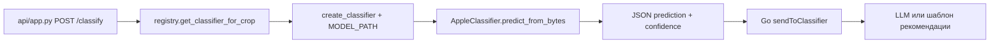

# Разбор: `cv/apple_classifier.py`

**Исходный файл:** `cv/apple_classifier.py`  
**Язык:** Python (PyTorch + torchvision)  
**Связанные модули:** `cv/registry.py`, `api/app.py`, `cv/train_classifier.py`  
**Кто вызывает:** `registry.get_classifier_for_crop()` → `app.py` (`POST /classify`)

---

## Зачем этот файл

Здесь живёт **нейросеть для распознавания болезней и состояния яблони/листа по фото**.

- Архитектура: **MobileNetV2** (лёгкая CNN, подходит для мобильного/сервера).
- На выходе: **один из 10 классов** + уверенность (confidence) + top-3 варианта.
- Два способа подать картинку: **путь к файлу** (`predict`) или **байты из HTTP** (`predict_from_bytes`).

Файл **не поднимает HTTP** — только логика модели. HTTP — в `app.py`.

---

## Классы, которые распознаёт модель

Константа **`DEFAULT_CLASS_LABELS`** (порядок важен: индекс 0 = первый класс). При загрузке `.pth` список может быть заменён на **`class_labels` из checkpoint**:

| Индекс | Метка | Смысл (кратко) |
|--------|--------|----------------|
| 0 | `healthy_apple` | Здоровое яблоко |
| 1 | `apple_scab` | Парша |
| 2 | `black_rot` | Чёрная гниль |
| 3 | `cedar_apple_rust` | Ржавчина |
| 4 | `healthy_leaf` | Здоровый лист |
| 5 | `powdery_mildew` | Мучнистая роса |
| 6 | `fire_blight` | Бактериальный ожог |
| 7 | `bitter_rot` | Горькая гниль |
| 8 | `blue_mold` | Голубая плесень |
| 9 | `brown_rot` | Бурая гниль |

При обучении (`train_classifier.py`) папки датасета идут **в порядке `DEFAULT_CLASS_LABELS`**; в checkpoint сохраняется `class_labels` — inference подхватывает тот же порядок.

---

## Инициализация: `__init__` (строки 28–54)

```python
AppleClassifier(model_path='../models/mobilenet_v2-b0353104.pth', num_classes=10)
```

Что происходит:

1. **`self.device`** — `cuda`, если есть GPU, иначе `cpu`.
2. Читает checkpoint (если есть) → **`class_labels`** и **`num_classes`**.
3. **`self.model = self._build_model(checkpoint)`** — backbone + голова + `state_dict`.
4. **`self.model.eval()`** — режим инференса (без dropout на обучении, фиксированное поведение).
5. **`self.transform`** — пайплайн подготовки картинки:
   - resize **224×224** (стандарт для ImageNet/MobileNet);
   - в тензор;
   - **Normalize** с mean/std ImageNet — те же числа, что при предобучении backbone.

Без своих весов модель всё равно «запускается», но голова случайная → предсказания бессмысленны, пока не обучите и не укажете `MODEL_PATH`.

---

## Загрузка модели: `_read_checkpoint` + `_build_model`

### Шаг 1 — backbone

```python
model = models.mobilenet_v2(weights=models.MobileNet_V2_Weights.IMAGENET1K_V1)
```

Берётся MobileNetV2, уже обученный на ImageNet (общие признаки: формы, текстуры, края).

### Шаг 2 — своя «голова» классификатора

Последний слой заменяется на:

- `Dropout(0.2)` — регуляризация при обучении;
- `Linear(..., num_classes)` — **10 выходов** (по числу болезней/состояний).

То есть transfer learning: тело сети — ImageNet, последний слой — под ваши классы.

### Шаг 3 — ваши веса (если есть `model_path`)

Checkpoint читается **один раз** в `__init__`; `_build_model` подставляет `state_dict`.

Ожидаемый формат файла `.pth` (как сохраняет `train_classifier.py`):

```python
{
    'epoch': ...,
    'state_dict': model.state_dict(),
    'class_labels': [...],  # метки из датасета при обучении
    'val_acc': ...
}
```

Важно: в `registry.py` путь к весам задаётся через `.env` (`MODEL_PATH`, `MODEL_PATH_{CROP}`). Если файла нет — в лог: «Весов нет — только backbone ImageNet».

---

## Инференс: общая логика

И `predict`, и `predict_from_bytes` делают одно и то же, разница только в источнике картинки:

| Метод | Вход |
|--------|------|
| `predict(image_path)` | путь к файлу на диске |
| `predict_from_bytes(image_bytes)` | байты из multipart (API) |

### Пайплайн (одинаковый)

1. **PIL** открывает изображение, `convert('RGB')` (даже если было grayscale/RGBA).
2. **`self.transform(image)`** → тензор 1×3×224×224.
3. **`torch.no_grad()`** — без градиентов, быстрее и меньше памяти.
4. **`outputs = self.model(image_tensor)`** — сырые логиты (10 чисел).
5. **`softmax`** → вероятности по классам.
6. **`torch.max`** → класс с максимальной вероятностью и **confidence**.
7. **`torch.topk(..., 3)`** → три лучших варианта для UI/отладки.

### Успешный ответ (словарь)

```json
{
  "success": true,
  "prediction": "apple_scab",
  "confidence": 0.87,
  "top_predictions": [
    {"label": "apple_scab", "confidence": 0.87},
    {"label": "powdery_mildew", "confidence": 0.08},
    {"label": "healthy_leaf", "confidence": 0.03}
  ],
  "image_processed": true
}
```

### Ошибка

```json
{
  "success": false,
  "error": "описание исключения",
  "image_processed": false
}
```

Исключения не пробрасываются наружу — API получает JSON с `success: false` (удобно для Go).

---

## Фабрика: `create_classifier` (строки 190–200)

```python
def create_classifier(model_path: str = None) -> AppleClassifier:
    return AppleClassifier(model_path=model_path)
```

Используется в **`registry.py`**: один раз создаёт классификатор на культуру и кладёт в кэш `_classifiers[crop_id]`.

---

## Блок `if __name__ == '__main__'` (строки 203–212)

Локальный тест без сервера:

```bash
cd cv
python apple_classifier.py
```

Ожидает файл `test_apple.jpg` рядом — для ручной проверки после обучения.

---

## Связь с остальной системой



### Go после Python

В Go (`server/classifier_client.go`, `server/photo_recommendations.go`):

- парсит JSON в `ClassificationResult` (`prediction`, `confidence`, `top_predictions`);
- `classifyAndRecommend` → `generatePhotoRecommendation` / `generateTemplateRecommendation` — текст совета по классу;
- сохраняет в БД `class_prediction`, `class_confidence` (`postgres_store.go`).

Порог confidence для «не уверен» в roadmap ещё в планах (фаза 4) — в `apple_classifier.py` сейчас **нет** отсечения по порогу, всегда отдаётся лучший класс.

---

## Обучение модели (отдельный файл)

Веса для `_load_model` готовит **`train_classifier.py`**:

- датасет: папки по классам (`healthy_apple/`, `apple_scab/`, …);
- та же архитектура MobileNetV2 + замена головы;
- сохранение в `.pth` с ключом `state_dict`.

После обучения:

1. Положить файл, например `models/apple_classifier.pth`.
2. В `.env`: `MODEL_PATH=models/apple_classifier.pth` (или путь из docker volume).
3. Перезапустить контейнер `classifier`.

Подробный разбор обучения — [cv-train_classifier.md](./cv-train_classifier.md).

---

## Частые вопросы

### Почему 224×224 и эти mean/std?

MobileNetV2 и ImageNet обучались на таких размерах и нормализации. Другие числа → хуже качество без переобучения.

### Почему `num_classes=10`, а в списке 10 меток?

Должно совпадать. Если добавите класс — меняйте и список, и `num_classes`, и переобучайте.

### Модель всегда отвечает уверенно, но неправильно

Скорее всего нет вашего `.pth` или мало данных при обучении. Проверьте лог registry: `Загрузка весов: ...` vs `Весов нет — только backbone ImageNet`.

### `predict` и `predict_from_bytes`

Оба вызывают общий **`_run_inference`** после препроцессинга тензора.

---

## Что читать дальше

| Тема | Файл |
|------|------|
| HTTP и эндпоинт `/classify` | [python-api.md](./python-api.md) |
| Выбор модели и кэш | [cv-registry.md](./cv-registry.md) |
| Обучение весов | [cv-train_classifier.md](./cv-train_classifier.md) |
| Рекомендация пользователю после CV | `server/classify_flow.go`, `photo_recommendations.go` (`generatePhotoRecommendation`) |

---

## Краткий итог

`apple_classifier.py` — **ядро Computer Vision**: загрузка MobileNetV2, подмена головы на 10 классов, препроцессинг, inference, JSON-результат. В проде вызывается только через **`predict_from_bytes`** из `app.py`; Go получает готовые `prediction` и `confidence` и дополняет ответ текстом.
