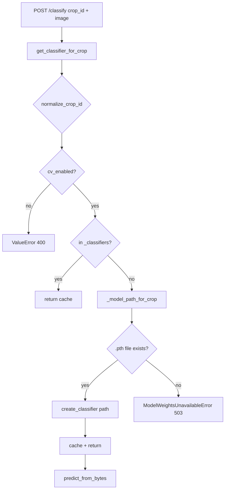

# Walkthrough: `cv/registry.py`

**Source file:** `cv/registry.py`  
**Language:** Python  
**Related modules:** `cv/apple_classifier.py`, `rag/crops_config.py`, `config/crops.json`, `api/app.py`  
**Called by:** `api/app.py` (`classify_image`) → `get_classifier_for_crop(crop_id)`

---

## Why this file exists

**Factory and cache for CV models by crop** (`crop_id`).

One file handles three tasks:

1. Check whether photo recognition is allowed for the crop (`cv_enabled` in `crops.json`).
2. Find `.pth` weight path in environment variables.
3. Create `AppleClassifier` **once per crop** and reuse (do not reload PyTorch on every request).

Without `registry.py` this logic would be duplicated in `app.py`.

---

## Global cache `_classifiers`

```python
_classifiers: Dict[str, AppleClassifier] = {}
_classifiers_lock = threading.Lock()
```

- Key: normalized `crop_id` (e.g. `"apple"`).
- Value: `AppleClassifier` instance.
- Lives **in Python service process memory** until container restart.
- All access goes through `_classifiers_lock` (thread-safe lazy loading under gunicorn threads).

Pro: fast repeat requests.  
Con: changed `.pth` on disk — need **restart** of `classifier` container, else old model stays in RAM.

---

## Weight path lookup: `_model_path_for_crop`

```python
def _model_path_for_crop(crop_id: str) -> Optional[str]:
    env_key = f"MODEL_PATH_{crop_id.upper()}"
    path = os.environ.get(env_key)
    if path:
        return path
    if crop_id == "apple":
        return os.environ.get("MODEL_PATH")
    return None
```

| Crop | `.env` variable (example) |
|------|---------------------------|
| apple | `MODEL_PATH` or `MODEL_PATH_APPLE` |
| pear (future) | `MODEL_PATH_PEAR` |
| any | `MODEL_PATH_{CROP_ID_UPPER}` |

If variable missing → `None` → `ModelWeightsUnavailableError` (HTTP 503 from `api/app.py`). Without trained weights the classification head is randomly initialized, so serving predictions would be meaningless.

### Relative paths

```python
if model_path and not os.path.isabs(model_path):
    model_path = os.path.normpath(os.path.join(os.path.dirname(__file__), model_path))
```

Path is relative to **`cv/`** folder, not project root.  
Example: `MODEL_PATH=../models/apple_classifier.pth`.

---

## Main function: `get_classifier_for_crop`

### Step 1 — normalization and crop config

```python
crop_id = normalize_crop_id(crop_id)
crop = get_crop(crop_id)
if not crop.get("cv_enabled", False):
    raise ValueError(...)
```

Currently only **apple** has `"cv_enabled": true` in `config/crops.json`.  
For pear/plum user gets clear error (HTTP 400 from `api/app.py`).

### Step 2 — cache (under lock)

```python
with _classifiers_lock:
    if crop_id in _classifiers:
        return _classifiers[crop_id]
```

### Step 3 — model creation

| Condition | Action |
|-----------|--------|
| `model_path` exists | `create_classifier(model_path=...)` + log `Loading weights: ...` |
| file missing | raise `ModelWeightsUnavailableError` → HTTP 503 (never serve an untrained head) |

Creation and cache access are guarded by `_classifiers_lock`, so concurrent first requests under gunicorn threads load the model exactly once.

### Step 4 — cache store

```python
_classifiers[crop_id] = clf
return clf
```

---

## Call diagram



---

## Multi-crop support

Currently **one** CV model (`AppleClassifier`), but interface is ready for several crops:

- different `MODEL_PATH_*` per crop;
- separate object in `_classifiers` per `crop_id`;
- enable/disable via `cv_enabled`.

To add pear, for example:

1. Train separate `.pth` (or shared — your choice).
2. `MODEL_PATH_PEAR=...` in `.env`.
3. In `crops.json`: `"cv_enabled": true` for `pear`.
4. If needed — different model class instead of `create_classifier` (currently always `AppleClassifier`).

---

## Environment variables (practice)

```env
MODEL_PATH=models/apple_classifier.pth
# or explicit:
MODEL_PATH_APPLE=models/apple_classifier.pth
```

In Docker often volume `./models:/app/models` and path `models/apple_classifier.pth`.

---

## Typical situations

### “Photo recognition for pear is unavailable”

`cv_enabled: false` in `crops.json` — expected behavior, not a registry bug.

### Model “always wrong” after training

1. Check log: `Loading weights: ...` should appear at first classify request.
2. Restart container after replacing `.pth`.
3. Ensure dataset folders and `DEFAULT_CLASS_LABELS` / `class_labels` in checkpoint match (see [cv-train_classifier.md](./cv-train_classifier.md)).

### Memory growth

Each crop with `cv_enabled` holds its model in RAM. For 1–2 crops this is normal.

---

## What to read next

| Topic | File |
|-------|------|
| Inference and classes | [cv-apple_classifier.md](./cv-apple_classifier.md) |
| HTTP `/classify` | [python-api.md](./python-api.md) |
| Train `.pth` | [cv-train_classifier.md](./cv-train_classifier.md) |
| Crop flags | `config/crops.json`, `rag/crops_config.py` |

---

## Brief summary

`registry.py` — **thin layer between API and PyTorch**: crop check, weight path from env, `AppleClassifier` cache per `crop_id`. All math is in `apple_classifier.py`.
