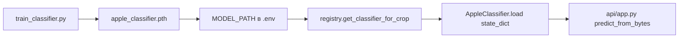

# Разбор: `cv/train_classifier.py`

**Исходный файл:** `cv/train_classifier.py`  
**Язык:** Python (PyTorch)  
**Связанные модули:** `cv/apple_classifier.py`, `cv/registry.py`  
**Когда запускать:** локально на машине с GPU/CPU, **не** в прод-контейнере при каждом запросе

---

## Зачем этот файл

Скрипт **обучает** MobileNetV2 под ваши 10 классов болезней/состояний яблони и сохраняет файл **`apple_classifier.pth`**.

После обучения:

1. Положить `.pth` в `models/` (или другой путь).
2. Указать `MODEL_PATH` в `.env`.
3. Перезапустить `classifier` — `registry.py` подхватит веса.

В проде этот файл **не вызывается** автоматически; это offline-задача (сессия 4 в roadmap).

---

## Структура датасета: `AppleDataset`

Ожидаемые папки (train и val — отдельно):

```
data/train/
  apple_scab/
    img001.jpg
  healthy_apple/
    ...
data/val/
  apple_scab/
    ...
```

### Как строится индекс классов

```python
from cv.apple_classifier import DEFAULT_CLASS_LABELS

for idx, class_name in enumerate(self.class_labels):  # фиксированный порядок
    class_dir = os.path.join(root_dir, class_name)
```

- Имена **подпапок** должны совпадать с метками из **`DEFAULT_CLASS_LABELS`** в `apple_classifier.py`.
- Индекс `idx` (0, 1, 2, …) — **тот же порядок**, что при инференсе (не `sorted()` по имени папки).
- Если папки класса нет в `train_dir` — класс пропускается (0 фото), но индекс в списке сохраняется.

| Индекс | Метка (`DEFAULT_CLASS_LABELS`) |
|--------|--------------------------------|
| 0 | `healthy_apple` |
| 1 | `apple_scab` |
| 2 | `black_rot` |
| … | … |

Поддерживаемые расширения: `.png`, `.jpg`, `.jpeg`.

---

## Аугментации и препроцессинг

### Train

- Resize 224×224  
- RandomHorizontalFlip, RandomRotation(10°)  
- ColorJitter (яркость/контраст/насыщенность)  
- ToTensor + Normalize (ImageNet mean/std)

### Validation

- Только Resize + ToTensor + Normalize (без случайных искажений)

Те же mean/std, что в `apple_classifier.py` при inference — **обязательно** для согласованности.

---

## Функция `train_model`

### Параметры

| Параметр | По умолчанию | Смысл |
|----------|--------------|--------|
| `train_dir` | — | Папка с подпапками классов для обучения |
| `val_dir` | — | Папка для валидации |
| `num_classes` | — | Число классов (для яблони = **10**) |
| `epochs` | 25 | Эпох |
| `batch_size` | 32 | Размер батча |
| `learning_rate` | 0.001 | Adam |
| `save_path` | `apple_classifier.pth` | Куда писать лучший чекпоинт |

### Архитектура (как в inference)

```python
model = models.mobilenet_v2(weights=IMAGENET1K_V1)
model.classifier = nn.Sequential(
    nn.Dropout(0.2),
    nn.Linear(..., num_classes)
)
```

Та же схема, что `_load_model` в `apple_classifier.py` — веса совместимы.

### Оптимизация

- **Loss:** `CrossEntropyLoss`
- **Optimizer:** Adam
- **Scheduler:** StepLR (каждые 7 эпох lr × 0.1)

### Цикл обучения (каждая эпоха)

1. **Train:** `model.train()`, forward, backward, метрики loss/accuracy.
2. **Val:** `model.eval()`, `torch.no_grad()`, val loss/accuracy.
3. Если `val_acc` лучше предыдущего best → **сохранить чекпоинт**.

### Формат сохранённого файла

```python
torch.save({
    'epoch': epoch,
    'state_dict': model.state_dict(),
    'class_labels': train_dataset.class_labels,
    'val_acc': val_epoch_acc
}, save_path)
```

При инференсе `AppleClassifier` читает **`state_dict`** и, если есть, **`class_labels`** из checkpoint — список меток подменяет `DEFAULT_CLASS_LABELS`.  
Поле `val_acc` — только для отладки.

---

## Как запустить обучение

В `if __name__ == '__main__'` сейчас закомментирован пример. Раскомментируйте и подставьте пути:

```python
train_model(
    train_dir='data/train',
    val_dir='data/val',
    num_classes=10,
    epochs=25,
    batch_size=32,
    learning_rate=0.001,
    save_path='apple_classifier.pth'
)
```

Пример из корня проекта:

```bash
cd cv
pip install -r requirements.txt
python train_classifier.py
```

Для GPU нужен PyTorch с CUDA (см. pytorch.org).

### После обучения

```bash
mkdir -p ../models
mv apple_classifier.pth ../models/
```

В `.env`:

```env
MODEL_PATH=models/apple_classifier.pth
```

```bash
docker compose up -d --build classifier
```

Проверьте лог: `[CV:apple] Загрузка весов: ...`

---

## Связь train → registry → api/app.py



---

## Советы по датасету (сессия 4)

- **Минимум:** десятки фото на класс; лучше сотни на частые болезни.
- **Баланс классов:** иначе модель «любит» частый класс.
- **Val:** отдельные фото, не дубликаты train (другие ракурсы/свет).
- **Метрики:** смотрите `Val Acc` в логе; для продакшена планируется порог confidence (в `apple_classifier` пока нет).

---

## `num_workers=4` в DataLoader

Ускоряет загрузку батчей на Linux. На Windows при ошибках можно поставить `num_workers=0`.

---

## Отличия от `apple_classifier.py`

| | train_classifier | apple_classifier |
|--|------------------|------------------|
| Режим | обучение, градиенты | только inference, `eval()` |
| Аугментации | да (train) | нет |
| Сохранение весов | да | загрузка весов |
| HTTP | нет | через registry + api/app.py |

---

## Частые ошибки

### Val accuracy низкая, train высокая

Переобучение: больше данных, аугментации, меньше epochs, early stopping (в коде нет — можно добавить).

### Модель в API «не та болезнь»

Проверьте: имена папок = `DEFAULT_CLASS_LABELS`, в checkpoint есть `class_labels`, лог registry — «Загрузка весов», а не «только backbone ImageNet».

### Файл не подхватывается

Неверный путь, относительный путь не от `cv/`, не перезапущен контейнер, кэш `_classifiers`.

---

## Что читать дальше

| Тема | Файл |
|------|------|
| Загрузка весов в runtime | [cv-registry.md](./cv-registry.md) |
| Inference | [cv-apple_classifier.md](./cv-apple_classifier.md) |
| Проверка в чате | [python-api.md](./python-api.md) |

---

## Краткий итог

`train_classifier.py` — **offline-обучение** MobileNetV2: датасет по папкам, аугментации, val accuracy, сохранение `state_dict` в `.pth`. Без этого файла в проде работает только «пустая» голова ImageNet; с ним — ваша обученная модель через `MODEL_PATH`.
