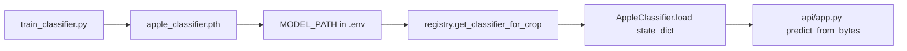

# Walkthrough: `cv/train_classifier.py`

**Source file:** `cv/train_classifier.py`  
**Language:** Python (PyTorch)  
**Related modules:** `cv/apple_classifier.py`, `cv/registry.py`  
**When to run:** locally on machine with GPU/CPU, **not** in prod container on each request

---

## Why this file exists

Script **trains** MobileNetV2 for your 10 apple disease/condition classes and saves **`apple_classifier.pth`**.

After training:

1. Put `.pth` in `models/` (or another path).
2. Set `MODEL_PATH` in `.env`.
3. Restart `classifier` — `registry.py` loads weights.

This file is **not** called automatically in production; it is an offline task.

---

## Dataset structure: `AppleDataset`

Expected folders (train and val separate):

```
data/train/
  apple_scab/
    img001.jpg
  healthy_apple/
    ...
data/val/
  apple_scab/
    ...
```

### How class index is built

```python
from cv.labels_config import default_class_labels_for_crop

DEFAULT_CLASS_LABELS = default_class_labels_for_crop("apple")

for idx, class_name in enumerate(self.class_labels):  # fixed order
    class_dir = os.path.join(root_dir, class_name)
```

- **Subfolder names** must match labels in **`DEFAULT_CLASS_LABELS`** in `apple_classifier.py`.
- Index `idx` (0, 1, 2, …) — **same order** as at inference (not `sorted()` by folder name).
- If class folder missing in `train_dir` — class skipped (0 photos), but index in list remains.

| Index | Label (`DEFAULT_CLASS_LABELS`) |
|-------|--------------------------------|
| 0 | `healthy_apple` |
| 1 | `apple_scab` |
| 2 | `black_rot` |
| … | … |

Supported extensions: `.png`, `.jpg`, `.jpeg`.

---

## Augmentations and preprocessing

### Train

- Resize 224×224  
- RandomHorizontalFlip, RandomRotation(10°)  
- ColorJitter (brightness/contrast/saturation)  
- ToTensor + Normalize (ImageNet mean/std)

### Validation

- Resize + ToTensor + Normalize only (no random distortion)

Same mean/std as `apple_classifier.py` at inference — **required** for consistency.

---

## Function `train_model`

### Parameters

| Parameter | Default | Meaning |
|-----------|---------|---------|
| `train_dir` | — | Folder with class subfolders for training |
| `val_dir` | — | Validation folder |
| `num_classes` | — | Class count (for apple = **10**) |
| `epochs` | 25 | Epochs |
| `batch_size` | 32 | Batch size |
| `learning_rate` | 0.001 | Adam |
| `save_path` | `apple_classifier.pth` | Best checkpoint path |

### Architecture (same as inference)

```python
model = models.mobilenet_v2(weights=IMAGENET1K_V1)
model.classifier = nn.Sequential(
    nn.Dropout(0.2),
    nn.Linear(..., num_classes)
)
```

Same scheme as `_build_model` in `apple_classifier.py` — weights are compatible.

### Optimization

- **Loss:** `CrossEntropyLoss`
- **Optimizer:** Adam
- **Scheduler:** StepLR (every 7 epochs lr × 0.1)

### Training loop (each epoch)

1. **Train:** `model.train()`, forward, backward, loss/accuracy metrics.
2. **Val:** `model.eval()`, `torch.no_grad()`, val loss/accuracy.
3. If `val_acc` beats previous best → **save checkpoint**.

### Saved file format

```python
torch.save({
    'epoch': epoch,
    'state_dict': model.state_dict(),
    'class_labels': train_dataset.class_labels,
    'val_acc': val_epoch_acc
}, save_path)
```

At inference `AppleClassifier` reads **`state_dict`** and, if present, **`class_labels`** from checkpoint — list replaces `DEFAULT_CLASS_LABELS`.  
Field `val_acc` — debugging only.

---

## How to run training

In `if __name__ == '__main__'` example is commented. Uncomment and set paths:

```python
train_model(
    train_dir='data/train',
    val_dir='data/val',
    num_classes=10,
    epochs=25,
    batch_size=32,
    learning_rate=0.001,
    save_path='apple_classifier.pth'
)
```

Example from project root:

```bash
cd cv
pip install -r requirements.txt
python train_classifier.py
```

For GPU need PyTorch with CUDA (see pytorch.org).

### After training

```bash
mkdir -p ../models
mv apple_classifier.pth ../models/
```

In `.env`:

```env
MODEL_PATH=models/apple_classifier.pth
```

```bash
docker compose up -d --build classifier
```

Check log: `[CV:apple] Loading weights: ...`

---

## train → registry → api/app.py chain



---

## Dataset tips

- **Minimum:** tens of photos per class; hundreds better for common diseases.
- **Class balance:** otherwise model favors frequent class.
- **Val:** separate photos, not train duplicates (other angles/light).
- **Metrics:** watch `Val Acc` in log; `apple_classifier` has no confidence threshold — it always returns the best class.

---

## `num_workers=4` in DataLoader

Speeds batch loading on Linux. On Windows on errors set `num_workers=0`.

---

## Differences from `apple_classifier.py`

| | train_classifier | apple_classifier |
|--|------------------|------------------|
| Mode | training, gradients | inference only, `eval()` |
| Augmentations | yes (train) | no |
| Save weights | yes | load weights |
| HTTP | no | via registry + api/app.py |

---

## Common mistakes

### Val accuracy low, train high

Overfitting: more data, augmentations, fewer epochs, early stopping (not in code — can add).

### API predicts wrong disease

Check: folder names = `DEFAULT_CLASS_LABELS`, checkpoint has `class_labels`, registry log shows `Loading weights: ...` for the expected `.pth` (a missing file would return 503, not wrong predictions).

### File not picked up

Wrong path, relative path not from `cv/`, container not restarted, cache `_classifiers`.

---

## What to read next

| Topic | File |
|-------|------|
| Runtime weight load | [cv-registry.md](./cv-registry.md) |
| Inference | [cv-apple_classifier.md](./cv-apple_classifier.md) |
| Chat verification | [python-api.md](./python-api.md) |

---

## Brief summary

`train_classifier.py` — **offline MobileNetV2 training**: folder dataset, augmentations, val accuracy, save `state_dict` to `.pth`. Without a trained `.pth` production `/classify` returns 503 (`ModelWeightsUnavailableError`); with it — your trained model via `MODEL_PATH`.
