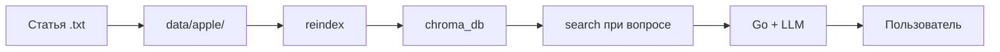

# Пайплайн данных: статьи RAG и модель CV

**Цель:** как пополнять знания для чата и (отдельно) обучать распознавание фото.  
**Связь с roadmap:** фаза 3 (статьи), фаза 4 (CV) — [../ROADMAP.md](../ROADMAP.md)

---

## Два разных контура

| Контур | Формат | Куда | Для чего |
|--------|--------|------|----------|
| **RAG (текст)** | `.txt` UTF-8 | `data/{crop_id}/` | ответы в чате по статьям |
| **CV (фото)** | папки с `.jpg`/`.png` | датасет локально | `train_classifier.py` → `.pth` |

**Не путать:** в админку загружают только **`.txt`**, не фото для обучения и не `.pth`.

---

## RAG: от статьи до ответа в чате



### Шаг 1 — подготовить текст

- Один файл = одна статья или большой фрагмент.
- Кодировка **UTF-8**.
- Имя файла: **латиница**, `article_n.txt` (правила admin — [server-admin-and-ux-api.md](./server-admin-and-ux-api.md)).
- Опционально: красивое название в [config/article_titles.json](./config-overview.md).

В репозитории для яблони: **16 статей** в `data/apple/` (`article1`–`article3`, `article4_scab` … `article15_organic_calendar`, `article16_planting_pit`). Цель пилота — расширять до 25+ по мере сбора материалов.

### Шаг 2 — положить в репозиторий или upload

**Вариант A — Git / папка:**

```
data/apple/my_article.txt
```

На хосте с Docker `data` смонтирован в classifier (read-only) и server (read-write для admin).

**Вариант B — админка:**

1. http://localhost/admin.html  
2. Basic auth (`ADMIN_USER` / `ADMIN_PASSWORD`)  
3. Upload → файл в `DATA_DIR/{crop_id}/` (в compose `DATA_DIR=/app/data`)

### Шаг 3 — переиндексация (обязательно)

Без reindex Chroma **не видит** новые файлы.

| Способ | Команда / действие |
|--------|-------------------|
| Админка | кнопка «Переиндексировать RAG» |
| Скрипт на хосте | `python scripts/reindex_rag.py` (нужен Python + deps) |
| Env | `FORCE_RAG_REINDEX=true` + restart classifier |
| API | `POST /admin/reindex` + `X-Admin-Secret` |

Подробно: [rag-vector_store.md](./rag-vector_store.md), [scripts-overview.md](./scripts-overview.md).

Ожидайте **минуты** при первом запуске (embeddings `multilingual-e5-small`).

**Docker:** после `reindex_rag.py` или admin reindex перезапустите classifier, иначе в памяти останется старый кэш Chroma и поиск даст `Error finding id`:

```bash
docker compose exec classifier python scripts/reindex_rag.py
docker compose restart classifier
```

### Шаг 4 — проверка

1. Логи classifier: `Фрагментов: N`, без «Нет статей».
2. `python scripts/run_rag_eval.py --suite apple` (retrieval) — см. [eval/README.md](../../eval/README.md).
3. Чат: вопрос по теме статьи (культура **apple**); в логах server — строки `[RAG]`.
4. При ошибке verify — числа в ответе должны быть в тексте статей.

### Шаг 5 — обслуживание

- Правка `.txt` → снова **reindex**.
- Удаление статьи → удалить файл + reindex.
- Backup: volume `chroma_data` (Docker) или папка `chroma_db` локально.

---

## CV: от датасета до `.pth`

Отдельный процесс, **не** через Web App.

### Шаг 1 — датасет

Структура для `train_classifier.py`:

```
dataset/train/
  healthy_apple/
  apple_scab/
  ...
dataset/val/
  ...
```

Папки датасета должны называться как метки в **`DEFAULT_CLASS_LABELS`** — см. [cv-train_classifier.md](./cv-train_classifier.md).

### Шаг 2 — обучение

```bash
cd cv
pip install -r requirements.txt
# раскомментировать train_model(...) в train_classifier.py
python train_classifier.py
```

Результат: `apple_classifier.pth` (или путь из `save_path`).

### Шаг 3 — подключить к Docker

1. Скопировать веса туда, откуда читает classifier:
   - в **volume** `models` (через временный контейнер или изменить compose на `./models:/app/models`), **или**
2. В `.env` / compose: `MODEL_PATH=models/apple_classifier.pth`

3. `docker compose up -d --force-recreate classifier`

4. Лог: `[CV:apple] Загрузка весов: ...`

### Шаг 4 — проверка

- Отправить фото в чат (культура apple).
- Смотреть `prediction`, `confidence` в ответе / БД.
- Порог confidence — в roadmap фазы 4 (пока не в коде).

---

## Чеклист сессии 4 (контент)

- [x] 16 `.txt` в `data/apple/` (включая `article16_planting_pit.txt`; цель пилота — 25+)
- [x] `run_rag_eval.py` + `eval/rag_apple_baseline.jsonl`
- [ ] reindex после пачки
- [ ] 5–10 тестовых вопросов вручную
- [ ] Датасет фото собран
- [ ] `apple_classifier.pth` обучен и подключён
- [ ] Smoke: `make smoke` после `compose up`

---

## Частые ошибки

| Ошибка | Причина |
|--------|---------|
| «Не нашёл информации в статьях» | нет reindex или пустой `data/apple/` |
| Ответ без связи со статьёй | мало чанков / нерелевантный вопрос |
| Upload OK, RAG пустой | reindex не нажали |
| CV всегда «случайный» класс | нет `.pth` в volume models |
| reindex на хосте, Docker пустой | chroma на хосте ≠ volume `chroma_data` |
| `Error finding id` после reindex | не перезапущен classifier — `docker compose restart classifier` |

---

## Краткий итог

**Текст:** `data/{crop}/` + **reindex** = база знаний чата. **Фото:** датасет + **train** + **MODEL_PATH** = осмысленный CV. Два пайплайна, одна админка только для текста.
