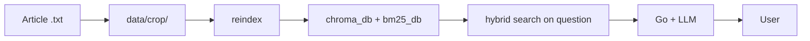

# Data pipeline: RAG articles and CV model

**Goal:** how to add knowledge for chat and (separately) train photo recognition.

---

## Two separate pipelines

| Pipeline | Format | Destination | Purpose |
|----------|--------|-------------|---------|
| **RAG (text)** | `.txt` UTF-8 | `data/{crop_id}/` | chat answers from articles |
| **CV (photos)** | folders with `.jpg`/`.png` | dataset locally | `train_classifier.py` → `.pth` |

**Do not confuse:** admin upload accepts only **`.txt`**, not training photos or `.pth`.

---

## RAG: from article to chat answer



### Step 1 — prepare text

- One file = one article or large fragment.
- Encoding **UTF-8**.
- Filename: **Latin**, `article_n.txt` (admin rules — [server-admin-and-ux-api.md](./server-admin-and-ux-api.md)).
- Optional: display title in [config/article_titles.json](./config-overview.md).

In **public** git: `data/demo_hr/`, `data/apple/sample_*.txt` and README in crop folders.  
Full corpus (~344 apple, ~42 pear, ~108 plum) — **local**, not in open repo ([DATA_LICENSE.md](../../DATA_LICENSE.md), [data/README.md](../../data/README.md)).

### Step 2 — put in repo or upload

**Option A — Git / folder:**

```
data/apple/my_article.txt
```

On Docker host `data` is mounted in classifier (read-only) and server (read-write for admin).

**Option B — admin UI:**

1. http://localhost/admin.html  
2. Basic auth (`ADMIN_USER` / `ADMIN_PASSWORD`)  
3. Upload → file in `DATA_DIR/{crop_id}/` (in compose `DATA_DIR=/app/data`)

### Step 3 — reindex (required)

Without reindex Chroma and BM25 **do not see** new files.

| Method | Command / action |
|--------|------------------|
| Admin UI | “Reindex RAG” button |
| Host script | `python scripts/reindex_rag.py` (needs Python + deps) |
| Env | `FORCE_RAG_REINDEX=true` + restart classifier |
| API | `POST /admin/reindex` + `X-Admin-Secret` |

Details: [rag-vector_store.md](./rag-vector_store.md), [scripts-overview.md](./scripts-overview.md).

Expect **minutes** on first run (embeddings `multilingual-e5-small` + BM25 over full corpus). First **query** after startup may additionally load reranker (`BAAI/bge-reranker-base`).

**Docker:** after `reindex_rag.py` or admin reindex restart classifier, otherwise in-memory Chroma cache is stale and search returns `Error finding id`:

```bash
docker compose exec classifier python scripts/reindex_rag.py
docker compose restart classifier
```

### Step 4 — verification

1. Classifier logs: `Fragments: N`, no “No articles”.
2. `python scripts/run_rag_eval.py --suite apple` (retrieval) — see [eval/README.md](../../eval/README.md).
3. Chat: question on article topic (crop **apple**); in server logs — `[RAG]` lines.
4. On verify error — numbers in answer must appear in article text.

### Step 5 — maintenance

- Edit `.txt` → **reindex** again.
- Delete article → remove file + reindex.
- Backup: volumes `chroma_data` + `bm25_data` (Docker) or folders `chroma_db/` + `bm25_db/` locally.

---

## CV: from dataset to `.pth`

Separate process, **not** through Web App.

### Step 1 — dataset

Structure for `train_classifier.py`:

```
dataset/train/
  healthy_apple/
  apple_scab/
  ...
dataset/val/
  ...
```

Dataset folders must match labels in **`DEFAULT_CLASS_LABELS`** — see [cv-train_classifier.md](./cv-train_classifier.md).

### Step 2 — training

```bash
cd cv
pip install -r requirements.txt
# uncomment train_model(...) in train_classifier.py
python train_classifier.py
```

Result: `apple_classifier.pth` (or path from `save_path`).

### Step 3 — connect to Docker

1. Copy weights where classifier reads them:
   - into **volume** `models` (via temp container or change compose to `./models:/app/models`), **or**
2. In `.env` / compose: `MODEL_PATH=models/apple_classifier.pth`

3. `docker compose up -d --force-recreate classifier`

4. Log: `[CV:apple] Loading weights: ...`

### Step 4 — verification

- Send photo in chat (crop apple).
- Check `prediction`, `confidence` in response / DB.
- Confidence threshold — in roadmap phase 4 (not in code yet).

---

## Session 4 content checklist

- [x] PVYUR corpus in `data/` (~344 apple, ~42 pear, ~108 plum)
- [x] `run_rag_eval.py` + `eval/rag_apple_baseline.jsonl`
- [ ] reindex after batch upload
- [ ] 5–10 manual test questions
- [ ] photo dataset collected
- [ ] `apple_classifier.pth` trained and connected
- [ ] Smoke: `make smoke` after `compose up`

---

## Common mistakes

| Error | Cause |
|-------|-------|
| “Could not find information in articles” | no reindex or empty `data/apple/` |
| Answer unrelated to article | few chunks / irrelevant question |
| Upload OK, RAG empty | reindex not run |
| CV always “random” class | no `.pth` in models volume |
| reindex on host, Docker empty | host indexes ≠ volumes `chroma_data` / `bm25_data` |
| Hybrid off after restart | no `bm25_data` volume or no reindex |
| `Error finding id` after reindex | classifier not restarted — `docker compose restart classifier` |

---

## Brief summary

**Text:** `data/{crop}/` + **reindex** = chat knowledge base. **Photos:** dataset + **train** + **MODEL_PATH** = meaningful CV. Two pipelines; admin UI is for text only.
