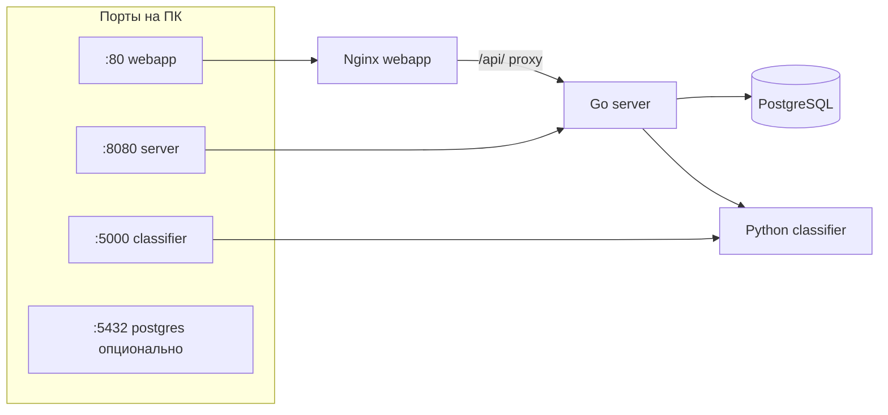

# Разбор: Docker и локальный запуск

**Файлы:** `docker-compose.yml`, `Dockerfile.server`, `Dockerfile.classifier`, `Dockerfile.webapp`, `.env`  
**Связь:** [server-overview.md](./server-overview.md), [webapp-overview.md](./webapp-overview.md)

---

## Зачем четыре сервиса



| Сервис | Образ | Роль |
|--------|-------|------|
| **postgres** | `postgres:16-alpine` | чат, users, feedback, analytics |
| **classifier** | `Dockerfile.classifier` | CV + Chroma RAG |
| **server** | `Dockerfile.server` | API, LLM, оркестрация |
| **webapp** | `Dockerfile.webapp` | HTML + nginx → server |

---

## Команды (корень проекта)

```bash
cp .env.example .env   # заполнить LLM_API_KEY, ADMIN_PASSWORD и т.д.
docker compose up -d --build
```

Полезное:

```bash
docker compose ps
docker compose logs -f server
docker compose logs -f classifier
docker compose restart server
docker compose up -d --force-recreate server   # подхватить .env
docker compose down
docker compose down -v   # удалить volumes (БД, chroma, uploads!)
```

Makefile: `make up`, `make logs`, `make smoke` — см. `Makefile`.

---

## Volumes (данные между перезапусками)

| Volume | Где | Что хранит |
|--------|-----|------------|
| `postgres_data` | postgres | таблицы чата |
| `chroma_data` | classifier `/app/chroma_db` | индекс RAG |
| `models` | classifier `/app/models` | `.pth` (не папка `./models` на хосте!) |
| `uploads_data` | server `/data/uploads` | фото пользователей |

**Bind mount (с хоста):**

| Путь хоста | Контейнер | Назначение |
|------------|-----------|------------|
| `./data` | classifier `:ro`, server `/app/data` | статьи `.txt` |
| `./webapp/*.html`, `nginx.conf` | webapp | UI без rebuild |
| `./classifier`, `./rag` | classifier `:ro` | dev (код) |

Важно: `MODEL_PATH=../models/apple_classifier.pth` смотрит в **volume `models`**, не в `doctor_gardens_ai/models/` на диске. Чтобы использовать локальную папку — сменить compose на `./models:/app/models`.

---

## Сервис `postgres`

- User/password/db: `gardener` / `gardener` / `gardener`
- `DATABASE_URL` в server совпадает с compose
- Healthcheck `pg_isready` — server стартует после БД

---

## Сервис `classifier`

- Порт **5000**
- Env: `MODEL_PATH`, `ADMIN_SECRET`, `FORCE_RAG_REINDEX`, `CROPS_CONFIG_PATH`
- Healthcheck: долгий `start_period: 120s` (embeddings при первом RAG)
- Endpoints: `/health`, `/classify`, `/rag/context`, `/admin/reindex`, `/crops`

Первый запрос RAG может быть медленным (скачивание embedding-модели).

---

## Сервис `server`

- Порт **8080**
- Зависит от healthy `postgres` + `classifier`
- В образ: `main`, `migrations/`, `config/` → `/config`
- `MIGRATIONS_DIR=/migrations` — SQL при старте
- Монтирует `./data` в `/app/data` для админ upload
- `UPLOAD_DIR` на volume `uploads_data`

Ключевые env см. [server-overview.md](./server-overview.md).

Локальная разработка без Telegram:

```env
TELEGRAM_AUTH_DISABLED=true
```

затем `docker compose up -d --force-recreate server`.

---

## Сервис `webapp`

- Порт **80** → http://localhost/
- `index.html` — чат, `admin.html` — админка
- `location /api/` → proxy `http://server:8080/`

Пользователь открывает **localhost**, API идёт через nginx (initData с браузера при dev).

---

## Сеть между контейнерами

Имена DNS в compose:

- `http://classifier:5000` — из server
- `http://server:8080` — из webapp nginx
- `postgres:5432` — из server

С хоста: `localhost:8080` (прямо в Go), `localhost/api/` (через nginx).

---

## `.env` и compose

Compose подставляет `${VAR:-default}` из файла `.env` в корне:

- `LLM_API_KEY`, `TELEGRAM_BOT_TOKEN`
- `ADMIN_PASSWORD`, `ADMIN_SECRET`
- `TELEGRAM_AUTH_DISABLED`
- `FORCE_RAG_REINDEX`

Без `.env` часть значений пустая — LLM и админка не заработают.

---

## Типичные проблемы

| Проблема | Решение |
|----------|---------|
| server unhealthy | `docker compose logs server`, ждать postgres/classifier |
| classifier unhealthy 2 мин | норма при первом старте; смотреть логи |
| Изменения в `config/` не видны | config в **образе** server — `docker compose up -d --build server` |
| Статьи не в RAG | файл в `data/apple/`, затем reindex |
| Модель не грузится | положить `.pth` в volume models или bind `./models` |
| 401 в чате | `TELEGRAM_AUTH_DISABLED=true` + recreate server |

---

## CI vs локальный Docker

GitHub Actions **собирает** образы server/webapp, но **не** поднимает полный compose в CI. Локально — полный стек; CI — тесты и build. См. [github-ci.yml.md](./github-ci.yml.md).

---

## Краткий итог

`docker-compose.yml` — **оркестрация всего продукта**: одна команда поднимает UI, API, ML и БД. Понимание volumes и портов объясняет, почему `.env`, статьи, Chroma и фото «живут» в разных местах.
