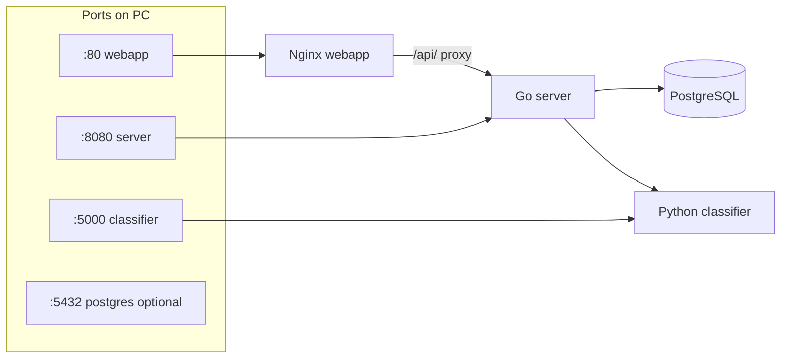

# Walkthrough: Docker and local run

**Files:** `docker-compose.yml`, `Dockerfile.server`, `Dockerfile.classifier`, `Dockerfile.webapp`, `.env`  
**Related:** [server-overview.md](./server-overview.md), [webapp-overview.md](./webapp-overview.md)

---

## Why four services



| Service | Image | Role |
|---------|-------|------|
| **postgres** | `postgres:16-alpine` | chat, users, feedback, analytics |
| **classifier** | `Dockerfile.classifier` | Flask `api/` + CV `cv/` + RAG `rag/` |
| **server** | `Dockerfile.server` | API, LLM, orchestration |
| **webapp** | `Dockerfile.webapp` | HTML + nginx → server |

---

## Commands (project root)

```bash
cp .env.example .env   # fill LLM_API_KEY, ADMIN_PASSWORD, etc.
docker compose up -d --build
```

Useful:

```bash
docker compose ps
docker compose logs -f server
docker compose logs -f classifier
docker compose restart server
docker compose up -d --force-recreate server   # pick up .env
docker compose down
docker compose down -v   # delete volumes (DB, chroma, uploads!)
```

Makefile: `make up`, `make logs`, `make smoke` — see `Makefile`.  
Compose project name: **`union_ai_apple`** (`name:` in `docker-compose.yml` = `PROJECT_NAME` in Makefile).

After changing Python entrypoint (`api/app.py` instead of legacy `api_server.py`) you must:

```bash
docker compose build --no-cache classifier
docker compose up -d --force-recreate classifier server webapp
```

---

## Volumes (data across restarts)

| Volume | Where | Stores |
|--------|-------|--------|
| `postgres_data` | postgres | chat tables |
| `chroma_data` | classifier `/app/chroma_db` | RAG vector index |
| `bm25_data` | classifier `/app/bm25_db` | RAG BM25 index |
| `models` | classifier `/app/models` | `.pth` (not host `./models` folder!) |
| `uploads_data` | server `/data/uploads` | user photos |

**Bind mount (from host):**

| Host path | Container | Purpose |
|-----------|-----------|---------|
| `./data` | classifier `:ro`, server `/app/data` | `.txt` articles |
| `./webapp/*.html`, `nginx.conf` | webapp | UI without rebuild |
| `./api`, `./cv`, `./rag` | classifier `:ro` | dev (Python code) |

Important: `MODEL_PATH=models/apple_classifier.pth` (from `/app` in container) points to **volume `models`**, not `doctor_gardens_ai/models/` on disk. To use a local folder — change compose to `./models:/app/models`.

---

## `postgres` service

- User/password/db: `gardener` / `gardener` / `gardener`
- `DATABASE_URL` in server matches compose
- Healthcheck `pg_isready` — server starts after DB

---

## `classifier` service (Python: `api/` + `cv/` + `rag/`)

- Port **5000** (published on `127.0.0.1` only), entrypoint: `gunicorn -c api/gunicorn.conf.py api.app:app`, runs as non-root (UID 1000)
- Env: `MODEL_PATH`, `ADMIN_SECRET`, `FORCE_RAG_REINDEX`, `CROPS_CONFIG_PATH`, `HF_TOKEN`, `RAG_*` (hybrid/rerank)
- Volumes: `chroma_data` → `/app/chroma_db`, `bm25_data` → `/app/bm25_db`
- Healthcheck: long `start_period: 120s` (embeddings + reranker on first RAG)
- Endpoints: `/health`, `/classify`, `/rag/context`, `/admin/reindex`, `/crops`

First RAG request may be slow (download e5 + reranker from HuggingFace).

---

## `server` service

- Port **8080**
- Depends on healthy `postgres` + `classifier`
- In image: `main`, `migrations/`, `config/` → `/config`
- `MIGRATIONS_DIR=/migrations` — SQL on startup
- Mounts `./data` to `/app/data` for admin upload
- `UPLOAD_DIR` on volume `uploads_data`

Key env see [server-overview.md](./server-overview.md).

Local dev without Telegram:

```env
TELEGRAM_AUTH_DISABLED=true
```

then `docker compose up -d --force-recreate server`.

---

## `webapp` service

- Port **80** → http://localhost/
- `index.html` — chat, `admin.html` — admin
- `location /api/` → proxy `http://server:8080/`
- Healthcheck: `GET /` (in Docker Desktop gray circle = “no healthcheck” until compose fix)

User opens **localhost**, API goes through nginx (initData from browser in dev).

---

## Network between containers

DNS names in compose:

- `http://classifier:5000` — from server
- `http://server:8080` — from webapp nginx
- `postgres:5432` — from server

From host: `localhost:8080` (direct to Go), `localhost/api/` (through nginx).

---

## `.env` and compose

Compose substitutes `${VAR:-default}` from `.env` in project root:

- `LLM_API_KEY`, `TELEGRAM_BOT_TOKEN`
- `ADMIN_PASSWORD`, `ADMIN_SECRET`
- `TELEGRAM_AUTH_DISABLED`
- `FORCE_RAG_REINDEX`

Without `.env` some values are empty — LLM and admin will not work.

---

## Common issues

| Problem | Solution |
|---------|----------|
| classifier Restarting, `api_server.py` not found | old image; `docker compose build classifier` and recreate |
| server unhealthy | `docker compose logs server`, wait for postgres/classifier |
| classifier unhealthy 2 min | normal on first start; check logs |
| webapp gray in UI | no healthcheck or server/classifier down; `docker compose ps` |
| Changes in `config/` | volume `./config:/config` (server, classifier); Go: `kill -HUP` or `CONFIG_RELOAD_INTERVAL_SEC` |
| Articles not in RAG | file in `data/apple/`, then reindex |
| Model not loading | put `.pth` in models volume or bind `./models` |
| 401 in chat | `TELEGRAM_AUTH_DISABLED=true` + recreate server |

---

## CI vs local Docker

GitHub Actions on PR: **go-test**, **python-test**, **docker-build** (server + webapp + classifier import smoke). Full compose and RAG eval **not** in PR CI — eval manual: workflow **RAG Eval**. Locally — full stack. See [github-ci.yml.md](./github-ci.yml.md), [BACKUPS.md](../BACKUPS.md).

**Metrics:** `GET http://localhost:8080/metrics` (server, no auth).

---

## Brief summary

`docker-compose.yml` — **orchestration of the whole product**: one command brings up UI, API, ML, and DB. Understanding volumes and ports explains why `.env`, articles, RAG indexes (`chroma_data`, `bm25_data`), and photos “live” in different places.
