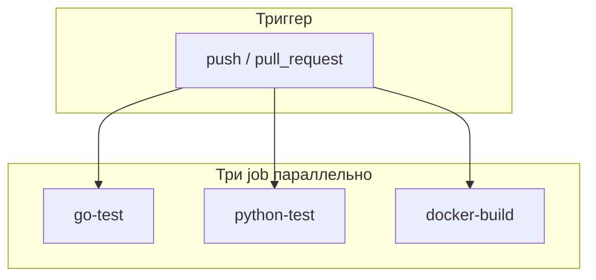

# Разбор: `.github/workflows/ci.yml`

**Исходный файл:** `.github/workflows/ci.yml`  
**Платформа:** [GitHub Actions](https://docs.github.com/en/actions)  
**Зачем:** автоматически проверять код при push и pull request — без ручного «а вдруг сломалось»

---

## Что такое CI простыми словами

**CI (Continuous Integration)** — «непрерывная интеграция».

Каждый раз, когда вы пушите код на GitHub или открываете Pull Request, GitHub запускает **виртуальную машину** (чистый Ubuntu), выполняет ваши команды (тесты, сборка) и показывает результат:

- ✅ зелёный — можно мержить;
- ❌ красный — что-то сломалось, нужно чинить до merge.

Вы **не обязаны** знать DevOps: достаточно понимать, что CI — это **робот-проверяльщик** на серверах GitHub.

---

## Когда запускается этот workflow

```yaml
on:
  push:
    branches: [master, main, "feature/**"]
  pull_request:
    branches: [master, main]
```

| Событие | Условие |
|---------|---------|
| **push** | В ветки `master`, `main` или любую `feature/...` (например `feature/session-6`) |
| **pull_request** | PR целится в `master` или `main` |

Push в случайную ветку `fix-bug` без префикса `feature/` — workflow **не запустится** (если не менять yaml).

Где смотреть результат: репозиторий на GitHub → вкладка **Actions** → workflow **CI**.

---

## Общая схема



Три задачи (**jobs**) идут **параллельно** — быстрее, чем по очереди.  
Если падает хотя бы одна — весь workflow считается failed.

---

## Job 1: `go-test` (тесты backend на Go)

```yaml
runs-on: ubuntu-latest
defaults:
  run:
    working-directory: server
```

### Что делает

1. **`actions/checkout@v4`** — скачивает код репозитория на runner.
2. **`actions/setup-go@v5`** — ставит Go **1.23** (как в `Dockerfile.server`).
   - `cache-dependency-path: server/go.sum` — кэширует зависимости Go между запусками (быстрее).
3. **`go mod tidy`** — приводит `go.mod` / `go.sum` в порядок (важно после добавления pgx и др.).
4. **`go test -v -count=1 ./...`** — все тесты в папке `server/`.

### Переменная окружения

```yaml
CROPS_CONFIG_PATH: ${{ github.workspace }}/config/crops.json
```

Тесты культур (`crops_test.go`) читают конфиг из корня проекта. На CI рабочая папка — весь репозиторий, путь задаётся явно.

### Зачем это вам

Ловит поломки в `rag_chat.go`, auth, admin **до merge**, без установки Go локально.

---

## Job 2: `python-test` (тесты Python)

```yaml
python-version: "3.11"
cache-dependency-path: tests/requirements-test.txt
```

### Что делает

1. Checkout кода.
2. Python **3.11** + кэш pip по `tests/requirements-test.txt`.
3. `pip install -r tests/requirements-test.txt` — лёгкие зависимости (pytest, без полного PyTorch).
4. `pytest tests/ -v --tb=short` — тесты верификатора RAG и `crops_config`.

```yaml
CROPS_CONFIG_PATH: config/crops.json
```

Относительный путь от корня репо (job без `working-directory: server`).

### Что **не** тестируется здесь

- Нет загрузки Chroma / LLM / тяжёлого PyTorch.
- Нет интеграционного «полного RAG end-to-end» — только unit-тесты в `tests/`.

### Зачем это вам

Проверяет логику `rag/verifier.py` и конфиг культур без GPU и без `.env` с ключами.

---

## Job 3: `docker-build` (сборка Docker-образов)

```yaml
docker build -f Dockerfile.server -t doctor-gardens-server:ci .
docker build -f Dockerfile.webapp -t doctor-gardens-webapp:ci .
```

### Что делает

Проверяет, что **Dockerfile’ы не сломаны**: зависимости копируются, `go build` проходит, Nginx/webapp собирается.

### Что **не** делает

- **Не** собирает `Dockerfile.classifier` (Python + PyTorch) — он тяжёлый и дольше; в CI сознательно урезали scope.
- **Не** запускает `docker compose up` и smoke-тесты — только `build`.
- **Не** пушит образы в registry — тег `:ci` локальный на runner, после job удаляется.

### Зачем это вам

Если в `server/go.sum` не хватает записей, `go-test` может пройти локально, а **docker build** упадёт на `go mod download` — CI как раз ловил такую ситуацию (фикс session 6).

---

## Сравнение трёх jobs

| Job | Проверяет | Нужен интернет | Типичная ошибка |
|-----|-----------|----------------|-----------------|
| `go-test` | Go unit-тесты | да (go modules) | сломанный тест, go.sum |
| `python-test` | pytest | да (pip) | verifier, crops config |
| `docker-build` | сборка образов | да (base images) | Dockerfile, go build в образе |

---

## Actions — что за `uses: actions/...`

Это готовые шаги от GitHub/сообщества:

| Action | Роль |
|--------|------|
| `checkout@v4` | git clone |
| `setup-go@v5` | установка Go |
| `setup-python@v5` | установка Python |

`@v4` / `@v5` — версия action (зафиксирована, не «latest»).

---

## Как это связано с вашим процессом

1. Работаете в ветке `feature/...` или `docs/project-knowledge-base`.
2. `git push` → GitHub запускает CI.
3. Открываете PR в `master` → CI снова на PR.
4. Все три job зелёные → можно мержить.
5. Красный job → открыть лог (Actions → run → job → шаг с ❌).

Локально перед push можно повторить то же:

```powershell
cd server; go mod tidy; go test ./...
pytest tests/ -v
docker build -f Dockerfile.server -t test-server .
```

(из корня проекта, с установленными Go/Python/Docker)

---

## Чего в CI пока нет (и это нормально)

- Деплой на сервер (CD) — отдельная тема.
- E2E smoke (`scripts/smoke.ps1`) — не в workflow.
- Eval RAG 30–50 вопросов — в плане, не в ci.yml.
- Сборка classifier-образа — долго, опционально добавить позже.

---

## Как безопасно менять ci.yml

| Хотите | Действие |
|--------|----------|
| Тесты на всех ветках | расширить `branches` в `on.push` |
| Добавить classifier build | третий `docker build -f Dockerfile.classifier` |
| Медленный CI | classifier build только на `master` |
| Python 3.12 | поменять `python-version` |

После изменения — push в feature-ветку и посмотреть Actions.

---

## Частые вопросы

### CI упал, локально тесты проходят

- На CI другая ОС (Linux) — редко, но пути/регистр файлов могут отличаться.
- Не закоммичен `go.sum` после `go mod tidy`.
- Нет `config/crops.json` в репо (должен быть в git).

### Нужно ли платить за Actions?

У публичных репозиториев — щедрые бесплатные минуты. Для учебного проекта обычно хватает.

### PR без CI

Проверьте имя целевой ветки (`main` vs `master`) и что workflow файл в ветке PR.

---

## Что читать дальше

| Тема | Файл |
|------|------|
| Что тестирует Go | `server/*_test.go`, [LEARNING_SESSION_6.md](../LEARNING_SESSION_6.md) |
| Что тестирует Python | `tests/test_verifier.py`, `tests/test_crops_config.py` |
| Локальный запуск | `docker-compose.yml`, `Makefile` |
| Smoke вручную | `scripts/smoke.ps1`, `scripts/smoke.sh` |

---

## Краткий итог

`ci.yml` — три автоматические проверки на GitHub: **Go-тесты**, **Python-тесты**, **сборка Docker server + webapp**. Запускается на push в `master`/`main`/`feature/**` и на PR в main-ветки. Это страховка перед merge, не магия DevOps: те же команды, что вы могли бы выполнить в терминале, только на чистой Ubuntu в облаке.
