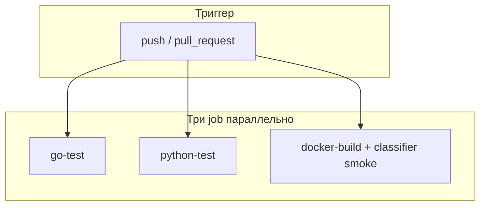

# Разбор: `.github/workflows/ci.yml` и RAG Eval

**Исходные файлы:**
- `.github/workflows/ci.yml` — на каждый push/PR
- `.github/workflows/rag-eval.yml` — **только вручную** (полный retrieval eval)

**Платформа:** [GitHub Actions](https://docs.github.com/en/actions)

---

## Что такое CI простыми словами

**CI (Continuous Integration)** — при push или Pull Request GitHub запускает виртуальную машину (Ubuntu), выполняет тесты и сборку, показывает ✅ или ❌.

---

## Когда запускается `ci.yml`

```yaml
on:
  push:
    branches: [master, main, "feature/**", "fix/**", "feat/**"]
  pull_request:
    branches: [master, main]
```

| Событие | Условие |
|---------|---------|
| **push** | В `master`, `main`, `feature/**`, `fix/**`, `feat/**` |
| **pull_request** | PR в `master` или `main` |

`concurrency` отменяет старый run при новом push в ту же ветку — экономит минуты Actions.

Результат: репозиторий → **Actions** → workflow **CI**.

---

## Общая схема CI (PR)



Типичное время: **~10–15 минут** (без reindex и без полного RAG eval).

---

## Job 1: `go-test`

- Go **1.23**, `working-directory: server`
- `go mod tidy` → `go test -v -count=1 ./...`
- `CROPS_CONFIG_PATH: ${{ github.workspace }}/config/crops.json`

Покрытие: verify, crops, admin, auth, rate limit, feedback report, контракт verify.

---

## Job 2: `python-test`

- Python **3.11**, `pytest tests/ -v --tb=short`
- Зависимости: `tests/requirements-test.txt` (без PyTorch/Chroma)
- Ожидание: **45 passed**

---

## Job 3: `docker-build`

- `scripts/docker_build.sh` — образы **server**, **webapp**, **classifier**
- Classifier: `SKIP_HF_BAKE=1` (без запекания HF-моделей в образ на CI)
- Smoke в контейнере: import torch 2.5 CPU, `load_all_documents()` из `data/`

**Не делает:** `docker compose up`, reindex, `run_rag_eval.py`, push в registry.

---

## RAG Eval — отдельный workflow (ручной)

**Файл:** `.github/workflows/rag-eval.yml`  
**Триггер:** `workflow_dispatch` (Actions → **RAG Eval** → Run workflow)

Почему не в каждом PR: reindex + embeddings на CPU в GHA занимает **20–45+ минут**.

### Параметры

| Input | Значения |
|-------|----------|
| `suite` | `apple`, `pear`, `plum`, `demo_hr`, `all` |

### Что делает job `rag-eval`

1. Сборка classifier-образа
2. В контейнере: `reindex_rag.py` → `run_rag_eval.py --suite … --in-process --fast`
3. `RAG_RERANK_ENABLED=false` на CI (ускорение; локально reranker включён)
4. Секрет **`HF_TOKEN`** в настройках репозитория (опционально, ускоряет HF)

Локальный аналог:

```bash
python scripts/run_rag_eval.py --suite all --timeout 300
```

(нужен запущенный classifier или `--in-process`)

---

## Сравнение

| Workflow | Когда | Длительность | Что проверяет |
|----------|-------|--------------|---------------|
| **CI** | каждый PR | ~10–15 мин | unit-тесты, сборка образов |
| **RAG Eval** | вручную | до ~45 мин | retrieval regression на JSONL |

---

## Локально перед push

```powershell
cd server; go mod tidy; go test ./...
pytest tests/ -v
docker build -f Dockerfile.server -t test-server .
```

Полный eval — перед релизом или после смены `data/`:

```powershell
python scripts/run_rag_eval.py --suite all
```

---

## Чего в CI нет (нормально)

- Деплой на сервер (CD)
- E2E smoke в workflow (`scripts/smoke.ps1` — вручную после `compose up`)
- End-to-end eval с LLM (`--full`)

---

## Связанные документы

| Тема | Файл |
|------|------|
| Go-тесты | `server/*_test.go`, [tests-overview.md](./tests-overview.md) |
| Python-тесты | [tests-overview.md](./tests-overview.md) |
| Eval-наборы | [eval/README.md](../../eval/README.md) |
| Качество RAG | [quality-eval-and-rag-logs.md](./quality-eval-and-rag-logs.md) |

---

## Краткий итог

**CI** — быстрая страховка: Go + Python unit + Docker build. **RAG Eval** — тяжёлая регрессия retrieval, запускается вручную когда меняется корпус или RAG-код.
