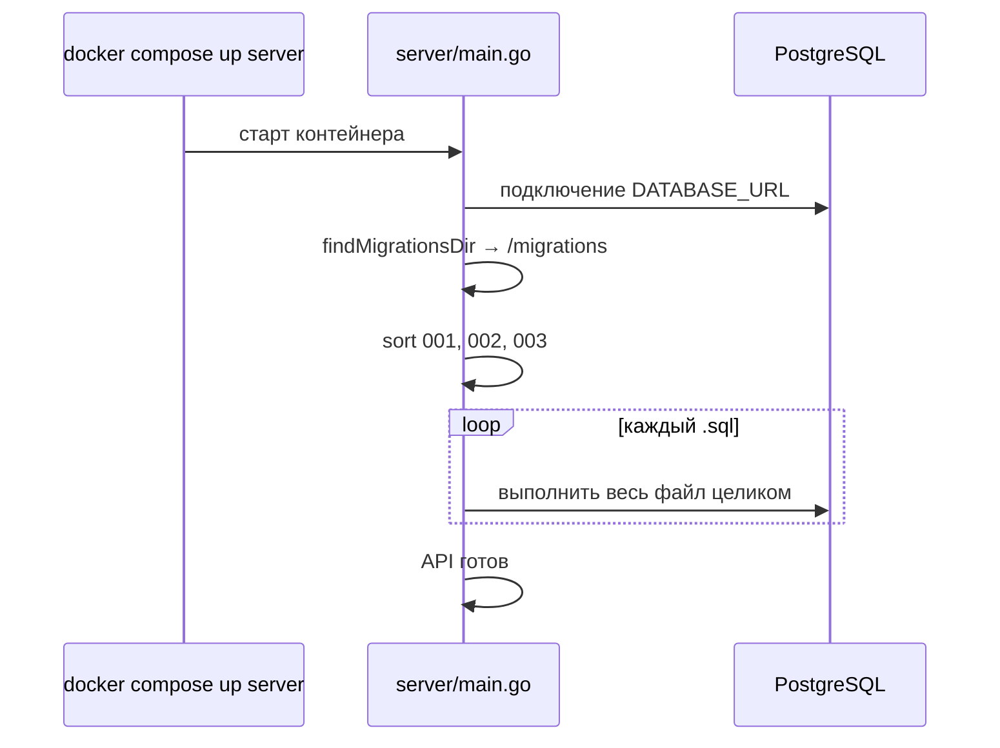

# Разбор: миграции PostgreSQL (`migrations/*.sql`)

**Папка:** `migrations/`  
**Файлы:** `001_init.sql`, `002_crop_id.sql`, `003_feedback_analytics.sql`  
**Кто применяет:** Go-сервер при старте (`server/postgres_store.go` → `runAllMigrations`)  
**СУБД:** PostgreSQL 16 (контейнер `postgres` в `docker-compose.yml`)

---

## Что такое миграция простыми словами

**Миграция** — SQL-скрипт, который **меняет структуру базы данных** (таблицы, колонки, индексы).

Зачем не править БД руками в pgAdmin:

- одна и та же схема у вас, у коллеги и на сервере;
- изменения в Git — видно историю («сессия 2 добавила messages»);
- при новом деплое сервер сам накатывает скрипты.

У вас **три файла по порядку номера** — это эволюция схемы, а не три разные базы.

---

## Как миграции запускаются в этом проекте



### Важные детали (не как в «большом» DevOps)

1. **Нет таблицы `schema_migrations`** — проект **не запоминает**, какие файлы уже применялись.
2. При **каждом старте** server снова выполняет **все** `.sql` по алфавиту (`001` → `002` → `003`).
3. Поэтому везде используют **`IF NOT EXISTS`** / **`ADD COLUMN IF NOT EXISTS`** — повторный запуск не падает.

Это проще для обучения, но для продакшена с сотней миграций обычно добавляют учёт версий (Flyway, golang-migrate). Пока у вас 3 файла — схема работает.

### Где лежат файлы в Docker

- `Dockerfile.server`: `COPY migrations /migrations`
- `docker-compose.yml`: `MIGRATIONS_DIR=/migrations`

Локально без Docker Go ищет папку `migrations` или `../migrations`.

---

## Базовый синтаксис SQL (шпаргалка)

### Комментарии

```sql
-- одна строка
```

### Типы данных (что встречается у вас)

| Тип | Смысл |
|-----|--------|
| `BIGSERIAL` | целое auto-increment (id сообщения, пользователя) |
| `BIGINT` | большое целое (telegram_id) |
| `TEXT` | строка произвольной длины |
| `TIMESTAMPTZ` | дата+время с часовым поясом |
| `DOUBLE PRECISION` | дробное (confidence CV) |
| `SMALLINT` | малое целое (-1, 1 для лайка) |
| `JSONB` | JSON в бинарном виде (аналитика) |

### `PRIMARY KEY`

Уникальный идентификатор строки. Одна строка — один id.

### `NOT NULL`

Поле обязательно (нельзя пустое).

### `DEFAULT`

Значение по умолчанию при вставке, если не указали:

```sql
created_at TIMESTAMPTZ NOT NULL DEFAULT NOW()
crop_id TEXT NOT NULL DEFAULT 'apple'
```

### `UNIQUE`

Значение не повторяется в таблице (у вас `telegram_id` у пользователя).

### `REFERENCES ... ON DELETE CASCADE`

**Внешний ключ:** строка ссылается на другую таблицу.

- `messages.session_id` → `chat_sessions.id`
- При удалении сессии **каскадом** удаляются все её сообщения.

`ON DELETE SET NULL` (в analytics): при удалении user поле `user_id` станет NULL, событие останется.

### `CHECK`

Ограничение на допустимые значения:

```sql
CHECK (role IN ('user', 'assistant'))
CHECK (rating IN (-1, 1))
```

### `CREATE INDEX`

Ускоряет поиск/сортировку по колонке (цена — место на диске и чуть медленнее INSERT).

```sql
CREATE INDEX IF NOT EXISTS idx_messages_session_created
  ON messages (session_id, created_at);
```

### `CREATE TABLE IF NOT EXISTS`

Создать таблицу только если её ещё нет — безопасно при повторном запуске миграции.

### `ALTER TABLE ... ADD COLUMN IF NOT EXISTS`

Добавить колонку в существующую таблицу (миграция 002), не ломая старые данные.

---

## Файл `001_init.sql` — фундамент (сессия 2)

Три таблицы + связи.

### `users` — кто пишет в чат

| Колонка | Назначение |
|---------|------------|
| `id` | внутренний id в БД |
| `telegram_id` | id из Telegram, **UNIQUE** |
| `username`, `first_name`, `last_name` | профиль |
| `created_at`, `updated_at` | метки времени |

### `chat_sessions` — один «диалог»

| Колонка | Назначение |
|---------|------------|
| `id` | TEXT (случайный hex из Go), не auto-increment |
| `user_id` | → `users.id`, CASCADE при удалении user |
| `created_at`, `updated_at` | когда открыли/обновили сессию |

Индекс `idx_chat_sessions_user_id` — быстро найти все сессии пользователя.

### `messages` — сообщения в сессии

| Колонка | Назначение |
|---------|------------|
| `id` | BIGSERIAL |
| `session_id` | → `chat_sessions.id` |
| `role` | `user` или `assistant` |
| `content` | текст |
| `kind` | тип (текст/фото и т.д. — логика в Go) |
| `image_token` | ссылка на файл фото на диске, не base64 в БД |
| `class_prediction`, `class_confidence` | результат CV |
| `created_at` | порядок в чате |

Индекс `(session_id, created_at)` — история чата по времени.

### Схема связей

```
users (1) ──< chat_sessions (N) ──< messages (N)
```

---

## Файл `002_crop_id.sql` — мультикультура (сессия 3)

Не создаёт новую таблицу, **расширяет** `chat_sessions`:

```sql
ALTER TABLE chat_sessions
    ADD COLUMN IF NOT EXISTS crop_id TEXT NOT NULL DEFAULT 'apple';
```

- Каждая сессия помнит выбранную культуру (яблоня, груша…).
- Старые сессии без колонки получат `'apple'` по DEFAULT.
- Индекс по `crop_id` — если понадобится аналитика по культурам.

Порядок файлов важен: **002 только после 001**, иначе таблицы `chat_sessions` ещё нет.

---

## Файл `003_feedback_analytics.sql` — UX и метрики (сессия 5)

### `message_feedback` — 👍 / 👎

| Колонка | Назначение |
|---------|------------|
| `message_id` | → `messages.id`, CASCADE |
| `user_id` | → `users.id` |
| `rating` | `-1` или `1` |
| `UNIQUE (message_id, user_id)` | один голос пользователя на сообщение |

### `analytics_events` — события для статистики

| Колонка | Назначение |
|---------|------------|
| `event_type` | строка-код события (onboarding, и т.д.) |
| `payload` | JSONB — произвольные поля |
| `user_id` | опционально, SET NULL если user удалён |

Индекс `(event_type, created_at DESC)` — выборка «последние события типа X».

Зависит от **001**: нужны `users` и `messages`.

---

## Порядок и именование файлов

```
001_init.sql
002_crop_id.sql
003_feedback_analytics.sql
```

Go делает `sort.Strings` → порядок по имени. Префикс `001_`, `002_` — **договорённость команды**, не магия PostgreSQL.

**Новая миграция:** `004_что_то.sql`, не менять старые файлы после merge в prod (только добавлять новые).

---

## Как Go использует эти таблицы (куда смотреть код)

| Таблица | Пример в коде |
|---------|----------------|
| `users` | `UpsertUser` в `postgres_store.go` |
| `chat_sessions` | создание сессии, `crop_id` |
| `messages` | сохранение чата, CV-поля |
| `message_feedback` | `server/feedback.go` |
| `analytics_events` | `server/analytics_store.go` |

---

## Практика: проверить БД вручную

```bash
docker compose exec postgres psql -U gardener -d gardener
```

```sql
\dt                    -- список таблиц
\d messages            -- структура таблицы
SELECT COUNT(*) FROM messages;
SELECT rating, COUNT(*) FROM message_feedback GROUP BY rating;
```

---

## Частые вопросы

### Удалил volume postgres — что будет?

Пустая БД. При старте server снова выполнит 001→002→003, таблицы создадутся заново. **Данные чата пропадут** (если volume не бэкапили).

### Можно ли изменить `001_init.sql` после деплоя?

На уже существующей БД — **опасно**: `CREATE TABLE IF NOT EXISTS` не обновит старую схему. Правильно: новый файл `004_...sql` с `ALTER TABLE`.

### Почему `session_id` TEXT, а не число?

Go генерирует случайный hex (`newSessionID`) — удобно отдавать в API без sequential id.

### Миграции и RAG/Chroma

**Не связаны.** Статьи — файлы + Chroma; миграции — только PostgreSQL (чат, пользователи, feedback).

---

## Краткий итог

| Файл | Что добавляет |
|------|----------------|
| **001** | users, chat_sessions, messages + индексы |
| **002** | колонка `crop_id` в сессии |
| **003** | message_feedback, analytics_events |

Миграции — это **версионированная схема БД на SQL**. В проекте их применяет Go при каждом старте, безопасно за счёт `IF NOT EXISTS`. Понимание синтаксиса `CREATE`, `ALTER`, `REFERENCES`, `CHECK`, `INDEX` — база для чтения любого нового `00N_*.sql`.
