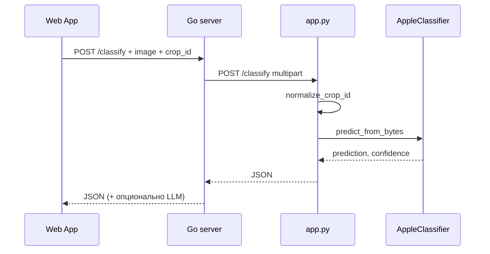

# Разбор: `api/app.py`

**Исходный файл:** `api/app.py`  
**Язык:** Python (Flask), **не Go**  
**Связанные модули:** `cv/registry.py`, `cv/apple_classifier.py`, `rag/retrieval.py`, `rag/vector_store.py`, `rag/crops_config.py`  
**Кто вызывает:** Go-сервер (`server/classifier_client.go`, `server/classify_handler.go`) по HTTP

---

## Зачем этот файл

Отдельный **веб-сервер на Python**, слушает порт (по умолчанию **5000**). В Docker — контейнер `classifier`.

| Эндпоинт | Назначение |
|----------|------------|
| `POST /classify` | Распознать болезнь/состояние по фото |
| `POST /rag/context` | Найти фрагменты статей для текстового вопроса (без LLM) |
| `GET /crops` | Список культур из конфига |
| `GET /health` | Проверка, что сервис жив |
| `POST /admin/reindex` | Пересобрать Chroma + BM25 |

Go ходит сюда, например: `http://classifier:5000/classify` (см. `CLASSIFIER_URL`, `CLASSIFIER_RAG_URL` в `.env`).

---

## Подготовка окружения (строки 1–20)

```python
_root = os.path.abspath(os.path.join(os.path.dirname(__file__), ".."))
sys.path.insert(0, _root)
load_dotenv(os.path.join(_root, ".env"))
```

- **`_root`** — корень проекта (папка на уровень выше `api/`).
- **`sys.path.insert`** — чтобы работали импорты `from rag...`, `from cv...`.
- **`load_dotenv`** — переменные из `.env` (порты, секреты, пути к моделям).

Импорты:

- `get_classifier_for_crop` — CV-модель для культуры (`cv/registry.py`).
- `retrieve_rag_context` — поиск по статьям (`rag/retrieval.py`).
- `vector_store` — переиндексация Chroma и BM25.

---

## Flask-приложение (строки 22–23)

```python
app = Flask(__name__)
CORS(app)
```

**Flask** — URL привязан к функции-обработчику.  
**CORS** — разрешает запросы с другого origin (браузер, dev).

---

## `POST /classify` — классификация фото

**Цепочка:** Web App → Go `POST /classify` → Python `POST /classify` → JSON обратно в Go.

### Шаги обработчика `classify_image()`

1. **`crop_id`** — из формы (`request.form`) или query (`request.args`), по умолчанию `"apple"`.
2. **`normalize_crop_id(crop_id)`** — проверка по `config/crops.json`; неверная культура → HTTP 400.
3. **Файл `image`** — обязателен в `request.files` (multipart, как в HTML-форме).
4. Проверки: пустое имя файла, нулевой размер → 400.
5. **`image_bytes = file.read()`** — сырые байты картинки.
6. **`get_classifier_for_crop(crop_id)`** (`registry.py`):
   - если `cv_enabled: false` для культуры → `ValueError` → 400;
   - иначе создаётся/берётся из кэша `AppleClassifier`;
   - веса: `MODEL_PATH` или `MODEL_PATH_{CROP}`; если файла нет — backbone ImageNet без вашего `.pth`.
7. **`clf.predict_from_bytes(image_bytes)`** (`apple_classifier.py`):
   - PIL открывает изображение;
   - resize 224×224, нормализация;
   - PyTorch inference → класс (`apple_scab`, `healthy_leaf`, …) и **confidence**;
   - в JSON также **top-3** предсказания.
8. В ответ добавляется **`crop_id`**, Content-Type `application/json; charset=utf-8`.

### Пример успешного ответа

```json
{
  "success": true,
  "prediction": "apple_scab",
  "confidence": 0.87,
  "top_predictions": [
    {"label": "apple_scab", "confidence": 0.87},
    {"label": "powdery_mildew", "confidence": 0.08}
  ],
  "image_processed": true,
  "crop_id": "apple"
}
```

### Коды ошибок

| Ситуация | HTTP |
|----------|------|
| Нет файла / пустой файл | 400 |
| Культура без CV / неверный crop_id | 400 |
| Сбой модели / неожиданная ошибка | 500 |

### Как Go отправляет запрос (справка)

В `server/classifier_client.go`, функция `sendToClassifier`:

- multipart с полем **`image`** (байты JPEG) и **`crop_id`**;
- POST на `CLASSIFIER_URL` (обычно `http://classifier:5000/classify`).

---

## `POST /rag/context` — только retrieval

**Цепочка:** пользователь пишет текст → Go → Python `/rag/context` → Go + LLM → ответ пользователю.

**Тело запроса (JSON):**

```json
{
  "question": "Какие признаки парши?",
  "crop_id": "apple"
}
```

**Обработчик `rag_context()`:**

- пустой `question` → 400;
- `retrieve_rag_context(question, crop_id)` в `rag/retrieval.py`:
  - hybrid search (vector + BM25 + reranker);
  - сбор **context** (тексты фрагментов);
  - **few_shot** по категории вопроса;
  - **fragments** для верификации на стороне Go.

**Важно:** LLM здесь **не вызывается**. Ответ пользователю собирает Go в `server/rag_chat.go`.

HTTP статус обычно 200; внутри JSON: `success: true/false`, при ошибке — поле `error`.

---

## `GET /crops`

Возвращает данные из **`config/crops.json`** (список культур, `cv_enabled`, `rag_enabled` и т.д.). Используется UI и для проверок.

---

## `GET /health`

```json
{"status": "healthy", "service": "garden-python"}
```

Smoke-тесты и проверка Docker.

---

## `POST /admin/reindex`

**Защита:** заголовок `X-Admin-Secret` = `ADMIN_SECRET` из `.env`, иначе 403.

**Действия:**

1. `vs.reset_vector_store()` — сброс in-memory кэша.
2. `vs.load_vector_store(force_reindex=True)` — чтение `data/{crop}/*.txt`, chunking, embeddings → `chroma_db/`, BM25 → `bm25_db/`.

Go-админка после upload `.txt` вызывает этот эндпоинт через `PYTHON_BASE_URL` + `/admin/reindex`.

---

## Запуск сервера (строки 103–106)

```python
if __name__ == "__main__":
    port = int(os.environ.get("CLASSIFIER_PORT", 5000))
    app.run(host="0.0.0.0", port=port, debug=False)
```

Локально: `python app.py` → порт 5000. В Docker — через `Dockerfile.classifier`.

---

## Общая схема (без углубления в Go)

```
Браузер (webapp)
    → Go :8080  (auth, лимиты, БД)
        → Python :5000/classify      (фото)
        → Python :5000/rag/context  (текст: только контекст)
    → Go вызывает LLM API
    → ответ пользователю
```

### Sequence: фото



---

## Что читать дальше

| Тема | Файл |
|------|------|
| Выбор и кэш модели | [cv-registry.md](./cv-registry.md) |
| PyTorch inference | `cv/apple_classifier.py` |
| RAG-поиск | `rag/retrieval.py`, `rag/vector_store.py` |
| Кто зовёт Python | `server/classifier_client.go` (`sendToClassifier`), `server/classify_handler.go` (`handleClassification`) |

---

## Краткий итог

`app.py` — **тонкий HTTP-слой**: валидация входа, делегирование в `cv/*` и `rag/*`, JSON на выходе. CV — PyTorch; RAG-поиск — Chroma + BM25 hybrid + reranker; LLM в этом файле **не участвует**.
