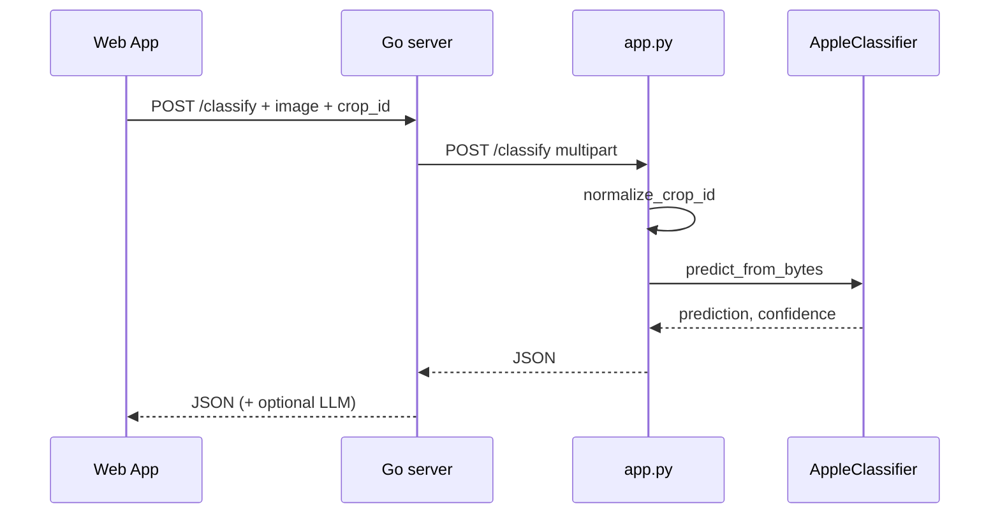

# Walkthrough: `api/app.py`

**Source file:** `api/app.py`  
**Language:** Python (Flask), **not Go**  
**Related modules:** `cv/registry.py`, `cv/apple_classifier.py`, `rag/retrieval.py`, `rag/vector_store.py`, `rag/crops_config.py`  
**Called by:** Go server (`server/classifier_client.go`, `server/classify_handler.go`) over HTTP

---

## Why this file exists

Separate **Python web server**, listens on port (default **5000**). In Docker — container `classifier`.

| Endpoint | Purpose |
|----------|---------|
| `POST /classify` | Recognize disease/condition from photo |
| `POST /rag/context` | Find article fragments for text question (no LLM) |
| `GET /crops` | Crop list from config |
| `GET /health` | Service liveness |
| `POST /admin/reindex` | Rebuild Chroma + BM25 |

Go calls here, e.g.: `http://classifier:5000/classify` (see `CLASSIFIER_URL`, `CLASSIFIER_RAG_URL` in `.env`).

---

## Environment setup (top of file)

```python
_root = os.path.abspath(os.path.join(os.path.dirname(__file__), ".."))
sys.path.insert(0, _root)
load_dotenv(os.path.join(_root, ".env"))
```

- **`_root`** — project root (folder one level above `api/`).
- **`sys.path.insert`** — so `from rag...`, `from cv...` work.
- **`load_dotenv`** — variables from `.env` (ports, secrets, model paths).

Imports:

- `get_classifier_for_crop`, `ModelWeightsUnavailableError` — CV model for crop (`cv/registry.py`).
- `retrieve_rag_context` — article search (`rag/retrieval.py`).
- `vector_store` — Chroma and BM25 reindex.
- `warmup_rag` — model preloading (`rag/warmup.py`).

---

## Flask app and upload limit

```python
MAX_UPLOAD_BYTES = int(os.environ.get("MAX_UPLOAD_BYTES", str(10 * 1024 * 1024)))

app = Flask(__name__)
app.config["MAX_CONTENT_LENGTH"] = MAX_UPLOAD_BYTES + 512 * 1024  # multipart overhead
CORS(app, origins=_cors_origins, supports_credentials=True)
```

**Flask** — URL bound to handler function.  
**`MAX_UPLOAD_BYTES`** — upload cap for `/classify` photos (env, default **10 MB**). `MAX_CONTENT_LENGTH` is set slightly higher (+512 KB) to allow multipart overhead; Flask rejects larger requests with **413**.  
**CORS** — restricted to origins from `CORS_ALLOWED_ORIGINS` env (default `http://localhost,http://127.0.0.1`), with credentials support.

---

## `POST /classify` — photo classification

**Chain:** Web App → Go `POST /classify` → Python `POST /classify` → JSON back to Go.

### Handler `classify_image()` steps

1. **`crop_id`** — from form (`request.form`) or query (`request.args`), default `"apple"`.
2. **`normalize_crop_id(crop_id)`** — check against `config/crops.json`; invalid crop → HTTP 400.
3. **File `image`** — required in `request.files` (multipart, like HTML form).
4. Checks: empty filename, zero size → 400.
5. **`image_bytes = file.read(MAX_UPLOAD_BYTES + 1)`** — raw image bytes; if more than `MAX_UPLOAD_BYTES` → **413** "Image too large".
6. **`get_classifier_for_crop(crop_id)`** (`registry.py`):
   - if `cv_enabled: false` for crop → `ValueError` → 400;
   - else creates/gets from cache `AppleClassifier` (thread-safe lazy loading);
   - weights: `MODEL_PATH` or `MODEL_PATH_{CROP}`; if the file is missing or fails to load — `ModelWeightsUnavailableError` → **503** (no untrained fallback).
7. **`clf.predict_from_bytes(image_bytes)`** (`apple_classifier.py`):
   - PIL opens image;
   - resize 224×224, normalization;
   - PyTorch inference → class (`apple_scab`, `healthy_leaf`, …) and **confidence**;
   - JSON also includes **top-3** predictions.
8. Response adds **`crop_id`**, Content-Type `application/json; charset=utf-8`.

### Example success response

```json
{
  "success": true,
  "prediction": "apple_scab",
  "confidence": 0.87,
  "top_predictions": [
    {"label": "apple_scab", "confidence": 0.87},
    {"label": "powdery_mildew", "confidence": 0.08}
  ],
  "image_processed": true,
  "crop_id": "apple"
}
```

### Error codes

| Situation | HTTP |
|-----------|------|
| No file / empty file | 400 |
| Crop without CV / invalid crop_id | 400 |
| Image larger than `MAX_UPLOAD_BYTES` (or request over `MAX_CONTENT_LENGTH`) | 413 |
| Model weights missing/broken (`ModelWeightsUnavailableError`) | 503 |
| Unexpected error | 500 (generic `"Internal error"`; details only in server logs) |

### How Go sends request (reference)

In `server/classifier_client.go`, function `sendToClassifier`:

- multipart with field **`image`** (JPEG bytes) and **`crop_id`**;
- POST to `CLASSIFIER_URL` (usually `http://classifier:5000/classify`).

---

## `POST /rag/context` — retrieval only

**Chain:** user types text → Go → Python `/rag/context` → Go + LLM → answer to user.

**Request body (JSON):**

```json
{
  "question": "What are scab symptoms?",
  "crop_id": "apple"
}
```

**Handler `rag_context()`:**

- empty `question` → 400;
- `retrieve_rag_context(question, crop_id)` in `rag/retrieval.py`:
  - hybrid search (vector + BM25 + reranker);
  - build **context** (fragment texts);
  - **few_shot** by question category;
  - **fragments** for verification on Go side.

**Important:** LLM is **not** called here. User answer is assembled by Go in `server/rag_chat.go`.

HTTP status: **200** if `success: true`, **422** if retrieval reports `success: false`; unexpected error → **500** with generic `"Internal error"` (details only in logs). On failure JSON contains field `error`.

---

## `GET /crops`

Returns data from **`config/crops.json`** (crop list, `cv_enabled`, `rag_enabled`, etc.). Used by UI and checks.

---

## `GET /health`

```json
{"status": "healthy", "service": "garden-python"}
```

Smoke tests and Docker health.

---

## `POST /admin/reindex`

**Protection:** header `X-Admin-Secret` compared to `ADMIN_SECRET` from `.env` via `hmac.compare_digest` (constant-time); missing/wrong secret → 403.

**Actions:**

1. `vs.reset_vector_store()` — reset in-memory cache.
2. `vs.load_vector_store(force_reindex=True)` — read `data/{crop}/*.txt`, chunking, embeddings → `chroma_db/`, BM25 → `bm25_db/`. If there are no articles to index → 400.

Go admin after `.txt` upload calls this endpoint via `PYTHON_BASE_URL` + `/admin/reindex`.

---

## Server run (bottom of file)

```python
if __name__ == "__main__":
    port = int(os.environ.get("CLASSIFIER_PORT", 5000))
    if os.environ.get("USE_GUNICORN", "").lower() in ("1", "true", "yes"):
        # exec gunicorn -c api/gunicorn.conf.py api.app:app
        ...
    warmup_rag()
    app.run(host="0.0.0.0", port=port, debug=False, threaded=True)
```

- **`USE_GUNICORN=1`** — production mode: launches **gunicorn** with `api/gunicorn.conf.py` (1 worker by default + `gthread` threads, `preload_app = False` so PyTorch doesn't initialize before fork; RAG warmup happens in `post_fork`).
- Otherwise — Flask dev server (threaded), with `warmup_rag()` called before start.

Locally: `python app.py` → port 5000. In Docker — via `Dockerfile.classifier`.

---

## Overall diagram (without Go detail)

```
Browser (webapp)
    → Go :8080  (auth, limits, DB)
        → Python :5000/classify      (photo)
        → Python :5000/rag/context  (text: context only)
    → Go calls LLM API
    → answer to user
```

### Sequence: photo



---

## What to read next

| Topic | File |
|-------|------|
| Model selection and cache | [cv-registry.md](./cv-registry.md) |
| PyTorch inference | `cv/apple_classifier.py` |
| RAG search | `rag/retrieval.py`, `rag/vector_store.py` |
| Who calls Python | `server/classifier_client.go` (`sendToClassifier`), `server/classify_handler.go` (`handleClassification`) |

---

## Brief summary

`app.py` — **thin HTTP layer**: input validation, delegate to `cv/*` and `rag/*`, JSON out. CV — PyTorch; RAG search — Chroma + BM25 hybrid + reranker; LLM does **not** participate in this file.
