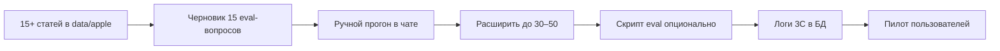

# План: Eval RAG (3B) и логи RAG (3C)

**Статус:** запланировано, в коде **ещё не реализовано** — дорожная карта качества после базового RAG.  
**Связь:** [../ROADMAP.md](../ROADMAP.md), [server-rag_chat.md](./server-rag_chat.md), [data-pipeline.md](./data-pipeline.md)

---

## Зачем это нужно

Сейчас качество проверяют вручную в чате и unit-тестами верификатора чисел. Для роста до **Middle-уровня продукта** и пилота нужно:

1. **Воспроизводимый eval** — набор вопросов + прогон после каждого reindex/смены модели.
2. **Наблюдаемость** — понять, *почему* ответ плохой (какие чанки, прошёл ли verify, был ли 👎).

---

## Фаза 3B — Eval-набор (30–50 Q&A)

### Цель

Регрессии RAG: не сломать ответы после новых статей, смены `LLM_MODEL`, правки промпта.

### Что подготовить

Файл (предложение): `eval/rag_apple_baseline.jsonl` — по одной строке JSON на вопрос:

```json
{
  "crop_id": "apple",
  "question": "Какие признаки парши на листьях?",
  "expect_contains": ["пятн", "парша"],
  "expect_numbers_from_context": false,
  "notes": "эталон вручную после просмотра ответа с текущим индексом"
}
```

Или проще на старте: таблица в CSV / Markdown с колонками: вопрос | допустим ли ответ «нет в материалах» | ключевые слова | эталонный фрагмент.

### Минимум 30–50 вопросов для яблони

| Категория | Доля | Примеры |
|-----------|------|---------|
| disease | ~30% | парша, пятна, лечение |
| fertilizer | ~30% | дозы, подкормка (с цифрами из статей) |
| variety | ~20% | сорта, рентабельность, склон |
| general / edge | ~20% | вопрос вне статей → «нет в материалах» |

Часть вопросов взять из [config/onboarding.json](../../config/onboarding.json), часть — из реальных пользователей пилота.

### Метрики прогона (ручные + полуавто)

| Метрика | Как считать |
|---------|-------------|
| **retrieval hit** | есть ли `success` от `/rag/context` |
| **verify pass rate** | доля ответов без ⚠️ verify |
| **«нет в материалах» accuracy** | на вопросах вне корпуса — не выдумывает |
| **manual score 1–5** | выборочно 10 ответов после прогона |

### Когда гонять

- после **каждого reindex** с новыми статьями;
- после смены **`LLM_MODEL`** или правки `prompts.json` / `rag_chat.go`;
- перед **пилотом** и перед merge крупных PR.

### Реализация (будущая)

- Скрипт `scripts/run_rag_eval.py`: вопросы → `POST /rag/context` + опционально полный путь через Go `/api/chat`;
- сохранение в `eval/results/YYYYMMDD_HHMM.json`;
- порог в CI (опционально): verify pass ≥ X%.

Пока: **ручной чеклист** + таблица в Excel/Notion достаточно.

---

## Фаза 3C — Логи RAG (наблюдаемость)

### Цель

Разбор плохих ответов и связка с feedback 👍/👎 без логирования тела LLM (политика 1C в ROADMAP).

### Что логировать (предложение)

На каждый текстовый ответ в `handleTextMessage` / `answerWithRAG`:

| Поле | Пример |
|------|--------|
| `session_id` | hex |
| `message_id` | после INSERT assistant |
| `crop_id` | apple |
| `question_hash` или первые 80 символов | не полный текст при GDPR — на усмотрение |
| `category` | disease |
| `fragment_filenames` | top-k из RAG |
| `verify_pass` | true/false |
| `verify_reason` | если fail |
| `rag_soft_fail` | нет статей |
| `latency_ms_rag`, `latency_ms_llm` | опционально |

**Не логировать:** полный промпт, полный ответ LLM (уже решение проекта).

### Куда писать

| Вариант | Плюсы |
|---------|--------|
| **Postgres** `rag_query_log` | SQL + связь с `message_id` и feedback |
| **Файл JSONL** | быстро внедрить |
| **analytics_events** | уже есть — расширить `event_type: rag_trace` |

Связка с feedback:

```sql
-- идея: message_id уже в message_feedback
SELECT m.content, mf.rating, /* будущие поля trace */
FROM messages m
JOIN message_feedback mf ON mf.message_id = m.id
WHERE mf.rating = -1;
```

### Использование

1. Пользователь нажал 👎 → найти `message_id` → посмотреть фрагменты и verify.
2. Массово: топ-10 вопросов с `verify_pass = false` за неделю.
3. Дополнение eval-набора реальными провальными вопросами.

---

## Порядок внедрения (рекомендация)



1. Сначала **контент** ([data-pipeline.md](./data-pipeline.md)).  
2. Параллельно набросать **10–15 eval-вопросов**.  
3. После стабильного RAG — **логи 3C** (проще отладка).  
4. Довести eval до **30–50** перед пилотом.

---

## Чеклист «готово к пилоту» (качество)

- [ ] ≥15 статей, reindex стабилен  
- [ ] Eval-набор ≥30 вопросов, последний прогон задокументирован  
- [ ] Verify pass rate известен (хотя бы вручную %)  
- [ ] Логи или analytics покрывают: fragments + verify + message_id  
- [ ] 5+ реальных пользователей, feedback разбирается раз в неделю  

---

## Обновление ROADMAP

См. секции **3B** и **3C** в [../ROADMAP.md](../ROADMAP.md).

---

## Краткий итог

**3B Eval** — эталонные вопросы и регрессии качества RAG. **3C Логи** — трассировка от вопроса до verify и связь с 👍/👎. Оба пункта — следующий шаг после наполнения `data/apple/` и стабильного compose, без блокера для чтения текущего кода.
