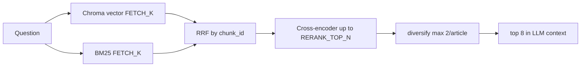

# RAG: BM25 hybrid + reranker

**Modules:** `rag/chunking.py`, `rag/bm25_store.py`, `rag/hybrid.py`, `rag/reranker.py`  
**Orchestration:** `rag/vector_store.py` → `search()`  
**BM25 store:** `bm25_db/` (in Docker — volume `bm25_data`)

See also: [rag-vector_store.md](./rag-vector_store.md), [rag-retrieval.md](./rag-retrieval.md).

---

## Why

Pure **vector search** (e5 embeddings) captures meaning well but is weaker on:

- rootstock codes (**M9**, **SK-4**, **PK SK-1**);
- rare terms and names;
- exact variety names in the question.

**BM25 hybrid** adds keyword search and merges with vector via **RRF** (Reciprocal Rank Fusion).  
**Cross-encoder reranker** re-sorts “question ↔ fragment” pairs before picking final 8 chunks.

---

## Search pipeline



| Stage | Default | Env |
|-------|---------|-----|
| Vector candidates | 24 | `RAG_FETCH_K` |
| BM25 candidates | 24 | `RAG_BM25_FETCH_K` |
| RRF constant | 60 | `RAG_RRF_K` |
| Rerank pool | 32 | `RAG_RERANK_TOP_N` |
| Final context | 8 | hardcoded in `retrieval.py` |
| Max chunks per article | 2 | `RAG_MAX_CHUNKS_PER_SOURCE` |

---

## `rag/chunking.py`

Shared chunking for Chroma and BM25 (same fragments):

- `chunk_size=650`, `chunk_overlap=80`;
- priority delimiters: section headers for gardener summaries, practical takeaways, tables;
- `chunk_id` in metadata: `{crop_id}:{source_file}:{md5(content)[:12]}`.

Without stable `chunk_id` RRF cannot merge vector and BM25.

---

## `rag/bm25_store.py`

- Index **per crop** (`crop_id`), same chunks as Chroma.
- On `create_vector_store()` → `save_bm25_indexes()` to `bm25_db/index.pkl` + `meta.json`.
- On `FORCE_RAG_REINDEX` folder `bm25_db/` is deleted with `chroma_db/`.
- Tokenization: `\w+` with Unicode (Cyrillic + Latin + digits).

If BM25 index missing (old deploy without reindex) — `search()` runs **vector-only**; reranker may still work.

---

## `rag/hybrid.py`

- `tokenize()` — text normalization for BM25.
- `rrf_merge()` — merge ranked lists by `chunk_id`.
- `hybrid_enabled()` / `rerank_enabled()` — flags from env.

---

## `rag/reranker.py`

- Default model: **`BAAI/bge-reranker-base`** (multilingual).
- Lazy-load on first request (like e5 embeddings).
- On load error — search without rerank, API does not crash.

First request after classifier start may take **extra seconds** (download reranker from HuggingFace).

---

## Environment variables

```env
RAG_HYBRID_ENABLED=true
RAG_RERANK_ENABLED=true
RAG_FETCH_K=24
RAG_BM25_FETCH_K=24
RAG_RRF_K=60
RAG_RERANK_TOP_N=32
RAG_RERANK_MODEL=BAAI/bge-reranker-base
RAG_MAX_CHUNKS_PER_SOURCE=2
```

See `.env.example`.

---

## Docker

In `docker-compose.yml` for classifier:

- `chroma_data:/app/chroma_db`
- `bm25_data:/app/bm25_db`

After reindex **both** indexes must be in volumes. Otherwise after `restart` without reindex hybrid disables (no BM25 on disk).

Command:

```bash
make docker-reindex-apply
```

---

## Dependencies

- `rank-bm25` — BM25Okapi (`cv/requirements.txt`, `tests/requirements-test.txt`);
- `sentence-transformers` — CrossEncoder (already in embeddings stack).

---

## Tests

`tests/test_hybrid_search.py` — tokenization, RRF, BM25 on mini corpus (no Chroma/HF).

`tests/test_rag_retrieval.py` — question categories, `diversify_fragments`.

---

## Brief summary

Hybrid + reranker — **second quality layer** on top of e5 + chunking. Enabled after reindex; configured via env without code changes.
