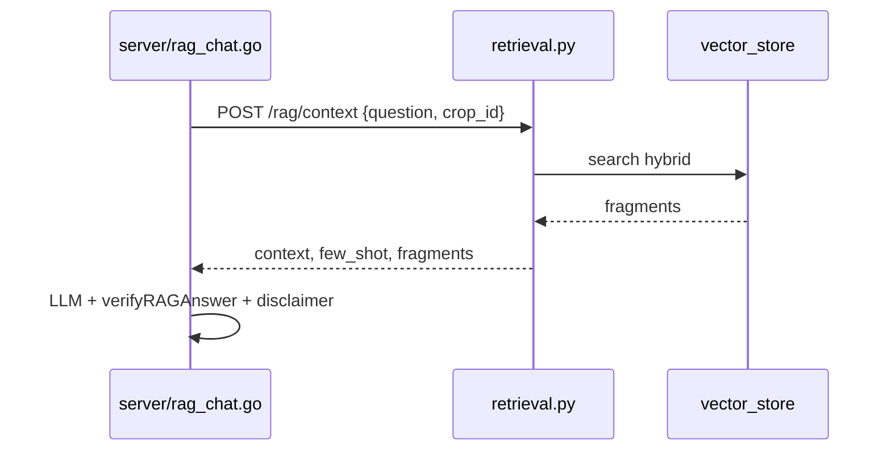

# Разбор: `rag/retrieval.py`

**Исходный файл:** `rag/retrieval.py`  
**Эндпоинт:** `POST /rag/context` в `api/app.py`  
**Дальше:** Go `server/rag_chat.go` собирает промпт и зовёт LLM

---

## Зачем этот файл

Слой **retrieval** в классической схеме RAG:

1. Принять вопрос и `crop_id`.
2. Найти фрагменты (`vector_store.search` — hybrid vector + BM25 + rerank).
3. Собрать **context** для LLM.
4. Подобрать **few-shot** пример по типу вопроса.
5. Отдать JSON Go — **без генерации ответа**.

---

## Главная функция: `retrieve_rag_context(user_question, crop_id)`

### Вход

- `user_question` — текст от пользователя;
- `crop_id` — культура (по умолчанию `apple`).

### Выход (словарь)

| Поле | Назначение |
|------|------------|
| `success` | удалось ли собрать контекст |
| `error` | текст ошибки на русском |
| `context` | большой текст из фрагментов для промпта |
| `few_shot` | пример вопрос-ответ из `config/few_shot.json` |
| `category` | категория вопроса (см. ниже) |
| `fragments` | список `{filename, content}` для верификации на Go |
| `crop_id` | нормализованный id |

### Шаги внутри

1. Пустой вопрос → `success: false`.
2. `normalize_crop_id` — неверная культура → ошибка.
3. `get_crop` → если `rag_enabled: false` → «база статей не подключена».
4. `search(q, crop_id, k=8)` — гибридный поиск (см. [rag-hybrid-search.md](./rag-hybrid-search.md)).
5. Нет фрагментов → «Не нашёл информации в статьях…».
6. Склейка контекста:

```
Текст из статьи 'article1.txt':
<чанк>

---

Текст из статьи 'article2.txt':
...
```

7. `classify_question(q)` → категория.
8. `few_shot_for(crop_id, category)` → строка-пример для промпта.

---

## Классификация вопроса: `classify_question`

**Rule-based** (ключевые слова), не ML. Влияет только на **few-shot**, не на поиск.

| Категория | Примеры слов в вопросе |
|-----------|-------------------------|
| `rootstock` | подвой, привой, черенк, саженц, питомник… |
| `fertilizer` | удобрение, доза, азот, подкормк, фертигац… |
| `disease` | болезн, парша, плодожорк, марссон, шарк… |
| `irrigation` | полив, капельн, засух, влаго… |
| `relief` | склон, террас, кбр, gis, рельеф… |
| `variety` | сорт, рентабельность, либерти, голден… |
| `general` | всё остальное |

---

## Few-shot: `few_shot_for`

Читает `config/few_shot.json`:

```json
{
  "apple": {
    "fertilizer": "Пример вопроса: ... Пример ответа: ...",
    "disease": "...",
    "rootstock": "...",
    "general": "..."
  }
}
```

Берёт категорию; если нет — fallback на `general`.

Кэш `_few_shot_cache` — один раз за процесс.

---

## Связь с Go



Go **не** ходит в Chroma/BM25 напрямую — только через Python.

---

## Логи

```
[RAG:apple] источник: article1.txt
```

Помогает отладке: какие чанки попали в контекст.

---

## Ошибки vs «нет в материалах»

| Ситуация | Где решается |
|----------|----------------|
| Нет чанков | `error` здесь, Go не зовёт LLM с пустым контекстом |
| LLM выдумал цифру | `verifyRAGAnswer` в Go (+ дубль в `verifier.py`) |
| Нет фактов в статьях | промпт в `rag_chat.go`: «нет в справочных материалах» |

---

## Что читать дальше

| Тема | Файл |
|------|------|
| Chroma, BM25, rerank | [rag-vector_store.md](./rag-vector_store.md), [rag-hybrid-search.md](./rag-hybrid-search.md) |
| Верификация чисел | [rag-verifier.md](./rag-verifier.md), `server/rag_chat.go` |
| HTTP | [python-api.md](./python-api.md) |

---

## Краткий итог

`retrieval.py` — **оркестратор RAG-поиска**: культура → hybrid search → context + few-shot + fragments для Go. Генерация ответа — не здесь.
