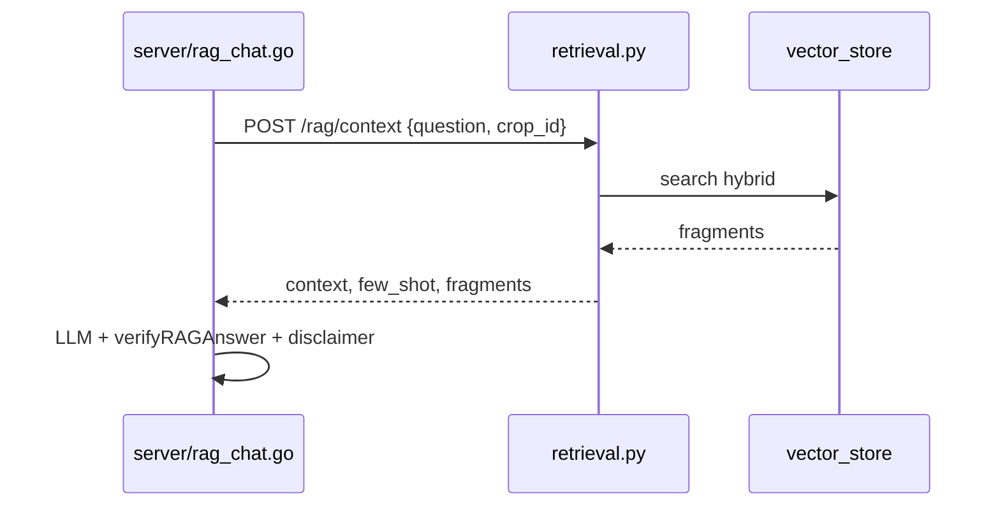

# Walkthrough: `rag/retrieval.py`

**Source file:** `rag/retrieval.py`  
**Endpoint:** `POST /rag/context` in `api/app.py`  
**Next:** Go `server/rag_chat.go` builds prompt and calls LLM

---

## Why this file exists

**Retrieval** layer in classic RAG:

1. Accept question and `crop_id`.
2. Find fragments (`vector_store.search` — hybrid vector + BM25 + rerank).
3. Build **context** for LLM.
4. Pick **few-shot** example by question type.
5. Return JSON to Go — **no answer generation**.

---

## Main function: `retrieve_rag_context(user_question, crop_id)`

### Input

- `user_question` — user text;
- `crop_id` — crop (default `apple`).

### Output (dict)

| Field | Purpose |
|-------|---------|
| `success` | whether context was assembled |
| `error` | error text (localized in product) |
| `context` | large text from fragments for prompt |
| `few_shot` | Q&A example from `config/few_shot.json` |
| `category` | question category (see below) |
| `fragments` | list `{filename, content}` for Go verification |
| `crop_id` | normalized id |

### Internal steps

1. Empty question → `success: false`.
2. `normalize_crop_id` — invalid crop → error.
3. `get_crop` → if `rag_enabled: false` → “Article base for «…» is not connected yet.”
4. `classify_question(q)` → **category** (computed before search — it decides whether the reranker runs).
5. `search(q, crop_id, k=8, category=category)` — hybrid search with conditional rerank (see [rag-hybrid-search.md](./rag-hybrid-search.md)).
6. No fragments → “No information found in articles for crop «…».”
7. Context assembly:

```
Text from article 'article1.txt':
<chunk>

---

Text from article 'article2.txt':
...
```

8. `few_shot_for(crop_id, category)` → example string for prompt.

---

## Question classification: `classify_question`

**Rule-based** (keywords from **`config/question_categories.json`**), not ML. Rule order in the config matters — first match wins; no match → `default_category` (`general`).

The category affects **few-shot selection** and **whether the reranker runs** (`rerank_for_category` in `rag/hybrid.py`).

Default categories: `rootstock`, `fertilizer`, `disease`, `irrigation`, `relief`, `variety`, `general`.  
Override: env `QUESTION_CATEGORIES_CONFIG_PATH`. Config is cached with mtime-based reload (changes picked up without restart). See `rag/question_categories.py`.

---

## Few-shot: `few_shot_for`

Reads `config/few_shot.json` (path overridable via env `FEW_SHOT_CONFIG_PATH`):

```json
{
  "apple": {
    "fertilizer": "Sample question: ... Sample answer: ...",
    "disease": "...",
    "rootstock": "...",
    "general": "..."
  }
}
```

Picks category; if missing — fallback to `general`.

Cache `_few_shot_cache` — once per process.

---

## Go integration



Go does **not** hit Chroma/BM25 directly — only through Python.

---

## Logs

```
[RAG:apple] source: article1.txt
```

Emitted via `rag_debug` (`rag/debug_log.py`). Helps debugging: which chunks entered context.

---

## Errors vs “not in materials”

| Situation | Where handled |
|-----------|---------------|
| No chunks | `error` here, Go does not call LLM with empty context |
| LLM invented a number | `verifyRAGAnswer` in Go (+ duplicate in `verifier.py`) |
| No facts in articles | prompt in `rag_chat.go`: “not in reference materials” |

---

## What to read next

| Topic | File |
|-------|------|
| Chroma, BM25, rerank | [rag-vector_store.md](./rag-vector_store.md), [rag-hybrid-search.md](./rag-hybrid-search.md) |
| Number verification | [rag-verifier.md](./rag-verifier.md), `server/rag_chat.go` |
| HTTP | [python-api.md](./python-api.md) |

---

## Brief summary

`retrieval.py` — **RAG search orchestrator**: crop → hybrid search → context + few-shot + fragments for Go. Answer generation is not here.
