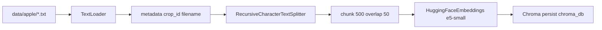

# Разбор: `rag/vector_store.py`

**Исходный файл:** `rag/vector_store.py`  
**Данные:** `data/{crop_id}/*.txt`  
**Хранилище:** папка `chroma_db/` (в Docker — volume `chroma_data`)  
**Кто вызывает:** `rag/retrieval.py` → `search()`, админка → `load_vector_store(force_reindex=True)`

---

## Зачем этот файл

Ядро **векторного RAG**: превратить `.txt` статьи в embeddings и искать по смыслу вопроса в **Chroma**.

LLM здесь **нет** — только индексация и similarity search.

---

## Ключевые пути

| Переменная | Путь |
|------------|------|
| `DATA_DIR` | `{корень}/data` |
| `PERSIST_DIR` | `{корень}/chroma_db` |

---

## Пайплайн индексации



### `load_all_documents()`

- Обходит все культуры из `crops.json`;
- для каждой — `data/{crop_id}/*.txt`;
- **legacy:** файлы прямо в `data/*.txt` считаются яблоней (`apple`).

### `_load_file(crop_id, file_path)`

К каждому документу LangChain добавляет metadata:

| Поле | Пример |
|------|--------|
| `filename` | красивое имя из `article_titles.json` или имя файла |
| `crop_id` | `apple` |
| `source_file` | `article1.txt` |

### `create_vector_store()`

1. Загрузить все документы.
2. **Chunking:** `chunk_size=500`, `chunk_overlap=50` символов.
3. **Embeddings:** `intfloat/multilingual-e5-small` (мультиязычно, русский ок).
4. `Chroma.from_documents(..., persist_directory=PERSIST_DIR)`.

Если статей нет → `None`, поиск пустой.

---

## Загрузка и переиндексация: `load_vector_store`

| Ситуация | Поведение |
|----------|-----------|
| Кэш `_vector_store` в памяти | вернуть его |
| `force_reindex=True` или `FORCE_RAG_REINDEX=true` | удалить `chroma_db`, пересоздать |
| `chroma_db` не пустая | открыть существующую Chroma |
| иначе | `create_vector_store()` |

`reset_vector_store()` — сброс только RAM-кэша (перед admin reindex).

### Admin reindex (`api/app.py`)

```
reset_vector_store() → load_vector_store(force_reindex=True)
```

После upload новых `.txt` в `data/` — обязателен reindex, иначе Chroma не видит файлы.

---

## Поиск: `search(query, crop_id, k=8)`

```python
store.similarity_search(query, k=k, filter={"crop_id": crop_id})
```

- **similarity_search** — ближайшие по embedding фрагменты;
- **filter** — только статьи выбранной культуры (мультикультура);
- **k=8** — до 8 чанков в контекст LLM.

Первый вызов может **долго** тянуть embedding-модель с HuggingFace.

---

## `article_titles.json`

Опционально: человекочитаемые названия для metadata `filename` (для логов и контекста LLM «Текст из статьи '…'»). Пользователю в чате названия статей не показываются (политика на Go).

---

## Docker

- `./data:/app/data:ro` — статьи;
- `chroma_data:/app/chroma_db` — индекс между перезапусками;
- `FORCE_RAG_REINDEX` — полная пересборка при старте.

---

## Частые вопросы

### Добавил `article4.txt`, RAG не видит

Нужен **reindex** (админка или `scripts/reindex_rag.py`).

### Папка `chroma_db` в git?

Обычно нет — генерируется локально/volume.

### Qdrant в roadmap

При росте объёма возможна замена Chroma; интерфейс для `retrieval.py` тогда поменяется внутри `vector_store.py`.

---

## Что читать дальше

| Тема | Файл |
|------|------|
| Сборка контекста для Go | [rag-retrieval.md](./rag-retrieval.md) |
| Культуры | [rag-crops_config.md](./rag-crops_config.md) |
| HTTP reindex | [python-api.md](./python-api.md) |

---

## Краткий итог

`vector_store.py` — **индекс статей в Chroma** + **семантический поиск** с фильтром `crop_id`. Всё тяжёлое для RAG (embeddings, chunking) сосредоточено здесь.
