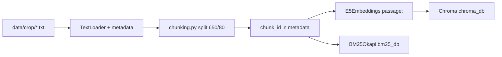

# Walkthrough: `rag/vector_store.py`

**Source file:** `rag/vector_store.py`  
**Data:** `data/{crop_id}/*.txt`  
**Stores:** `chroma_db/` (vector), `bm25_db/` (keyword) — in Docker volumes `chroma_data`, `bm25_data`  
**Called by:** `rag/retrieval.py` → `search()`, admin → `load_vector_store(force_reindex=True)`

**Hybrid details:** [rag-hybrid-search.md](./rag-hybrid-search.md)

---

## Why this file exists

Core of **RAG retrieval**: turn `.txt` articles into indexes and search relevant fragments by question.

No LLM here — only indexing and search (vector + BM25 + rerank).

---

## Key paths

| Variable | Path |
|----------|------|
| `DATA_DIR` | `{root}/data` |
| `PERSIST_DIR` | `{root}/chroma_db` |
| BM25 | `{root}/bm25_db` (`rag/bm25_store.py`) |

---

## Indexing pipeline



### `load_all_documents()`

- Walks all crops from `crops.json`;
- for each — `data/{crop_id}/*.txt`;
- **legacy:** files directly in `data/*.txt` count as apple (`apple`).

Corpus (estimate): **~344** apple, **~42** pear, **~108** plum (after miscategorized cleanup in `data/plum/`).

### `_load_file(crop_id, file_path)`

LangChain document metadata:

| Field | Example |
|-------|---------|
| `filename` | display name from `article_titles.json` or filename |
| `crop_id` | `apple` |
| `source_file` | `article1.txt` |

### `create_vector_store()`

1. Load all documents.
2. **Chunking** (`rag/chunking.py`): 650/80, section delimiters.
3. **chunk_id** in each chunk metadata.
4. **Embeddings:** `intfloat/multilingual-e5-small` with `passage:` / `query:` prefixes (`rag/embeddings.py`).
5. **Chroma** → `chroma_db/`.
6. **BM25** → `bm25_db/` (`rag/bm25_store.py`).

If no articles → `None`, empty search.

---

## Load and reindex: `load_vector_store`

| Situation | Behavior |
|-----------|----------|
| `_vector_store` RAM cache | return it |
| `force_reindex=True` or `FORCE_RAG_REINDEX=true` | delete `chroma_db` and `bm25_db`, recreate |
| `chroma_db` not empty | open Chroma + load BM25 from disk |
| otherwise | `create_vector_store()` |

`reset_vector_store()` — reset RAM cache for Chroma and BM25 (before admin reindex).

### Admin reindex (`api/app.py`)

```
reset_vector_store() → load_vector_store(force_reindex=True)
```

After uploading new `.txt` to `data/` — reindex required, otherwise indexes do not see files.

---

## Search: `search(query, crop_id, k=8)`

Not only `similarity_search` — full pipeline:

1. **Vector:** `similarity_search`, `k=FETCH_K`, filter `crop_id`.
2. **BM25** (if `RAG_HYBRID_ENABLED` and `bm25_db` exists): top `BM25_FETCH_K`.
3. **RRF** by `chunk_id` from both lists.
4. **Reranker** (if `RAG_RERANK_ENABLED`): cross-encoder on pool up to `RERANK_TOP_N`.
5. **diversify_fragments:** max 2 chunks per article → **8** in context.

First call may **long** download e5 and reranker from HuggingFace.

---

## `article_titles.json`

Optional: human-readable names for metadata `filename` (for logs and LLM context “Text from article '…'”). Not shown to user in chat (policy on Go).

---

## Docker

- `./data:/app/data:ro` — articles;
- `chroma_data:/app/chroma_db` — vector index;
- `bm25_data:/app/bm25_db` — BM25 index;
- `FORCE_RAG_REINDEX` — full rebuild on startup.

After reindex in Docker: **`docker compose restart classifier`** (reset in-memory cache).

---

## FAQ

### Added `article4.txt`, RAG does not see it

Need **reindex** (`make docker-reindex-apply` or admin).

### Folders `chroma_db/` / `bm25_db/` in git?

No — generated locally / in Docker volumes (`.gitignore`).

### Hybrid off after restart

Check volume `bm25_data` and that reindex ran after `data/` change.

### Qdrant in roadmap

At larger scale Chroma may be replaced; interface for `retrieval.py` would change inside `vector_store.py`.

---

## What to read next

| Topic | File |
|-------|------|
| BM25, RRF, reranker | [rag-hybrid-search.md](./rag-hybrid-search.md) |
| Context assembly for Go | [rag-retrieval.md](./rag-retrieval.md) |
| Crops | [rag-crops_config.md](./rag-crops_config.md) |
| HTTP reindex | [python-api.md](./python-api.md) |

---

## Brief summary

`vector_store.py` — **indexing** (Chroma + BM25) and **hybrid search** with reranker and diversify. Chunking lives in `rag/chunking.py`.
