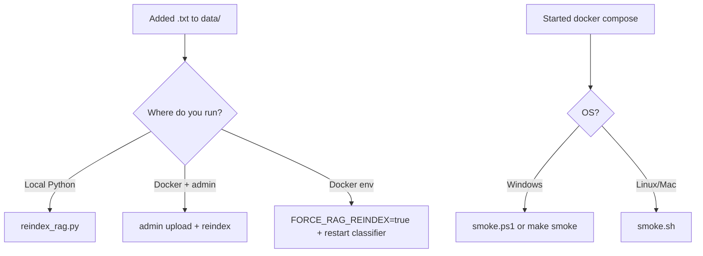

# Walkthrough: `scripts/` folder

**Folder:** `scripts/`  
**Purpose:** development utilities — **not** part of Docker runtime (except indirectly: you run the same commands manually).

| File | Platform | Task |
|------|----------|------|
| `reindex_rag.py` | Python | Rebuild Chroma + BM25 from `data/` |
| `run_rag_eval.py` | Python | Run `eval/*.jsonl` (retrieval), report to `eval/results/` |
| `docker_build.sh` | Linux / CI | Build Docker images |
| `smoke.sh` | Linux / macOS / Git Bash | Quick Go API check |
| `smoke.ps1` | Windows PowerShell | Same for Windows |

> Article ingestion scripts (`journal_ingest.py`, etc.) exist on the `master` branch but **are not** in the public `public-portfolio` branch.

---

## When to use what



---

## `reindex_rag.py` — RAG reindex

### Why

After adding or changing articles in `data/{crop_id}/*.txt`, **Chroma** (`chroma_db/`) and **BM25** (`bm25_db/`) indexes must be updated. Otherwise `search()` will not find new text (or hybrid disables without BM25).

### How it works (step by step)

1. Adds project root to `sys.path` (like `app.py`).
2. Sets **`FORCE_RAG_REINDEX=true`** — same flag understood by `rag/vector_store.py`.
3. Calls **`create_vector_store()`** directly:
   - reads all `.txt`;
   - chunks (`rag/chunking.py`);
   - builds embeddings → `chroma_db/`;
   - builds BM25 → `bm25_db/`.

Does not start Flask and does not need `ADMIN_SECRET`.

### Run

From project root (need Python with `cv/requirements.txt` deps, `rag/` packages):

```bash
python scripts/reindex_rag.py
```

Expected output: `Creating new vector store...`, `Fragments: N`, `BM25 index saved...`, `RAG reindex complete.`

### Alternatives (same meaning)

| Method | When |
|--------|------|
| Admin `admin.html` → Reindex | Docker, have `ADMIN_SECRET` |
| `POST /admin/reindex` on Python service (compose: classifier) | from Go admin |
| `FORCE_RAG_REINDEX=true` on classifier startup | in `.env`, once on deploy |

Details: [rag-vector_store.md](./rag-vector_store.md).

### Difference from admin reindex

- **Script** — convenient on dev machine with local `chroma_db/` and `bm25_db/`.
- **Admin/API** — when everything is in Docker and volumes `chroma_data` + `bm25_data` are inside the container.

Index paths must match what the process sees on `/rag/context`. After reindex: **`docker compose restart classifier`**.

---

## `run_rag_eval.py` — RAG regressions

### Why

Verify that after reindex or prompt changes **retrieval** finds expected fragments (without calling LLM).

### Suites

| `--suite` | File | Questions |
|-----------|------|-----------|
| `apple` | `eval/rag_apple_baseline.jsonl` | 45 |
| `pear` | `eval/rag_pear_baseline.jsonl` | 8 |
| `plum` | `eval/rag_plum_baseline.jsonl` | 10 |
| `demo_hr` | `eval/rag_demo_hr_baseline.jsonl` | 5 |
| `all` | all above | **68** |

### Run

```bash
# classifier must listen on :5000
set CLASSIFIER_RAG_URL=http://localhost:5000/rag/context
python scripts/run_rag_eval.py --suite all

# Fast in-process (in Docker classifier)
python scripts/run_rag_eval.py --suite all --in-process --fast

make eval-retrieval
```

**CI:** full run — GitHub Actions → workflow **RAG Eval** (manual). See [github-ci.yml.md](./github-ci.yml.md).

Report: `eval/results/`. Details: [eval/README.md](../../eval/README.md), [quality-eval-and-rag-logs.md](./quality-eval-and-rag-logs.md).

---

## `smoke.sh` and `smoke.ps1` — API smoke test

### Why

**Quickly verify** Go server is alive and main routes return **2xx**, without manual clicks in the Web App.

This is **not** full E2E (no RAG question, no photo, no LLM).

### Prerequisites

1. Stack running, **Go on port 8080** available (usually `docker compose up`).
2. For **`POST /api/session`** without Telegram in `.env`:

   ```env
   TELEGRAM_AUTH_DISABLED=true
   ```

   And recreate server: `docker compose up -d --force-recreate server`.

Otherwise session returns 401 — smoke fails (`.ps1` will show `[WARN]`).

### What they check (same in sh and ps1)

| Step | Method | Path | Meaning |
|------|--------|------|---------|
| health | GET | `/health` | server up |
| crops | GET | `/api/crops` | crop config |
| session | POST | `/api/session` `{"crop_id":"apple"}` | create chat session |
| onboarding | GET | `/api/onboarding?crop_id=apple` | crop onboarding |

Success: HTTP **2xx** (200–299).  
Result: `Smoke PASSED` or exit code 1.

### `smoke.sh` (bash)

```bash
./scripts/smoke.sh
# or another host:
./scripts/smoke.sh http://127.0.0.1:8080
```

- `set -euo pipefail` — fail on errors.
- `curl` writes body to `/tmp/smoke_body.txt`.
- First argument — `BASE_URL` (default `http://localhost:8080`).

Works: Git Bash on Windows, Linux, macOS, CI (if you add a job manually).

### `smoke.ps1` (PowerShell)

```powershell
.\scripts\smoke.ps1
.\scripts\smoke.ps1 -BaseUrl "http://localhost:8080"
```

- `Invoke-WebRequest` instead of curl.
- Parses `session_id` from JSON and prints `[INFO] session_id=...`.
- **`make smoke`** in Makefile calls this file (Windows-oriented project).

### What smoke does **not** check

- Python classifier `:5000` (only indirectly — if server healthy).
- `POST /api/message` / RAG / LLM.
- `POST /classify` with photo.
- PostgreSQL directly.
- Admin upload / reindex.

For RAG/CV — manual webapp test or separate tests (`pytest`, `go test`).

### CI relation

In [github-ci.yml.md](./github-ci.yml.md) smoke is **not** in the workflow — only `go-test`, `python-test`, `docker-build`. Smoke — **locally after `docker compose up`**.

---

## Three-script comparison

| | reindex_rag.py | smoke.sh / smoke.ps1 |
|--|----------------|----------------------|
| Needs Docker | no (but paths must match) | yes (usually) |
| Service | Python rag | Go :8080 |
| Dependencies | torch/langchain/chroma heavy | curl or PowerShell |
| Time | minutes (embeddings) | seconds |
| Frequency | after new articles | after each deploy/start |

---

## Typical scenarios

### “Uploaded articles, bot does not find answers”

```bash
python scripts/reindex_rag.py
# or reindex in admin
docker compose restart classifier   # if searching from container
```

### “Started compose, want to verify API”

```powershell
make smoke
# or .\scripts\smoke.ps1
```

### “Smoke FAIL on session”

Check `TELEGRAM_AUTH_DISABLED=true` in `.env` and `force-recreate server`.

---

## Brief summary

`scripts/` — **two developer tasks**: (1) **refresh article index** — `reindex_rag.py`; (2) **verify Go API responds** — `smoke.ps1` / `smoke.sh`. Do not confuse with unit tests (`tests/`, `go test`) or GitHub Actions CI.
