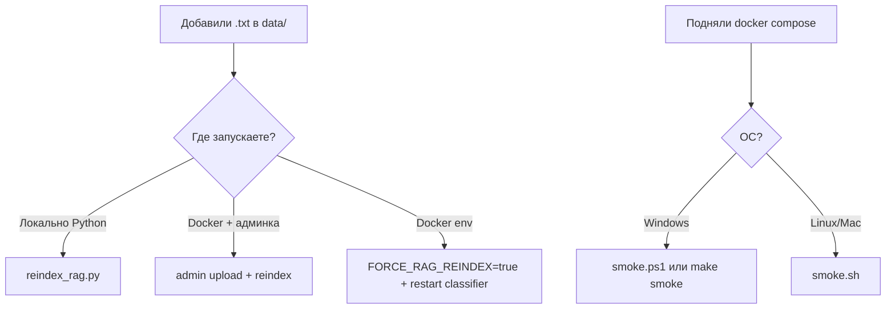

# Разбор: папка `scripts/`

**Папка:** `scripts/`  
**Назначение:** утилиты для разработки — **не** часть runtime в Docker (кроме косвенно: те же команды вы делаете руками).

| Файл | Платформа | Задача |
|------|-----------|--------|
| `reindex_rag.py` | Python | Пересобрать Chroma из `data/` |
| `smoke.sh` | Linux / macOS / Git Bash | Быстрая проверка API Go |
| `smoke.ps1` | Windows PowerShell | То же для Windows |

---

## Когда что использовать



---

## `reindex_rag.py` — переиндексация RAG

### Зачем

После добавления или изменения статей в `data/{crop_id}/*.txt` векторная база **Chroma** (`chroma_db/`) должна обновиться. Иначе `search()` не найдёт новый текст.

### Как работает (построчно)

1. Добавляет корень проекта в `sys.path` (как `app.py`).
2. Ставит **`FORCE_RAG_REINDEX=true`** — тот же флаг, что понимает `rag/vector_store.py`.
3. Вызывает **`create_vector_store()`** напрямую:
   - читает все `.txt`;
   - режет на чанки;
   - строит embeddings;
   - пишет в `chroma_db/`.

Не поднимает Flask и не нужен `ADMIN_SECRET`.

### Запуск

Из корня проекта (нужен Python с зависимостями `cv/requirements.txt`, пакеты `rag/`):

```bash
python scripts/reindex_rag.py
```

Ожидаемый вывод: `Создаю новую векторную базу...`, `Фрагментов: N`, `RAG reindex complete.`

### Альтернативы (то же по смыслу)

| Способ | Когда |
|--------|--------|
| Админка `admin.html` → Reindex | Docker, есть `ADMIN_SECRET` |
| `POST /admin/reindex` на Python-сервис (compose: classifier) | из Go-админки |
| `FORCE_RAG_REINDEX=true` при старте classifier | в `.env`, один раз при деплое |

Подробнее: [rag-vector_store.md](./rag-vector_store.md).

### Отличие от admin reindex

- **Скрипт** — удобно на машине разработчика с локальной `chroma_db/`.
- **Admin/API** — когда всё в Docker и volume `chroma_data` внутри контейнера.

Путь `chroma_db` должен быть тот же, что видит процесс, который потом отвечает на `/rag/context`.

---

## `smoke.sh` и `smoke.ps1` — smoke-тест API

### Зачем

**Быстро проверить**, что Go-сервер жив и основные маршруты отвечают **2xx**, без ручного кликанья в Web App.

Это **не** полноценные E2E-тесты (нет RAG-вопроса, нет фото, нет LLM).

### Предусловия

1. Запущен стек, доступен **Go на порту 8080** (обычно `docker compose up`).
2. Для **`POST /api/session`** без Telegram в `.env`:

   ```env
   TELEGRAM_AUTH_DISABLED=true
   ```

   И пересоздать server: `docker compose up -d --force-recreate server`.

Иначе session вернёт 401 — smoke упадёт (в `.ps1` будет `[WARN]`).

### Что проверяют (одинаково в sh и ps1)

| Шаг | Метод | Путь | Смысл |
|-----|--------|------|--------|
| health | GET | `/health` | сервер поднялся |
| crops | GET | `/api/crops` | конфиг культур |
| session | POST | `/api/session` `{"crop_id":"apple"}` | создать чат-сессию |
| onboarding | GET | `/api/onboarding?crop_id=apple` | онбординг для культуры |

Успех: HTTP код **2xx** (200–299).  
Итог: `Smoke PASSED` или exit code 1.

### `smoke.sh` (bash)

```bash
./scripts/smoke.sh
# или другой хост:
./scripts/smoke.sh http://127.0.0.1:8080
```

- `set -euo pipefail` — падать при ошибках.
- `curl` пишет тело во `/tmp/smoke_body.txt`.
- Первый аргумент — `BASE_URL` (по умолчанию `http://localhost:8080`).

Подходит: Git Bash на Windows, Linux, macOS, CI (если добавите job вручную).

### `smoke.ps1` (PowerShell)

```powershell
.\scripts\smoke.ps1
.\scripts\smoke.ps1 -BaseUrl "http://localhost:8080"
```

- `Invoke-WebRequest` вместо curl.
- Парсит `session_id` из JSON и выводит `[INFO] session_id=...`.
- **`make smoke`** в Makefile вызывает именно этот файл (Windows-ориентированный проект).

### Чего smoke **не** проверяет

- Python classifier `:5000` (только косвенно — если server healthy).
- `POST /api/message` / RAG / LLM.
- `POST /classify` с фото.
- PostgreSQL напрямую.
- Admin upload / reindex.

Для RAG/CV — ручной тест в webapp или отдельные тесты (`pytest`, `go test`).

### Связь с CI

В [github-ci.yml.md](./github-ci.yml.md) smoke **не** входит в workflow — только `go-test`, `python-test`, `docker-build`. Smoke — **локально после `docker compose up`**.

---

## Сравнение трёх скриптов

| | reindex_rag.py | smoke.sh / smoke.ps1 |
|--|----------------|----------------------|
| Нужен Docker | нет (но пути должны совпасть) | да (обычно) |
| Сервис | Python rag | Go :8080 |
| Зависимости | torch/langchain/chroma тяжёлые | curl или PowerShell |
| Время | минуты (embeddings) | секунды |
| Частота | после новых статей | после каждого деплоя/запуска |

---

## Типичные сценарии

### «Залил статьи, бот не находит ответ»

```bash
python scripts/reindex_rag.py
# или reindex в админке
docker compose restart classifier   # если искали из контейнера
```

### «Поднял compose, хочу убедиться что API ок»

```powershell
make smoke
# или .\scripts\smoke.ps1
```

### «Smoke FAIL на session»

Проверить `TELEGRAM_AUTH_DISABLED=true` в `.env` и `force-recreate server`.

---

## Краткий итог

`scripts/` — **две задачи разработчика**: (1) **обновить индекс статей** — `reindex_rag.py`; (2) **проверить, что Go API отвечает** — `smoke.ps1` / `smoke.sh`. Не путать с unit-тестами (`tests/`, `go test`) и не с CI на GitHub Actions.
