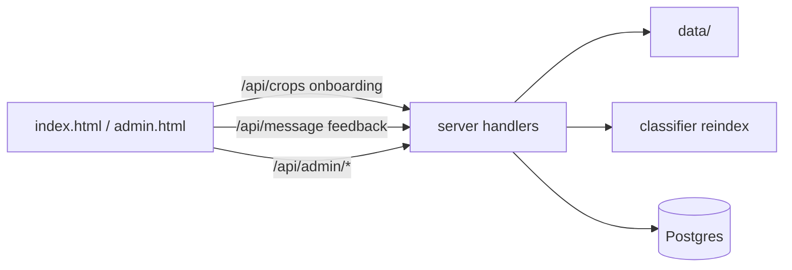

# Walkthrough: admin and UX API (`server/`)

**Files:** `admin.go`, `onboarding.go`, `branding.go`, `feedback.go`, `feedback_report.go`, `analytics_store.go`, `crops.go`, `config_reload.go`  
**Client:** [webapp-overview.md](./webapp-overview.md) (`admin.html`, `index.html`)

---

## Overview

Small handlers that do not run ML themselves:

- **admin** — articles on disk + reindex + feedback report;
- **crops / onboarding / branding** — config for UI;
- **feedback + analytics** — product metrics;
- **config_reload** — hot reload of all JSON catalogs.

---

## `admin.go` — RAG article management

### Auth `adminBasicAuth`

- HTTP Basic: `ADMIN_USER` / `ADMIN_PASSWORD`.
- If `ADMIN_PASSWORD` empty → **503** “admin disabled”.

**Not** Telegram initData.

### Routes (duplicate `/admin` and `/api/admin`)

| Method | Handler | Action |
|--------|---------|--------|
| GET | `handleAdminStatus` | `{ success, data_dir, crops }` (crop count) |
| GET | `handleAdminListArticles` | list `.txt` in `data/{crop_id}/` |
| POST | `handleAdminUpload` | save file |
| POST | `handleAdminReindex` | `triggerRAGReindex` → Python |
| GET | `handleAdminFeedback` | 👍/👎 ratings with question, answer, and **`rag`** field |

### Upload

- `crop_id` from form.
- File: regex `^[a-zA-Z0-9._-]+\.txt$`, max **2 MB**.
- Path: `{DATA_DIR}/{crop_id}/{filename}`.

Test: `admin_test.go` — `TestSafeFilename`.

### Reindex

HTTP POST to `{PYTHON_BASE_URL}/admin/reindex` with header **`X-Admin-Secret`** = `ADMIN_SECRET`.

Resets Chroma + BM25 in Python — see [rag-vector_store.md](./rag-vector_store.md).

---

## `crops.go` — crop catalog

### Load on startup and hot reload

`loadCropCatalog()` reads `CROPS_CONFIG_PATH` or `config/crops.json` (same meaning as Python `crops_config`). It is called from **`loadRuntimeCatalogs()`** (`catalogs.go`), which parses **all** JSON catalogs (crops, prompts, onboarding, photo templates, branding) into one `runtimeCatalogs` struct and swaps it in atomically (`atomic.Pointer`). Handlers read the active set via `currentCatalogs()`.

Hot reload (`config_reload.go`): **SIGHUP** or a `CONFIG_RELOAD_INTERVAL_SEC` polling ticker calls `reloadRuntimeConfig()` → `loadRuntimeCatalogs()`. On any parse error the previous catalog set stays active; handlers never see a partially updated state.

### `GET /crops`, `/api/crops` — public

No Telegram auth. Crops with `ui_hidden: true` are filtered out. Response:

```json
{
  "success": true,
  "default_crop": "apple",
  "crops": [
    { "id": "apple", "name_ru": "...", "name_en": "Apple", "emoji": "🍎", "cv_enabled": true, "rag_enabled": true }
  ]
}
```

`normalizeCropID` / `cropInfo` — used in chat and RAG handlers.

---

## `onboarding.go` — sample questions

### Config

`config/onboarding.json` — map `crop_id` → array of question strings.

`ONBOARDING_CONFIG_PATH` in Docker: `/config/onboarding.json`.

### `GET /onboarding?crop_id=apple` — public

```json
{ "success": true, "crop_id": "apple", "questions": ["What are scab symptoms?", ...] }
```

Web App renders chips; click → `sendMessage()`.

---

## `branding.go` — Web App copy

`BrandingConfig` (app title, header emoji/subtitle, crop label, onboarding title, chat divider, disclaimer, photo beta notice) is loaded from `BRANDING_CONFIG_PATH` or `config/branding.json` as part of `loadRuntimeCatalogs`.

### `GET /branding`, `/api/branding` — public

```json
{ "success": true, "branding": { "app_title": "...", "header_emoji": "...", ... } }
```

---

## `feedback.go` — answer ratings

### `POST /feedback` (protected)

JSON:

```json
{ "session_id": "...", "message_id": 123, "rating": 1 }
```

`rating`: **1** (👍) or **-1** (👎).

- Check: message exists and belongs to user.
- `UNIQUE (message_id, user_id)` in DB — one vote per message.
- `LogEvent("message_feedback", ...)`.

Table: `message_feedback` — [migrations-overview.md](./migrations-overview.md).

### `GET /admin/feedback` (Basic auth)

Query: `rating` (1 or -1, empty = all), `limit` (1–200, default 50).

Response (`feedback_report.go`, `ListFeedbackReport`):

- `summary` — total `{ likes, dislikes }`;
- `items` — ratings with `question` (last user message before the rated reply), `answer`, `rating`, `crop_id`, `session_id`, `telegram_id`, and optional **`rag`** — metadata joined from `analytics_events` (`rag_answer` with the same `message_id`): category, fragments, verify_pass, verify_reason, soft_fail, retrieval/LLM/total latency.

See [metrics-and-alerts.md](./metrics-and-alerts.md).

---

## `analytics_store.go` — events

### `LogEvent(ctx, telegramID, eventType, payload)`

INSERT into `analytics_events` (`event_type`, `payload` JSONB).

Called from:

- `handleFeedback` (`message_feedback`)
- `logAnalytics` (helper in `feedback.go`) from message handlers: `message_sent`, `rag_answer`, `photo_classified`

Example SQL analytics — tables `analytics_events`, `message_feedback` (see [migrations-overview.md](./migrations-overview.md)).

---

## Component relationships



---

## Env for this group

| Variable | File |
|----------|------|
| `ADMIN_USER`, `ADMIN_PASSWORD`, `ADMIN_SECRET` | admin |
| `DATA_DIR` | admin upload |
| `CROPS_CONFIG_PATH` | crops |
| `ONBOARDING_CONFIG_PATH` | onboarding |
| `BRANDING_CONFIG_PATH` | branding |
| `CONFIG_RELOAD_INTERVAL_SEC` | config_reload (polling; SIGHUP always works) |

---

## Brief summary

**admin.go** — RAG content on disk + feedback report. **crops/onboarding/branding** — public UX config, hot-reloadable via `runtimeCatalogs`. **feedback/analytics** — answer quality and telemetry. All around main chat from [server-chat-and-db.md](./server-chat-and-db.md), without duplicating ML logic.
