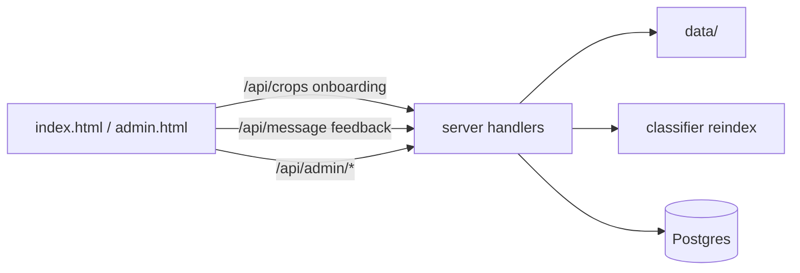

# Разбор: админка и UX API (`server/`)

**Файлы:** `admin.go`, `onboarding.go`, `feedback.go`, `analytics_store.go`, `crops.go`  
**Клиент:** [webapp-overview.md](./webapp-overview.md) (`admin.html`, `index.html`)

---

## Обзор

Мелкие handlers, которые не тянут ML сами:

- **админка** — статьи на диск + reindex;
- **crops / onboarding** — конфиг для UI;
- **feedback + analytics** — продуктовые метрики.

---

## `admin.go` — управление статьями RAG

### Авторизация `adminBasicAuth`

- HTTP Basic: `ADMIN_USER` / `ADMIN_PASSWORD`.
- Если `ADMIN_PASSWORD` пуст → **503** «админка отключена».

**Не** Telegram initData.

### Маршруты (дубль `/admin` и `/api/admin`)

| Метод | Handler | Действие |
|-------|---------|----------|
| GET | `handleAdminStatus` | `{ data_dir, ok }` |
| GET | `handleAdminListArticles` | список `.txt` в `data/{crop_id}/` |
| POST | `handleAdminUpload` | сохранить файл |
| POST | `handleAdminReindex` | `triggerRAGReindex` → Python |
| GET | `handleAdminFeedback` | оценки 👍/👎 с вопросом, ответом и полем **`rag`** |

### Upload

- `crop_id` из формы.
- Файл: regex `^[a-zA-Z0-9._-]+\.txt$`, max **2 МБ**.
- Путь: `{DATA_DIR}/{crop_id}/{filename}`.

Тест: `admin_test.go` — `TestSafeFilename`.

### Reindex

HTTP POST на `{PYTHON_BASE_URL}/admin/reindex` с заголовком **`X-Admin-Secret`** = `ADMIN_SECRET`.

Сбрасывает Chroma + BM25 в Python — см. [rag-vector_store.md](./rag-vector_store.md).

---

## `crops.go` — каталог культур

### Загрузка при старте

`loadCropCatalog()` читает `CROPS_CONFIG_PATH` или `config/crops.json` (тот же смысл, что Python `crops_config`).

### `GET /crops`, `/api/crops` — публично

Без Telegram auth. Ответ:

```json
{
  "success": true,
  "default_crop": "apple",
  "crops": [
    { "id": "apple", "name_ru": "Яблоня", "emoji": "🍎", "cv_enabled": true, "rag_enabled": true }
  ]
}
```

`normalizeCropID` / `getCropMeta` — используются в обработчиках чата и RAG.

---

## `onboarding.go` — примеры вопросов

### Конфиг

`config/onboarding.json` — map `crop_id` → массив строк-вопросов.

`ONBOARDING_CONFIG_PATH` в Docker: `/config/onboarding.json`.

### `GET /onboarding?crop_id=apple` — публично

```json
{ "success": true, "crop_id": "apple", "questions": ["Какие признаки парши?", ...] }
```

Web App рисует chips; клик → `sendMessage()`.

---

## `feedback.go` — оценка ответов

### `POST /feedback` (защищённый)

JSON:

```json
{ "session_id": "...", "message_id": 123, "rating": 1 }
```

`rating`: **1** (👍) или **-1** (👎).

- Проверка: сообщение существует и принадлежит пользователю.
- `UNIQUE (message_id, user_id)` в БД — один голос на сообщение.
- `LogEvent("message_feedback", ...)`.

Таблица: `message_feedback` — [migrations-overview.md](./migrations-overview.md).

### `GET /admin/feedback` (Basic auth)

Query: `rating` (1 или -1), `limit` (default 50).

Ответ: список оценок с `question`, `answer`, `rating`, и опционально **`rag`** — метаданные из `analytics_events` (`rag_answer`): category, fragments, verify_pass, latency.  
См. [metrics-and-alerts.md](./metrics-and-alerts.md), `server/feedback_report.go`.

---

## `analytics_store.go` — события

### `LogEvent(userTelegramID, eventType, payload)`

INSERT в `analytics_events` (`event_type`, `payload` JSONB).

Вызывается из:

- `feedback.go`
- `logAnalytics` в `message_handlers.go` (`rag_answer`, `photo_classified`)

Примеры SQL-аналитики — таблицы `analytics_events`, `message_feedback` (см. [migrations-overview.md](./migrations-overview.md)).

---

## Связь компонентов



---

## Env для этой группы

| Переменная | Файл |
|------------|------|
| `ADMIN_USER`, `ADMIN_PASSWORD`, `ADMIN_SECRET` | admin |
| `DATA_DIR` | admin upload |
| `CROPS_CONFIG_PATH` | crops |
| `ONBOARDING_CONFIG_PATH` | onboarding |

---

## Краткий итог

**admin.go** — контент RAG на диске. **crops/onboarding** — публичный UX-config. **feedback/analytics** — качество ответов и телеметрия. Всё вокруг основного чата из [server-chat-and-db.md](./server-chat-and-db.md), без дублирования ML-логики.
