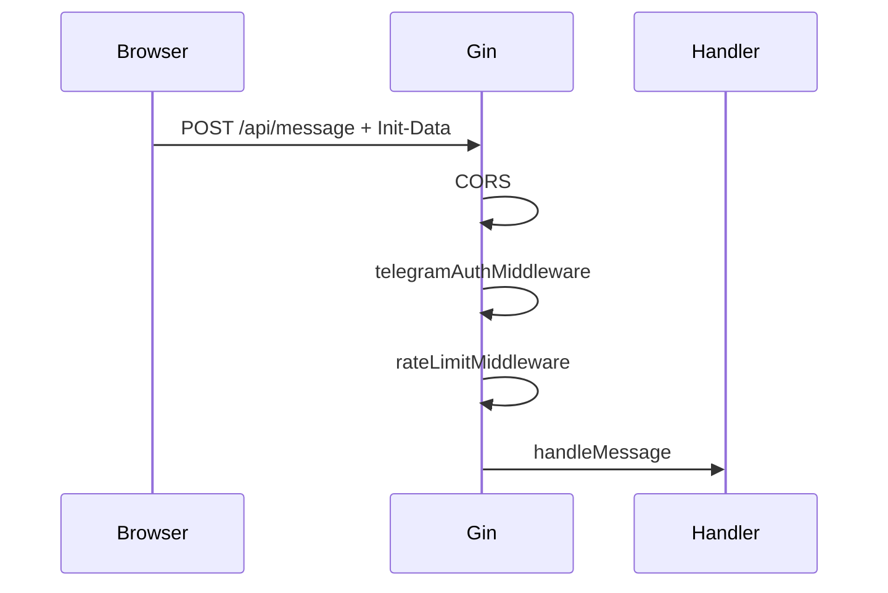

# Разбор: авторизация и лимиты (`server/`)

**Файлы:** `auth_telegram.go`, `middleware.go`, `ratelimit.go`  
**Связь:** [webapp-overview.md](./webapp-overview.md) (заголовок initData), [server-overview.md](./server-overview.md) (маршруты)

---

## Два типа доступа в проекте

| Тип | Кто | Как |
|-----|-----|-----|
| **Пользователь (Telegram)** | Telegram Web App | `X-Telegram-Init-Data` → HMAC-проверка |
| **Пользователь (браузер)** | Web App без Telegram | `X-API-Key` (ключи в `API_KEYS` / `API_KEYS_FILE`) |
| **Админ** | Браузер `/admin.html` | HTTP Basic `ADMIN_USER` / `ADMIN_PASSWORD` |

Эта статья — про **Telegram / API key**, **CORS**, **rate limit**, **метрики**.

---

## `auth_telegram.go` — проверка Telegram

### Что такое `initData`

Строка query-параметров от Telegram Web App (`user=...&auth_date=...&hash=...`).  
Подписана секретом бота — **подделать без токена бота нельзя**.

Документация: [Telegram Web Apps — validating data](https://core.telegram.org/bots/webapps#validating-data-received-via-the-mini-app).

### `validateTelegramInitData(initData, botToken, maxAge)`

1. Разбор query, извлечение `hash`.
2. Сборка `data_check_string` (остальные поля, сортировка).
3. HMAC-SHA256 с ключом из `botToken` + `"WebAppData"`.
4. Сравнение с `hash` (constant-time `hmac.Equal`).
5. Проверка `auth_date` — не старше `TELEGRAM_INIT_DATA_MAX_AGE_SEC` (по умолчанию 86400).
6. Парсинг JSON поля `user` → `TelegramUser` (id, имя, username).

Тесты: `auth_telegram_test.go` (валидный / неверный hash).

---

## `middleware.go` — CORS

### `corsMiddleware(allowedOrigins)`

- Читает `CORS_ALLOWED_ORIGINS` (через запятую).
- Если Origin в списке — отражает в `Access-Control-Allow-Origin`.
- Разрешает методы GET, POST, OPTIONS.
- Заголовки: `Content-Type`, `X-Telegram-Init-Data`, `X-API-Key`, `Authorization`.
- **OPTIONS** → 204 без тела.

Зачем: webapp на `http://localhost` стучится в API на том же origin через nginx.

---

## `middleware.go` — Telegram auth

### `telegramAuthMiddleware(cfg)`

**Режим разработки** (`TELEGRAM_AUTH_DISABLED=true`):

- Пропускает проверку initData.
- В контекст кладёт `telegram_user_id` = 1 (или `X-Dev-User-Id`).
- Для smoke и локального браузера.

**Продакшен:**

1. Берёт `X-Telegram-Init-Data` или `Authorization: tma <initData>`.
2. Пусто → **401** с текстом «откройте из бота».
3. `validateTelegramInitData` → при ошибке **401**.
4. Успех → в Gin context: `telegram_user_id`, `telegram_user`.

Handlers читают через `ctxTelegramUser(c)` в `chat_session.go`.

---

## `registerProtectedRoutes`

Все ниже идут с **`auth` + `lim`** (rate limit):

- `/classify`, `/chat`, `/session`, `/history`, `/message`, `/feedback`, `/media/:token`
- Дубли на `/api/...`

**Не защищены:** `/health`, `/crops`, `/onboarding`, `/branding`, `/metrics`, админка (другая auth).

---

## `ratelimit.go` — лимит запросов

### In-memory по `telegram_user_id` (или API key user)

- `RATE_LIMIT_REQUESTS_PER_MINUTE` (default 30).
- Окно 1 минута, скользящий список timestamp'ов.
- `gcStale()` — периодическая очистка пустых ключей (не рост map при долгой работе).
- `0` или отрицательный → лимит выключен.

При превышении: **429** «Слишком много запросов…».

### Ограничение

Один процесс Go — при нескольких репликах счётчики не общие (в коде комментарий про будущий Redis).

---

## `metrics.go` — Prometheus

- `GET /metrics`, `GET /api/metrics` — **без auth** (на проде — только internal network).
- Счётчики: HTTP 2xx/4xx/5xx, LLM errors, RAG requests, verify pass/fail, latency sums.
- См. [metrics-and-alerts.md](./metrics-and-alerts.md).

---

## Поток запроса (защищённый)

---

## Типичные ошибки

| Симптом | Причина |
|---------|---------|
| 401 на session | нет initData, не disabled auth |
| 401 «неверная подпись» | неверный `TELEGRAM_BOT_TOKEN` |
| 401 «устарел» | старый initData, открыть Web App заново |
| 429 | > N запросов в минуту с одного user id |

---

## Краткий итог

**auth_telegram** — криптография Telegram. **middleware** — CORS + обёртка auth. **ratelimit** — защита от спама LLM/CV. Без прохождения auth недоступны чат, фото и feedback.
