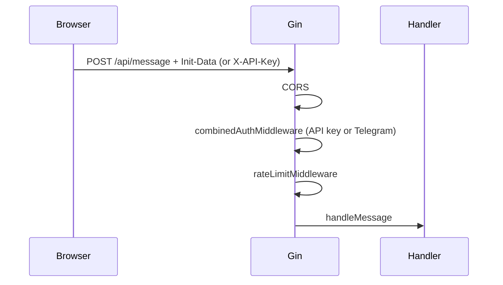

# Walkthrough: authentication and limits (`server/`)

**Files:** `auth_telegram.go`, `auth_combined.go`, `api_keys.go`, `rbac.go`, `middleware.go`, `ratelimit.go`, `auth_info.go`  
**Related:** [webapp-overview.md](./webapp-overview.md) (initData header), [server-overview.md](./server-overview.md) (routes)

---

## Two access types in the project

| Type | Who | How |
|------|-----|-----|
| **User (Telegram)** | Telegram Web App | `X-Telegram-Init-Data` → HMAC verification |
| **User (browser)** | Web App without Telegram | `X-API-Key` (keys in `API_KEYS` / `API_KEYS_FILE`) |
| **Admin** | Browser `/admin.html` | HTTP Basic `ADMIN_USER` / `ADMIN_PASSWORD` |

This article covers **Telegram / API key**, **CORS**, **rate limit**, **metrics**.

---

## `auth_telegram.go` — Telegram verification

### What is `initData`

A query-parameter string from the Telegram Web App (`user=...&auth_date=...&hash=...`).  
Signed with the bot secret — **cannot be forged without the bot token**.

Docs: [Telegram Web Apps — validating data](https://core.telegram.org/bots/webapps#validating-data-received-via-the-mini-app).

### `validateTelegramInitData(initData, botToken, maxAge)`

1. Parse query, extract `hash`.
2. Build `data_check_string` (other fields, sorted).
3. HMAC-SHA256 with key from `botToken` + `"WebAppData"`.
4. Compare with `hash` (constant-time `hmac.Equal`).
5. Check `auth_date` — not older than `TELEGRAM_INIT_DATA_MAX_AGE_SEC` (default 86400).
6. Parse JSON field `user` → `TelegramUser` (id, name, username).

Tests: `auth_telegram_test.go` (valid / invalid hash).

---

## `middleware.go` — CORS

### `corsMiddleware(allowedOrigins)`

- Reads `CORS_ALLOWED_ORIGINS` (comma-separated); empty list → any Origin is reflected.
- If Origin is in the list — reflect in `Access-Control-Allow-Origin` (+ `Vary: Origin`).
- Allows methods GET, POST, OPTIONS; `Access-Control-Max-Age: 86400`.
- Headers: `Content-Type`, `X-Requested-With`, `X-Telegram-Init-Data`, `X-API-Key`, `Authorization`.
- **OPTIONS** → 204 with no body.

Why: webapp on `http://localhost` hits API on the same origin through nginx.

---

## `middleware.go` — Telegram auth

### `telegramAuthMiddleware(cfg)`

**Development mode** (`TELEGRAM_AUTH_DISABLED=true`):

- Skips initData verification.
- Puts `telegram_user_id` = 1 (or `X-Dev-User-Id`) in context.
- For smoke and local browser.

**Production:**

1. Reads `X-Telegram-Init-Data` or `Authorization: tma <initData>`.
2. Empty → **401** “Authorization required: Telegram (X-Telegram-Init-Data) or API key (X-API-Key)”.
3. `validateTelegramInitData` → on error **401**.
4. Success → in Gin context: `telegram_user_id`, `telegram_user`.

Handlers read via `ctxTelegramUser(c)` in `chat_session.go`.

---

## `auth_combined.go` + `api_keys.go` + `rbac.go` — API key auth

Protected routes use **`combinedAuthMiddleware`**, not the Telegram middleware directly:

1. If header `X-API-Key` is present — look up the key in the registry (`loadAPIKeys`: `API_KEYS_FILE` JSON with `key`/`label`/`roles`, or `API_KEYS` env as `key:label,...`).
2. Unknown key → **401**; key without chat access (RBAC) → **403**.
3. Valid key → context gets a synthetic `TelegramUser` with a **stable negative actor ID** (`apiKeyActorID`, SHA-256 of the key) and username `api:<label>`, plus `api_key_label` and `api_roles`.
4. No `X-API-Key` header → fall through to `telegramAuthMiddleware`.

RBAC (`rbac.go`): the only built-in role is **`chat_only`** (aliases `chat`, `chat-only`); keys without explicit roles get it by default; `canUseChatAPI` gates chat access.

`GET /auth/info` (`auth_info.go`, public) reports which methods are enabled: `telegram`, `web_api_key`, `dev_mode`.

---

## `registerProtectedRoutes`

All below use **`auth` (combined) + `lim`** (rate limit):

- `/classify`, `/chat`, `/session`, `/history`, `/message`, `/message/stream`, `/feedback`, `/media/:token`
- Duplicates on `/api/...`

**Not protected:** `/health`, `/crops`, `/onboarding`, `/branding`, `/auth/info`, `/metrics`, admin (different auth).

---

## `ratelimit.go` — request limit

### In-memory, keyed by `rateLimitKey` (`auth_combined.go`)

- Bucket key: `api:<label>` for API keys, `tg:<id>` for Telegram users; unauthenticated `anon` requests skip the limiter.
- `RATE_LIMIT_REQUESTS_PER_MINUTE` (default 30).
- 1-minute window, sliding list of timestamps.
- `gcStale()` — cleanup of stale keys every 256 requests (prevents map growth on long runs).
- `0` or negative → limit disabled.

On exceed: **429** “Too many requests…”.

### Limitation

Single Go process — with multiple replicas counters are not shared (code comment mentions future Redis).

---

## `metrics.go` — Prometheus

- `GET /metrics`, `GET /api/metrics` — **no auth** (on prod — internal network only).
- Counters: HTTP 2xx/4xx/5xx, LLM errors, RAG requests, verify pass/fail, latency sums.
- See [metrics-and-alerts.md](./metrics-and-alerts.md).

---

## Protected request flow

---

## Common errors

| Symptom | Cause |
|---------|-------|
| 401 on session | no initData / API key, auth not disabled |
| 401 “invalid signature” | wrong `TELEGRAM_BOT_TOKEN` |
| 401 “expired” | stale initData, reopen Web App |
| 401 “Invalid API key” | key not in `API_KEYS` / `API_KEYS_FILE` |
| 403 | API key has no `chat_only` role |
| 429 | > N requests per minute from one user id / key |

---

## Brief summary

**auth_telegram** — Telegram cryptography. **auth_combined + api_keys + rbac** — API-key path with roles. **middleware** — CORS + Telegram auth wrapper. **ratelimit** — protection against LLM/CV spam. Chat, photo, and feedback require passing auth.
