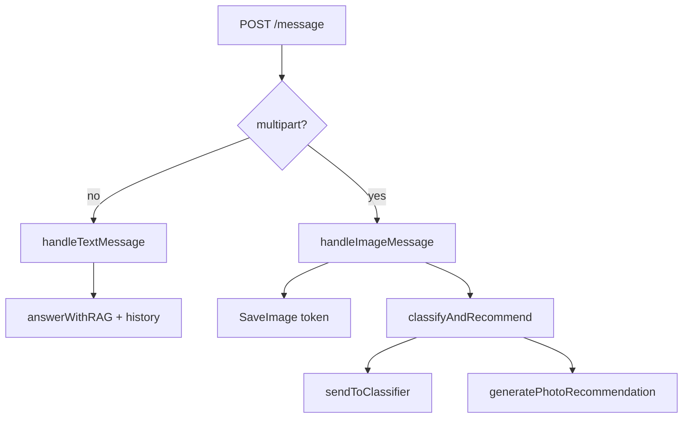

# Walkthrough: chat and database (`server/`)

**Files:** `message_handlers.go`, `message_stream_handlers.go`, `session_handlers.go`, `chat_session.go`, `postgres_store.go`, `classify_flow.go` (photos)  
**DB:** schema in [migrations-overview.md](./migrations-overview.md)  
**Client:** [webapp-overview.md](./webapp-overview.md) → `POST /message`

---

## Main user flow

**`POST /message`** (auth + rate limit) — everything the Telegram chat does.

Two body formats:

| Content-Type | Fields | Branch |
|--------------|--------|--------|
| `application/json` | `session_id`, `crop_id`, `text` | text → RAG |
| `multipart/form-data` | `session_id`, `crop_id`, `text`, `image` | photo → CV + LLM |

Photo limit: **10 MB** (`maxUploadImageBytes` in `classify_flow.go`).

---

## `handleMessage` → branching

Response: JSON `{ success, session_id, crop_id, new_messages: [...] }` — only the new user + assistant pair (`respondWithNewMessages`), not full history; UI appends them locally.

---

## Text: `handleTextMessage`

1. **`HistoryForLLM`** — latest user/assistant turns for LLM context (up to 24 messages, SQL `LIMIT`).
2. **`answerWithRAG(ctx, text, cropID, prior, sid)`** — see [server-rag_chat.md](./server-rag_chat.md); returns answer + `RAGTrace` with latency/verify metrics.
3. Save **user** message in DB.
4. On RAG error (soft) — assistant with error text, `logAnalytics("rag_answer", soft_fail)`.
5. On success — assistant with answer, `logRAGTrace` + analytics `rag_answer` with the full trace payload.
6. **`respondWithNewMessages`** — return the new message pair.

### Streaming variant: `POST /message/stream` (`message_stream_handlers.go`)

Same pipeline, but the answer is streamed as **Server-Sent Events** (`sse.go`): JSON body only (no photo), `buildRAGLLMMessages` → save user message → SSE `meta` event (session, user message) → `callLLMCompletionStream` sends `delta` events per token → `finalizeRAGAnswer` (verify) → save assistant message → `done` event with the final `assistant_message`. RAG soft-fail and pre-LLM errors are returned as plain JSON before the stream starts; mid-stream errors become an SSE `error` event.

---

## Photo: `handleImageMessage`

1. History for LLM (same as text).
2. **`SaveImage`** — file in `UPLOAD_DIR`, DB stores only **token** (not base64).
3. **`classifyAndRecommend(ctx, image, cropID, caption, prior)`** (`classify_flow.go`):
   - Python CV → prediction + confidence;
   - **`generatePhotoRecommendation`** — LLM with history or template from `photo_templates.json`.
4. User message: caption, `kind=image`, token, class_prediction, class_confidence.
5. Assistant message with recommendation.
6. Analytics `photo_classified` with prediction/confidence.

On CV failure — assistant with error, no LLM.

Separate **`POST /classify`** (no session) uses same `classifyAndRecommend` but without DB save — see [server-overview.md](./server-overview.md).

---

## Sessions: `session_handlers.go` + `chat_session.go`

### `POST /session`

JSON `{ "crop_id": "apple" }` → new `chat_sessions` + `session_id` (random hex).

### `GET /history?session_id=`

Owner check (telegram_id) → message list for UI.

### `GET /media/:token`

Serve photo file from disk; only if token belongs to user session.

### `ctxTelegramUser(c)`

Gets `TelegramUser` from Gin context after middleware.

---

## `postgres_store.go` — `ChatStore`

### Connection

- `pgxpool` to `DATABASE_URL`.
- Migrations run in `main()` before the store is created, on a separate short-lived pool; `newChatStore` then opens the long-lived pool.

### Migrations: `schema_migrations` ledger

`runAllMigrations` reads `.sql` files from `migrations/` in name order and applies **only pending ones**: applied filenames are recorded in the `schema_migrations` table (created on first run), and each new migration runs **once, inside a transaction** together with its ledger INSERT. Already-applied files are skipped on subsequent startups (log: “Migrations up to date: N already applied”).

### Key methods

| Method | Purpose |
|--------|---------|
| `UpsertUser` | user by `telegram_id` |
| `CreateSession` / `GetOrCreateSession` | session + crop_id |
| `sessionOwned` / `SessionCropID` | foreign session_id → 404 |
| `AppendMessage` | INSERT into `messages` + trim to last 80 per session |
| `ListMessages` | history + LEFT JOIN `message_feedback.rating` |
| `HistoryForLLM` | role/content for LLM (SQL LIMIT, last 24) |
| `SaveImage` | file + token |
| `UserCanAccessImage` / `ReadImage` | safe media serve |
| `SaveMessageFeedback` | 👍/👎, UNIQUE (message_id, user_id) |
| `LogEvent` | INSERT `analytics_events` JSONB |
| `ListFeedbackReport` | admin feedback report (see `feedback_report.go`) |

### Session security

Any request with `session_id` checks: session belongs to **this** `telegram_id`. Cannot read another user’s chat by guessing id.

### History limits

- `maxSessionMessages = 80` — `AppendMessage` **deletes** older rows beyond the last 80 per session.
- `maxLLMHistoryMessages = 24` — `HistoryForLLM` fetches only the last 24 convertible messages (SQL `LIMIT`) for LLM context.

---

## `ChatMessage` structure (for API)

JSON fields for webapp:

- `id`, `role`, `content`, `kind`
- `image_url` or path via `/media/:token`
- `class_prediction`, `class_confidence` (for photos)
- `feedback_rating` (-1, 1 or null)

---

## `POST /chat` vs `POST /message`

| | `/chat` | `/message` |
|--|---------|------------|
| Status | **deprecated** (`Deprecation: true`) | main API |
| DB history | no | yes |
| Session | not required | required |
| Use | legacy integrations | Telegram Web App |

Web App uses **`POST /api/message`** (and **`/api/message/stream`** for streamed text answers). Both text paths run the same RAG pipeline (with `rag_enabled` check); `/message` and `/message/stream` save the dialog in Postgres, `/chat` does not.

Photo in chat: multipart `image` + `readImageFromFormFile` → `classifyAndRecommend` (`cv_enabled` check).

---

## Analytics from message handlers

`logAnalytics` (defined in `feedback.go`) → `analytics_events` (see [server-admin-and-ux-api.md](./server-admin-and-ux-api.md)):

- `message_sent` — every incoming text/image message (kind, crop_id, session_id)
- `rag_answer` — RAG result with the full trace payload (category, fragments, verify_pass, latency; `soft_fail` on failures)
- `photo_classified` — CV result

---

## Common errors

| Symptom | Where to look |
|---------|---------------|
| “Session not found” | wrong session_id or user change |
| Photo missing in chat | `GET /media/:token` (`handleMedia`) + `UserCanAccessImage` + auth |
| Empty history after refresh | `GET /history`, sessionStorage in UI |
| DB error on startup | postgres not ready, migrations (`schema_migrations`) |

---

## Brief summary

**message_handlers** / **session_handlers** — chat business logic (text/photo). **postgres_store** — persistence and user isolation. **chat_session** — Telegram user helpers from context. Center of the product for the gardener in Telegram.
