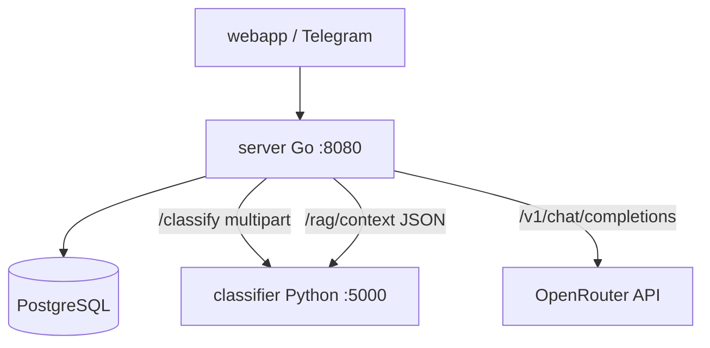

# Разбор: Go-сервер — обзор (`server/`)

**Папка:** `server/`  
**Роль:** оркестратор — Telegram auth, API, PostgreSQL, вызовы Python (CV + RAG) и LLM (OpenRouter)  
**Фреймворк:** [Gin](https://gin-gonic.com/)  
**Порт:** `8080` (контейнер `server`)

Другие статьи по `server/`:

| Документ | Тема |
|----------|------|
| [server-auth-and-limits.md](./server-auth-and-limits.md) | Telegram, CORS, rate limit |
| [server-chat-and-db.md](./server-chat-and-db.md) | Чат, БД, фото |
| [server-rag_chat.md](./server-rag_chat.md) | RAG + LLM + verify |
| [server-admin-and-ux-api.md](./server-admin-and-ux-api.md) | Админка, crops, onboarding, feedback |

---

## Файлы `server/` (разбиение пакета)

| Файл | Назначение |
|------|------------|
| `main.go` | Точка входа: router, миграции при старте, регистрация маршрутов |
| `config.go` | `Config`, `loadConfig`, `getEnv`, `logStartup` |
| `llm.go` | `Message`, `callLLMCompletion` (OpenAI-compatible API) |
| `classifier_client.go` | `sendToClassifier`, типы `ClassificationResult` |
| `photo_recommendations.go` | `generateRecommendation*`, шаблоны по классу болезни |
| `classify_handler.go` | `handleClassification` — `POST /classify` |
| `health.go` | `handleHealthCheck` |
| `messenger.go` | `/message`, `/session`, `/history`, `/media` |
| `chat_session.go` | типы сообщений, маппинг в LLM |
| `rag_chat.go` | RAG + `POST /chat` |
| `postgres_store.go` | SQL, миграции, фото на диске |
| `analytics_store.go` | feedback, события |
| `auth_telegram.go`, `middleware.go`, `ratelimit.go` | auth и лимиты |
| `crops.go`, `onboarding.go`, `admin.go`, `feedback.go` | конфиги и UX API |

Все файлы — **`package main`**, один бинарник. Подпапок `internal/` пока нет.

---

## Зачем Go в проекте

Python-сервис (`api/` + `cv/` + `rag/`, контейнер compose: `classifier`) — **ML** (PyTorch, Chroma).  
Go — **лёгкий backend**:

- проверка Telegram `initData`;
- сессии и история в Postgres;
- склейка «вопрос → RAG-контекст → LLM → ответ»;
- загрузка фото → CV → совет по фото.

Вы можете **не знать Go глубоко**: достаточно понимать **маршруты** и **кто кого вызывает**.

---

## Схема сервисов



---

## Старт `main()` — порядок инициализации

1. **`loadConfig()`** (`config.go`) — `.env`, переменные (см. таблицу ниже).
2. **`logStartup(config)`** — сводка в лог.
3. **Ожидание Postgres** (`waitForPostgres` в `postgres_store.go`, до ~30 попыток).
4. **`runAllMigrations`** — SQL из `migrations/` → [migrations-overview.md](./migrations-overview.md).
5. Загрузка конфигов:
   - `loadCropCatalog()` — `config/crops.json` (`crops.go`)
   - `loadPromptCatalog()` — `config/prompts.json` (`crops.go`)
   - `loadOnboardingConfig()` — `config/onboarding.json` (`onboarding.go`)
6. **`newChatStore`** — пул pgx + папка `UPLOAD_DIR` для фото.
7. **Gin router** — CORS, JSON charset, маршруты (`middleware.go`, `main.go`).
8. **`router.Run(:8080)`**.

Глобальные переменные: `config`, `chatStore`, каталоги культур/промптов.

---

## Конфиг `Config` (`config.go`, из `.env`)

| Поле | Env | Назначение |
|------|-----|------------|
| `PythonServiceURL` | `CLASSIFIER_URL` | POST фото → CV |
| `PythonRAGURL` | `CLASSIFIER_RAG_URL` | POST JSON → RAG context |
| `PythonBaseURL` | `PYTHON_BASE_URL` | reindex админки |
| `LLMAPIKey` | `LLM_API_KEY` | без ключа — шаблоны по фото, текстовый чат с ошибкой |
| `LLMBaseURL` | `LLM_BASE_URL` | OpenRouter по умолчанию |
| `LLMModel` | `LLM_MODEL` | модель в запросе |
| `DatabaseURL` | `DATABASE_URL` | Postgres |
| `UploadDir` | `UPLOAD_DIR` | файлы фото |
| `DataDir` | `DATA_DIR` | статьи для админки |
| `TelegramBotToken` | `TELEGRAM_BOT_TOKEN` | проверка initData |
| `TelegramAuthDisabled` | `TELEGRAM_AUTH_DISABLED` | dev без Telegram |
| `AdminUser/Password/Secret` | `ADMIN_*` | админка |

---

## Таблица HTTP-маршрутов

Дублирование **`/`** и **`/api/`** — для nginx (`/api/` → Go без префикса) и прямого `:8080`.

### Публичные (без Telegram auth)

| Метод | Путь | Handler | Файл |
|-------|------|---------|------|
| GET | `/health`, `/api/health` | `handleHealthCheck` | `health.go` |
| GET | `/crops`, `/api/crops` | `handleListCrops` | `crops.go` |
| GET | `/onboarding`, `/api/onboarding` | `handleOnboarding` | `onboarding.go` |

### Админка (HTTP Basic, не Telegram)

| Метод | Путь | Назначение |
|-------|------|------------|
| GET | `/admin/status`, `/api/admin/status` | статус, `data_dir` |
| GET | `/admin/articles` | список `.txt` |
| POST | `/admin/upload` | загрузка статьи |
| POST | `/admin/reindex` | reindex Chroma |

→ [server-admin-and-ux-api.md](./server-admin-and-ux-api.md) (`admin.go`)

### Защищённые (Telegram + rate limit)

| Метод | Путь | Handler | Файл |
|-------|------|---------|------|
| POST | `/classify` | `handleClassification` | `classify_handler.go` |
| POST | `/chat` | `handleChat` | `rag_chat.go` |
| POST | `/session` | `handleNewSession` | `messenger.go` |
| GET | `/history` | `handleHistory` | `messenger.go` |
| POST | `/message` | `handleMessage` | `messenger.go` |
| POST | `/feedback` | `handleFeedback` | `feedback.go` |
| GET | `/media/:token` | `handleMedia` | `messenger.go` |

→ auth: [server-auth-and-limits.md](./server-auth-and-limits.md)  
→ чат: [server-chat-and-db.md](./server-chat-and-db.md)  
→ RAG: [server-rag_chat.md](./server-rag_chat.md)

---

## Фото: CV и рекомендации (не в `main.go`)

### `classifier_client.go` — `sendToClassifier`

Multipart `image` + `crop_id` → `CLASSIFIER_URL` (Python). Парсит JSON в `ClassificationResult`.

### `photo_recommendations.go` — советы

- **`generateRecommendation`** — для `POST /classify` без истории чата.
- **`generateRecommendationWithHistory`** — для фото в `messenger.go` (с контекстом диалога).
- Промпты из `config/prompts.json` через `promptsForCrop` (`crops.go`).
- Если **`LLM_API_KEY` пуст** → `generateTemplateRecommendation` (готовые тексты на русском).
- Иначе → `callLLMCompletion` (`llm.go`).

### `classify_handler.go` — `handleClassification`

Прямой `POST /classify`: лимит 10 МБ, classification + recommendation (без сессии чата).

---

## `llm.go` — `callLLMCompletion`

```http
POST {LLM_BASE_URL}/v1/chat/completions
Authorization: Bearer {LLM_API_KEY}
```

Таймаут 120s. Используется в `photo_recommendations.go` и `rag_chat.go`.

---

## `health.go` — проверка живости

`handleHealthCheck`: `status: healthy` или `degraded`, если Postgres ping не прошёл.

---

## Локальный запуск

- Docker: `docker compose up server` (ждёт postgres + classifier).
- Прямой Go: из `server/`, `go run .` или `go build .` — нужны env и Postgres.

Логи при старте (`logStartup` в `config.go`): URL Python, модель LLM, Telegram auth, CORS, rate limit.

---

## Краткий итог

`server/` — один Go-сервис, разбитый по файлам по зонам ответственности. **`main.go`** только стартует и вешает маршруты; конфиг, LLM, CV-клиент и советы по фото — в соседних `.go`. Детали чата, RAG и админки — в связанных статьях базы знаний.
