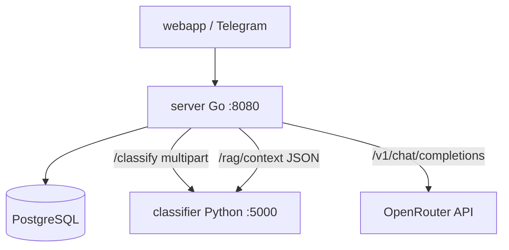

# Walkthrough: Go server overview (`server/`)

**Folder:** `server/`  
**Role:** orchestrator — Telegram auth, API, PostgreSQL, calls to Python (CV + RAG) and LLM (OpenRouter)  
**Framework:** [Gin](https://gin-gonic.com/)  
**Port:** `8080` (container `server`)

Other articles on `server/`:

| Document | Topic |
|----------|-------|
| [server-auth-and-limits.md](./server-auth-and-limits.md) | Telegram, CORS, rate limit |
| [server-chat-and-db.md](./server-chat-and-db.md) | Chat, DB, photos |
| [server-rag_chat.md](./server-rag_chat.md) | RAG + LLM + verify |
| [server-admin-and-ux-api.md](./server-admin-and-ux-api.md) | Admin, crops, onboarding, feedback |

---

## `server/` files (package split)

| File | Purpose |
|------|---------|
| `main.go` | Entry point: router, migrations on startup, route registration |
| `config.go` | `Config`, `loadConfig`, `getEnv`, `logStartup` |
| `llm.go` | `Message`, `callLLMCompletion` (OpenAI-compatible API) |
| `classifier_client.go` | `sendToClassifier`, `ClassificationResult` types |
| `classify_flow.go` | `classifyAndRecommend`, 10 MB limit, shared CV+recommendation flow |
| `photo_recommendations.go` | `generatePhotoRecommendation`, templates from JSON |
| `photo_templates.go` | load `config/photo_templates.json` |
| `classify_handler.go` | `handleClassification` — `POST /classify` (integrations) |
| `session_handlers.go` | `/session`, `/history`, `/media` |
| `message_handlers.go` | `POST /message` — text and photo in chat |
| `chat_session.go` | message types, mapping to LLM |
| `rag_chat.go` | RAG, `answerWithRAG`, legacy `POST /chat` |
| `rag_verify.go` | number verify, disclaimer (mirror of `rag/verifier.py`) |
| `crop_guards.go` | check `cv_enabled` / `rag_enabled` |
| `api_errors.go` | `publicAPIError`, safe client responses |
| `routes.go` | public and protected routes, `Deprecation` on `/chat` |
| `config_reload.go` | SIGHUP and `CONFIG_RELOAD_INTERVAL_SEC` |
| `postgres_store.go` | SQL, migrations, photos on disk |
| `analytics_store.go` | feedback, events |
| `auth_telegram.go`, `middleware.go`, `ratelimit.go` | auth and limits |
| `metrics.go` | Prometheus `/metrics` |
| `feedback_report.go` | enrich feedback with RAG data |
| `crops.go`, `onboarding.go`, `branding.go`, `admin.go`, `feedback.go` | configs and UX API |
| `rag_log.go` | structured `[RAG]` logs (no LLM body) |
| `health.go` | `handleHealthCheck` |

All files are **`package main`**, one binary. No `internal/` subfolders yet.

---

## Why Go in the project

Python service (`api/` + `cv/` + `rag/`, compose container: `classifier`) — **ML** (PyTorch, Chroma, BM25, reranker).  
Go — **lightweight backend**:

- verify Telegram `initData`;
- sessions and history in Postgres;
- glue “question → RAG context → LLM → answer”;
- photo upload → CV → photo advice.

You can **not know Go deeply**: enough to understand **routes** and **who calls whom**.

---

## Service diagram



---

## `main()` startup — initialization order

1. **`loadConfig()`** (`config.go`) — `.env`, variables (see table below).
2. **`logStartup(config)`** — summary in log.
3. **Wait for Postgres** (`waitForPostgres` in `postgres_store.go`, up to ~30 attempts).
4. **`runAllMigrations`** — SQL from `migrations/` → [migrations-overview.md](./migrations-overview.md).
5. Load configs:
   - `loadCropCatalog()` — `config/crops.json` (`crops.go`)
   - `loadPromptCatalog()` — `config/prompts.json` (`crops.go`)
   - `loadOnboardingConfig()` — `config/onboarding.json` (`onboarding.go`)
   - `loadPhotoTemplates()` — `config/photo_templates.json` (`photo_templates.go`)
6. **`newChatStore`** — pgx pool + `UPLOAD_DIR` folder for photos.
7. **Gin router** — CORS, JSON charset, routes (`middleware.go`, `main.go`).
8. **`router.Run(:8080)`**.

Global variables: `config`, `chatStore`, crop/prompt catalogs.

---

## `Config` (`config.go`, from `.env`)

| Field | Env | Purpose |
|-------|-----|---------|
| `PythonServiceURL` | `CLASSIFIER_URL` | POST photo → CV |
| `PythonRAGURL` | `CLASSIFIER_RAG_URL` | POST JSON → RAG context |
| `PythonBaseURL` | `PYTHON_BASE_URL` | admin reindex |
| `LLMAPIKey` | `LLM_API_KEY` | without key — photo templates, text chat error |
| `LLMBaseURL` | `LLM_BASE_URL` | OpenRouter by default |
| `LLMModel` | `LLM_MODEL` | model in request |
| `DatabaseURL` | `DATABASE_URL` | Postgres |
| `UploadDir` | `UPLOAD_DIR` | photo files |
| `DataDir` | `DATA_DIR` | articles for admin |
| `TelegramBotToken` | `TELEGRAM_BOT_TOKEN` | initData verification |
| `TelegramAuthDisabled` | `TELEGRAM_AUTH_DISABLED` | dev without Telegram |
| `AdminUser/Password/Secret` | `ADMIN_*` | admin UI |

---

## HTTP routes table

Duplication **`/`** and **`/api/`** — for nginx (`/api/` → Go without prefix) and direct `:8080`.

### Public (no Telegram auth)

| Method | Path | Handler | File |
|--------|------|---------|------|
| GET | `/health`, `/api/health` | `handleHealthCheck` | `health.go` |
| GET | `/crops`, `/api/crops` | `handleListCrops` | `crops.go` |
| GET | `/onboarding`, `/api/onboarding` | `handleOnboarding` | `onboarding.go` |
| GET | `/branding`, `/api/branding` | `handleBranding` | `branding.go` |

### Admin (HTTP Basic, not Telegram)

| Method | Path | Purpose |
|--------|------|---------|
| GET | `/admin/status`, `/api/admin/status` | status, `data_dir` |
| GET | `/admin/articles` | list `.txt` |
| POST | `/admin/upload` | upload article |
| POST | `/admin/reindex` | reindex Chroma + BM25 |

→ [server-admin-and-ux-api.md](./server-admin-and-ux-api.md) (`admin.go`)

### Protected (Telegram + rate limit)

| Method | Path | Handler | File |
|--------|------|---------|------|
| POST | `/classify` | `handleClassification` | `classify_handler.go` |
| POST | `/chat` | `handleChat` | `rag_chat.go` — **deprecated** (`Deprecation`) |
| POST | `/session` | `handleNewSession` | `session_handlers.go` |
| GET | `/history` | `handleHistory` | `session_handlers.go` |
| POST | `/message` | `handleMessage` | `message_handlers.go` — main Web App API |
| POST | `/feedback` | `handleFeedback` | `feedback.go` |
| GET | `/media/:token` | `handleMedia` | `session_handlers.go` |

→ auth: [server-auth-and-limits.md](./server-auth-and-limits.md)  
→ chat: [server-chat-and-db.md](./server-chat-and-db.md)  
→ RAG: [server-rag_chat.md](./server-rag_chat.md)

---

## Photos: CV and recommendations (not in `main.go`)

### `classifier_client.go` — `sendToClassifier`

Multipart `image` + `crop_id` → `CLASSIFIER_URL` (Python). Parses JSON into `ClassificationResult`.

### `classify_flow.go` — shared flow

- **`maxUploadImageBytes`** (10 MB) — for `/classify` and `/message`.
- **`classifyAndRecommend(image, cropID, caption, history)`** — CV → recommendation.
- **`parseClassifyForm`** — parse multipart for `POST /classify`.

Before CV: **`requireCVEnabled`** (`crop_guards.go`). Used in `classify_handler.go` (no history) and `handleImageMessage` in `message_handlers.go` (with LLM history).

### `photo_recommendations.go` + `photo_templates.go`

- **`generatePhotoRecommendation`** — single function: LLM with optional dialog history.
- **`buildPhotoUserPrompt`** — user prompt from `photo_user_intro` + `photo_user_body` (`prompts.json`).
- If **`LLM_API_KEY` empty** or LLM error → **`generateTemplateRecommendation`** (texts from `photo_templates.json`).
- Otherwise → `callLLMCompletion` (`llm.go`).

### `classify_handler.go` — `handleClassification`

`POST /classify` without session: `parseClassifyForm` → `classifyAndRecommend` → JSON with classification + recommendation.

---

## `llm.go` — `callLLMCompletion`

```http
POST {LLM_BASE_URL}/v1/chat/completions
Authorization: Bearer {LLM_API_KEY}
```

Timeout 120s. Used in `photo_recommendations.go` and `rag_chat.go`.

---

## `health.go` — liveness check

`handleHealthCheck`: `status: healthy` or `degraded` if Postgres ping failed.

---

## Local run

- Docker: `docker compose up server` (waits for postgres + classifier).
- Direct Go: from `server/`, `go run .` or `go build .` — need env and Postgres.

Startup logs (`logStartup` in `config.go`): Python URL, LLM model, Telegram auth, CORS, rate limit.

---

## Brief summary

`server/` — one Go service split by responsibility. **`main.go`** only starts and registers routes; config, LLM, CV client, and photo advice live in sibling `.go` files. Chat, RAG, and admin details — in related knowledge-base articles.
