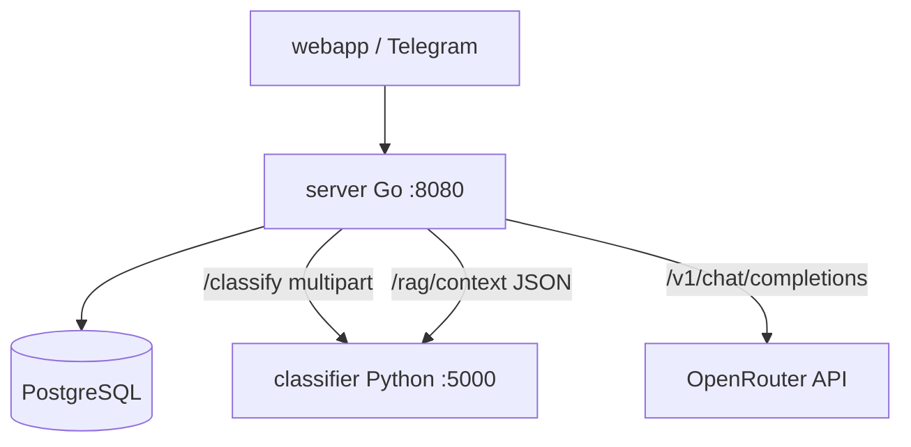

# Разбор: Go-сервер — обзор (`server/main.go` и старт)

**Папка:** `server/`  
**Роль:** оркестратор — Telegram auth, API, PostgreSQL, вызовы Python (CV + RAG) и LLM (OpenRouter)  
**Фреймворк:** [Gin](https://gin-gonic.com/)  
**Порт:** `8080` (контейнер `server`)

Другие статьи по `server/`:

| Документ | Тема |
|----------|------|
| [server-auth-and-limits.md](./server-auth-and-limits.md) | Telegram, CORS, rate limit |
| [server-chat-and-db.md](./server-chat-and-db.md) | Чат, БД, фото |
| [server-rag_chat.md](./server-rag_chat.md) | RAG + LLM + verify |
| [server-admin-and-ux-api.md](./server-admin-and-ux-api.md) | Админка, crops, onboarding, feedback |

---

## Зачем Go в проекте

Python (`classifier`) — **тяжёлый ML** (PyTorch, Chroma).  
Go — **лёгкий backend**:

- проверка Telegram `initData`;
- сессии и история в Postgres;
- склейка «вопрос → RAG-контекст → LLM → ответ»;
- загрузка фото → CV → совет по фото.

Вы можете **не знать Go глубоко**: достаточно понимать **маршруты** и **кто кого вызывает**.

---

## Схема сервисов



---

## Старт `main()` — порядок инициализации

1. **`loadConfig()`** — `.env`, переменные (см. таблицу ниже).
2. **Ожидание Postgres** (`waitForPostgres`, до ~30 попыток).
3. **`runAllMigrations`** — SQL из `migrations/` → [migrations-overview.md](./migrations-overview.md).
4. Загрузка конфигов:
   - `loadCropCatalog()` — `config/crops.json`
   - `loadPromptCatalog()` — `config/prompts.json`
   - `loadOnboardingConfig()` — `config/onboarding.json`
5. **`newChatStore`** — пул pgx + папка `UPLOAD_DIR` для фото.
6. **Gin router** — CORS, JSON charset, маршруты.
7. **`router.Run(:8080)`**.

Глобальные переменные: `config`, `chatStore`, каталоги культур/промптов.

---

## Конфиг `Config` (из `.env`)

| Поле | Env | Назначение |
|------|-----|------------|
| `PythonServiceURL` | `CLASSIFIER_URL` | POST фото → CV |
| `PythonRAGURL` | `CLASSIFIER_RAG_URL` | POST JSON → RAG context |
| `PythonBaseURL` | `PYTHON_BASE_URL` | reindex админки |
| `LLMAPIKey` | `LLM_API_KEY` | без ключа — шаблоны по фото, текстовый чат с ошибкой |
| `LLMBaseURL` | `LLM_BASE_URL` | OpenRouter по умолчанию |
| `LLMModel` | `LLM_MODEL` | модель в запросе |
| `DatabaseURL` | `DATABASE_URL` | Postgres |
| `UploadDir` | `UPLOAD_DIR` | файлы фото |
| `DataDir` | `DATA_DIR` | статьи для админки |
| `TelegramBotToken` | `TELEGRAM_BOT_TOKEN` | проверка initData |
| `TelegramAuthDisabled` | `TELEGRAM_AUTH_DISABLED` | dev без Telegram |
| `AdminUser/Password/Secret` | `ADMIN_*` | админка |

---

## Таблица HTTP-маршрутов

Дублирование **`/`** и **`/api/`** — для nginx (`/api/` → Go без префикса) и прямого `:8080`.

### Публичные (без Telegram auth)

| Метод | Путь | Handler | Назначение |
|-------|------|---------|------------|
| GET | `/health`, `/api/health` | `handleHealthCheck` | жив ли сервер + ping БД |
| GET | `/crops`, `/api/crops` | `handleListCrops` | список культур |
| GET | `/onboarding`, `/api/onboarding` | `handleOnboarding` | примеры вопросов |

### Админка (HTTP Basic, не Telegram)

| Метод | Путь | Назначение |
|-------|------|------------|
| GET | `/admin/status`, `/api/admin/status` | статус, `data_dir` |
| GET | `/admin/articles` | список `.txt` |
| POST | `/admin/upload` | загрузка статьи |
| POST | `/admin/reindex` | reindex Chroma |

→ [server-admin-and-ux-api.md](./server-admin-and-ux-api.md)

### Защищённые (Telegram + rate limit)

| Метод | Путь | Назначение |
|-------|------|------------|
| POST | `/classify` | только CV + LLM совет (без сессии чата) |
| POST | `/chat` | один RAG-вопрос без истории БД |
| POST | `/session` | новая чат-сессия |
| GET | `/history` | история сообщений |
| POST | `/message` | **главный** чат: текст или фото |
| POST | `/feedback` | 👍/👎 |
| GET | `/media/:token` | отдача фото по token |

→ auth: [server-auth-and-limits.md](./server-auth-and-limits.md)  
→ чат: [server-chat-and-db.md](./server-chat-and-db.md)  
→ RAG: [server-rag_chat.md](./server-rag_chat.md)

---

## Фото: `main.go` (не в отдельном файле)

### `sendToClassifier`

Multipart `image` + `crop_id` → `CLASSIFIER_URL` (Python).

### `generateRecommendation` / `generateRecommendationWithHistory`

- С промптом из `config/prompts.json` (`promptsForCrop`).
- Если **`LLM_API_KEY` пуст** → `generateTemplateRecommendation` (готовые тексты по классу болезни на русском).
- Иначе → `callLLMCompletion` (OpenAI-compatible API).

### `handleClassification`

Прямой `POST /classify` для тестов/API без messenger — лимит 10 МБ, возвращает classification + recommendation.

---

## `callLLMCompletion`

```http
POST {LLM_BASE_URL}/v1/chat/completions
Authorization: Bearer {LLM_API_KEY}
```

Таймаут 120s. Используется и для RAG, и для фото.

---

## Health

`handleHealthCheck`: `status: ok` или `degraded`, если Postgres ping не прошёл.

---

## Разбиение `server/` (после рефакторинга)

| Файл | Назначение |
|------|------------|
| `main.go` | Точка входа, router, миграции при старте |
| `config.go` | `Config`, `loadConfig`, логи старта |
| `llm.go` | `Message`, `callLLMCompletion` |
| `classifier_client.go` | `sendToClassifier`, типы CV |
| `photo_recommendations.go` | Шаблоны и LLM-советы по фото |
| `classify_handler.go` | `POST /classify` |
| `health.go` | `GET /health` |
| `messenger.go` | `/message`, сессии |
| `rag_chat.go` | RAG + текстовый чат |
| `postgres_store.go` | SQL, миграции |

---

## Локальный запуск

- Docker: `docker compose up server` (ждёт postgres + classifier).
- Прямой Go: из `server/`, нужны env и Postgres.

Логи при старте печатают URL Python, модель LLM, режим Telegram auth, CORS, rate limit.

---

## Краткий итог

`main.go` — **старт и маршрутизация**; конфиг, LLM и CV вынесены в соседние файлы (см. таблицу выше). Детали чата и RAG — в соседних статьях базы знаний.
