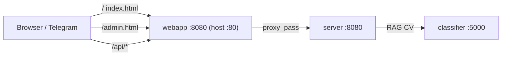

# Walkthrough: `webapp/` folder

**Folder:** `webapp/` — frontend without React/Vue: **static HTML + CSS + JS**, served by **Nginx** (container `webapp`). Nginx **listens on 8080** inside the container (unprivileged, non-root nginx); docker-compose maps host **80 → container 8080**.

| File | Role |
|------|------|
| `index.html` | Chat markup (Telegram Web App) |
| `app.css` | Chat styles |
| `app.js` | Chat logic, `apiFetch`, sessions, `/message` |
| `admin.html` | Admin UI: upload `.txt` + RAG reindex |
| `nginx.conf` | Proxy `/api/` → Go, serve HTML |

Build: `Dockerfile.webapp` copies `index.html`, `app.css`, `app.js`, `admin.html` into the image.

Header and disclaimer text are loaded from **`GET /api/branding`** (`config/branding.json`) — when cloning the platform, edit JSON, not necessarily HTML. Field **`photo_beta_notice`** is shown when attaching a photo (CV in beta).

---

## Architecture in Docker



In `docker-compose.yml`, HTML is mounted **read-only** from the host — edits to `index.html` appear after refresh without rebuilding the image (if the volume is set to `./webapp/...`).

---

## `nginx.conf` — gateway

### `location = /api/message/stream` (SSE)

Dedicated block for the streaming chat endpoint: `proxy_buffering off`, `proxy_cache off`, `chunked_transfer_encoding on` — LLM tokens stream to the browser without nginx buffering. Same auth headers and 120s timeouts as `/api/`.

### `location /api/`

- Requests `http://localhost/api/session` → `http://server:8080/session` (prefix `/api` is stripped on proxy).
- Forwards **`X-Telegram-Init-Data`** (Telegram user identity) and **`X-API-Key`** (browser access key).
- Timeouts up to **120s** — long RAG+LLM.
- `client_max_body_size 12m` — photo upload.

### `location /`

- `try_files` → `index.html` for SPA-like behavior (effectively one HTML page).
- Security headers: `X-Frame-Options`, `nosniff`, `no-cache` for HTML.

### Static `js|css|png|...`

Cache 1 year — almost everything is inline in HTML here, so this block is barely used.

### Local debugging without nginx

`index.html` can fall back to **`http://host:8080/api/`** (see `apiFetch` in JS) — if you opened the file directly or nginx is not proxying.

---

## `index.html` — user chat

**`index.html`** — markup; **`app.css`** — styles; **`app.js`** — logic (~1000 lines). Telegram Web App SDK is loaded from `telegram.org`.

### Appearance

- Messenger style: user/assistant bubbles, header with disclaimer (ids: `headerTitle`, `headerSubtitle`, `headerDisclaimer` — filled from branding API).
- CSS variables `--tg-theme-*` — adapt to Telegram theme.
- **Crop** selector (`cropSelect`) in the header.
- Onboarding: chips with sample questions (`onboardingRoot`).
- Composer: text, 📎 photo, send.
- Bot replies: **👍 / 👎** (`feedback-row`).

### Telegram Web App

```javascript
const tg = window.Telegram && window.Telegram.WebApp;
tg.ready(); tg.expand();
```

- `getTelegramInitData()` → **`X-Telegram-Init-Data`** header on every API request.
- In a browser without Telegram, initData is empty; `ensureWebAuth()` queries **`GET /auth/info`** and:
  - `dev_mode` on Go → no auth needed (local dev);
  - `web_api_key` configured → login overlay asks for an **access key**, sent as **`X-API-Key`** header (stored in sessionStorage);
  - Telegram-only server → error “Open this app from the Telegram bot.”

### sessionStorage (browser state)

| Key | Content |
|------|---------|
| `apple_gardener_session_id` | chat session id in Postgres |
| `apple_gardener_crop_id` | selected crop |
| `apple_gardener_api_key` | browser access key (web login, sent as `X-API-Key`) |
| `apple_gardener_api_base` | which base URL worked (`/api/` or `:8080`) |
| `apple_gardener_api_base_v` | schema version of the saved base (stale bases are cleared) |

Crop change → new session (`createSessionWithCrop`).

### `apiFetch(path)` — smart API client

1. Tries saved base, then `/api/`, then direct Go: `http://127.0.0.1:8080/api/` (and `{host}:8080/api/` when the host differs; 5s timeout on the `:8080` candidates).
2. Treats a response as “ours” if JSON has **`success`** (filters foreign 404 HTML).
3. Remembers working base in sessionStorage.

`apiStreamFetch(path)` — same base-candidate logic for the SSE endpoint (accepts `text/event-stream` instead of checking JSON body).

Typical paths:

| Method | path | Purpose |
|--------|------|---------|
| GET | `/auth/info` | auth mode (dev_mode / web_api_key / telegram) |
| GET | `/branding` | titles, disclaimer, photo beta notice |
| GET | `/crops` | crop list |
| POST | `/session` | `{ crop_id }` → `session_id` |
| GET | `/history?session_id=` | restore chat |
| GET | `/onboarding?crop_id=` | sample questions |
| POST | `/message/stream` | text message, SSE stream (meta/delta/done/error events) |
| POST | `/message` | multipart with photo (also JSON fallback for text) |
| POST | `/feedback` | `{ session_id, message_id, rating: ±1 }` |
| GET | `/uploads/...` | image from history (via `loadAuthedImage`) |

### Sending a message `sendMessage()`

**Text only** — streaming (SSE):

```json
POST /message/stream
{ "session_id", "crop_id", "text" }
```

The reply arrives as SSE events: `meta` (session/user message), `delta` (LLM tokens appended live), `done` (final saved assistant message), `error`. If the server responds with plain JSON instead of `text/event-stream`, the client falls back to non-streaming handling.

**Photo (+ optional text):**

```
POST /message
multipart: session_id, crop_id, text, image
```

Non-streaming responses carry **`new_messages`** (appended to chat) or **`messages`** (full list, UI redraws via `renderMessages`).

### Onboarding

`loadOnboarding` → GET `/api/onboarding` → hint buttons; click fills text and calls `sendMessage()`. Hidden when the chat already has messages.

### Feedback

Only on assistant messages with **`id`** (from DB). `sendFeedback` → POST `/feedback`, buttons disabled after voting.

### Photos in history

`` does not send auth headers → `loadAuthedImage` does `fetch` with initData, blob URL.

### CV classes in UI

`formatPredictionName` — localized labels for `apple_scab`, `healthy_leaf`, etc. (if backend returned prediction in the message).

### App startup

```
loadBranding → ensureWebAuth → loadCropsCatalog → ensureSession → loadOnboarding
```

Error on any step → toast “Connection failed”.

---

## `admin.html` — article admin

Separate page: **`http://localhost/admin.html`** (not inside Telegram).

### Authentication

- **HTTP Basic** — login/password from `.env`: `ADMIN_USER`, `ADMIN_PASSWORD`.
- Credentials in **`sessionStorage`** (`garden_admin_basic`), browser tab only.
- `checkLogin()` → GET `/api/admin/status` with `Authorization: Basic ...` header.

### After login (`toolsCard`)

| Action | API |
|--------|-----|
| File list | GET `/api/admin/articles?crop_id=` |
| Upload `.txt` | POST `/api/admin/upload` (FormData: crop_id, file) |
| Reindex RAG | POST `/api/admin/reindex` → Go → Python `/admin/reindex` |
| Feedback tab | GET `/api/admin/feedback?limit=100` — 👍/👎 ratings table |

Upload limits (on Go): Latin filename, `.txt`, up to 2 MB — see `admin_test.go`.

### Important

- Admin UI is **not** for CV training and **not** for uploading `.pth` — only **text articles** in `data/{crop}/`.
- After upload you need **Reindex**, otherwise Chroma and BM25 are not updated.

---

## index vs admin comparison

| | `index.html` | `admin.html` |
|--|--------------|--------------|
| User | gardener in Telegram | you / colleague |
| Auth | Telegram initData | Basic |
| API prefix | `/api/...` | `/api/admin/...` |
| Tasks | chat, photo, feedback | articles, reindex |

---

## Common issues

| Symptom | Check |
|---------|-------|
| 401 on session | open from Telegram, or sign in with the web access key (`X-API-Key`), or dev mode on Go |
| 404 JSON | nginx not proxying `/api/` — `docker compose up webapp server` |
| API only on :8080 | normal — `apiFetch` will switch automatically |
| Admin 403 | `ADMIN_PASSWORD` in `.env`, recreate server |
| Reindex slow | embeddings, check `classifier` logs |
| HTML changes not visible | volume mount vs old image — `up --build webapp` |

---

## What to read next

| Topic | File |
|-------|------|
| Go routes | [server-overview.md](./server-overview.md), `server/message_handlers.go` |
| Onboarding JSON | `config/onboarding.json` |
| Admin backend | `server/admin.go` |
| RAG after reindex | [rag-vector_store.md](./rag-vector_store.md) |
| API smoke | [scripts-overview.md](./scripts-overview.md) |

---

## Brief summary

`webapp/` — **thin client**: Nginx serves HTML and proxies `/api/` to Go. `index.html` — Telegram chat with session, crop, text, photo, feedback. `admin.html` — article upload and reindex. All “smart” logic is on Go/Python; here only UI and `fetch`.
