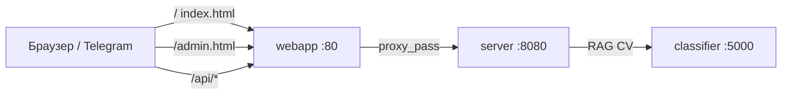

# Разбор: папка `webapp/`

**Папка:** `webapp/` — фронтенд без React/Vue: **статический HTML + CSS + JS**, раздаётся **Nginx** (контейнер `webapp`, порт **80**).

| Файл | Роль |
|------|------|
| `index.html` | Чат для пользователя (Telegram Web App) |
| `admin.html` | Админка: upload `.txt` + reindex RAG |
| `nginx.conf` | Прокси `/api/` → Go, раздача HTML |

Сборка: `Dockerfile.webapp` копирует все три файла в образ.

---

## Архитектура в Docker



В `docker-compose.yml` HTML монтируется **read-only** с хоста — правки `index.html` видны после refresh без пересборки образа (если volume настроен на `./webapp/...`).

---

## `nginx.conf` — шлюз

### `location /api/`

- Запросы `http://localhost/api/session` → `http://server:8080/session` (префикс `/api` срезается при proxy).
- Пробрасывает **`X-Telegram-Init-Data`** — без этого Go не узнает пользователя Telegram.
- Таймауты до **120s** — долгий RAG+LLM.
- `client_max_body_size 12m` — загрузка фото.

### `location /`

- `try_files` → `index.html` для SPA-подобного поведения (фактически один HTML).
- Заголовки безопасности: `X-Frame-Options`, `nosniff`, `no-cache` для HTML.

### Статика `js|css|png|...`

Кэш 1 год — у вас почти всё inline в HTML, блок почти не используется.

### Локальная отладка без nginx

`index.html` умеет fallback на **`http://host:8080/api/`** (см. `apiFetch` в JS) — если открыли файл напрямую или nginx не проксирует.

---

## `index.html` — пользовательский чат

~970 строк: **вёрстка + стили + один `<script>`**. Telegram Web App SDK подключается с `telegram.org`.

### Внешний вид

- Стиль «мессенджер»: пузыри user/assistant, шапка с дисклеймером.
- CSS-переменные `--tg-theme-*` — подстройка под тему Telegram.
- Выбор **культуры** (`cropSelect`) в шапке.
- Онбординг: чипы с примерами вопросов (`onboardingRoot`).
- Композер: текст, 📎 фото, отправка.
- У ответов бота: **👍 / 👎** (`feedback-row`).

### Telegram Web App

```javascript
const tg = window.Telegram && window.Telegram.WebApp;
tg.ready(); tg.expand();
```

- `getTelegramInitData()` → заголовок **`X-Telegram-Init-Data`** на каждый API-запрос.
- В браузере без Telegram initData пустой → нужен **`TELEGRAM_AUTH_DISABLED=true`** на Go (локальная разработка).

### sessionStorage (состояние в браузере)

| Ключ | Содержимое |
|------|------------|
| `apple_gardener_session_id` | id чат-сессии в Postgres |
| `apple_gardener_crop_id` | выбранная культура |
| `apple_gardener_api_base` | какой base URL сработал (`/api/` или `:8080`) |

Смена культуры → новая сессия (`createSessionWithCrop`).

### `apiFetch(path)` — умный клиент API

1. Пробует сохранённый base, затем `/api/`, затем `http://127.0.0.1:8080/api/`.
2. Считает ответ «нашим», если JSON с полем **`success`** (отсекает чужие 404 HTML).
3. Запоминает рабочий base в sessionStorage.

Типичные пути:

| Метод | path | Назначение |
|-------|------|------------|
| GET | `/crops` | список культур |
| POST | `/session` | `{ crop_id }` → `session_id` |
| GET | `/history?session_id=` | восстановить чат |
| GET | `/onboarding?crop_id=` | примеры вопросов |
| POST | `/message` | текст JSON или multipart с фото |
| POST | `/feedback` | `{ session_id, message_id, rating: ±1 }` |
| GET | `/uploads/...` | картинка из истории (через `loadAuthedImage`) |

### Отправка сообщения `sendMessage()`

**Только текст:**

```json
POST /message
{ "session_id", "crop_id", "text" }
```

**Фото (+ опционально текст):**

```
multipart: session_id, crop_id, text, image
```

Go → CV и/или RAG → в ответе **`messages`** — полный список, UI перерисовывает чат (`renderMessages`).

### Онбординг

`loadOnboarding` → GET `/api/onboarding` → кнопки-подсказки; клик подставляет текст и вызывает `sendMessage()`. Скрывается, когда в чате уже есть сообщения.

### Feedback

Только у сообщений assistant с полем **`id`** (из БД). `sendFeedback` → POST `/feedback`, кнопки блокируются после голоса.

### Фото в истории

`` не шлёт заголовки auth → `loadAuthedImage` делает `fetch` с initData, blob URL.

### Классы CV в UI

`formatPredictionName` — русские подписи для `apple_scab`, `healthy_leaf` и т.д. (если backend вернул prediction в сообщении).

### Старт приложения

```
loadCropsCatalog → ensureSession → loadOnboarding
```

Ошибка на любом шаге → toast «Не удалось подключиться».

---

## `admin.html` — админка статей

Отдельная страница: **`http://localhost/admin.html`** (не внутри Telegram).

### Авторизация

- **HTTP Basic** — логин/пароль из `.env`: `ADMIN_USER`, `ADMIN_PASSWORD`.
- Креды в **`sessionStorage`** (`garden_admin_basic`), только вкладка браузера.
- `checkLogin()` → GET `/api/admin/status` с заголовком `Authorization: Basic ...`.

### После входа (`toolsCard`)

| Действие | API |
|----------|-----|
| Список файлов | GET `/api/admin/articles?crop_id=` |
| Upload `.txt` | POST `/api/admin/upload` (FormData: crop_id, file) |
| Reindex RAG | POST `/api/admin/reindex` → Go → Python `/admin/reindex` |

Ограничения upload (на Go): латиница в имени, `.txt`, до 2 МБ — см. `admin_test.go`.

### Важно

- Админка **не** для обучения CV и **не** для загрузки `.pth` — только **текстовые статьи** в `data/{crop}/`.
- После upload нужен **Reindex**, иначе Chroma не обновится.

---

## Сравнение index vs admin

| | `index.html` | `admin.html` |
|--|--------------|--------------|
| Пользователь | садовод в Telegram | вы / коллега |
| Auth | Telegram initData | Basic |
| API префикс | `/api/...` | `/api/admin/...` |
| Задачи | чат, фото, feedback | статьи, reindex |

---

## Типичные проблемы

| Симптом | Проверить |
|---------|-----------|
| 401 на session | `TELEGRAM_AUTH_DISABLED` или открыть из Telegram |
| 404 JSON | nginx не проксирует `/api/` — `docker compose up webapp server` |
| API только с :8080 | нормально — `apiFetch` переключится сам |
| Админка 403 | `ADMIN_PASSWORD` в `.env`, пересоздать server |
| Reindex долго | embeddings, смотреть логи `classifier` |
| Изменения HTML не видны | volume mount vs старый образ — `up --build webapp` |

---

## Что читать дальше

| Тема | Файл |
|------|------|
| Маршруты Go | [server-overview.md](./server-overview.md), `server/messenger.go` |
| Онбординг JSON | `config/onboarding.json` |
| Admin backend | `server/admin.go` |
| RAG после reindex | [rag-vector_store.md](./rag-vector_store.md) |
| Smoke API | [scripts-overview.md](./scripts-overview.md) |

---

## Краткий итог

`webapp/` — **тонкий клиент**: Nginx отдаёт HTML и проксирует `/api/` на Go. `index.html` — Telegram-чат с сессией, культурой, текстом, фото, feedback. `admin.html` — загрузка статей и reindex. Вся «умная» логика — на Go/Python; здесь только UI и `fetch`.
